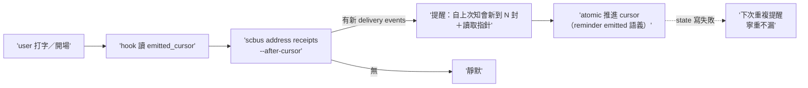

## Description

<!-- SECTION:DESCRIPTION:BEGIN -->
架構 A 落地（三方收斂：muse＋codex web＋codex native astra 三腿全支持；設計權威 .agent-tmp/mail-arch/verdict-*.md）。依賴：sc-router `address receipts` 唯讀 timeline face（提案信已寄 sc-router-marshal）——face 未落地前可 stub-first 開發（mock runner RED 先行）。

做什麼：①AIR-225.1 hook 查詢核心重寫——**移除** direct maildir 讀取（addresses_root/receipt_acked/cur_unacked 全段，iteration 2 的 downstream domain-logic 重做被 upstream face 取代）；改為 `scbus address receipts --address <addr> --after-cursor <cursor> --limit N` 消費。②emitted_cursor 狀態（consumer-owned，XDG_STATE_HOME ai-guide 路徑，atomic advance-after-emit；語義＝reminder emitted 非 AI seen——advisory badge 非責任結清點）。③monitor eligibility gate（hook 推進 cursor 前先判定合法 monitor invocation——workspace 鎖最低限度；防錯誤 session 吃掉 watermark）。④bootstrap/cutover：--since-us 一次性 seed＋冷啟動只建 cursor 不告警（防歷史洪水）＋cursor 損壞顯性 reconcile。⑤輸出語義修正：「新增收件紀錄 N 封」（accepted 不等於送達 UI 不等於 body 可讀）＋可執行讀取指針。⑥ownership doc monitor 段升級：monitor 資料源從 mailbox snapshot 改為 delivery-event timeline（架構 invariant：三軸互不代理——transport ack／human seen/done／AI notification 各持 cursor）。

不做：ack/recv/lease 操作；route grammar；SC extension 改動（southchariot 零 card——其 human lifecycle unseen/seen/done 已正確分層）；雙版本兼容（不用向後相容，face 落地後 filesystem workaround 退場）。

<!-- SECTION:DESCRIPTION:END -->
