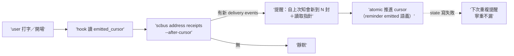
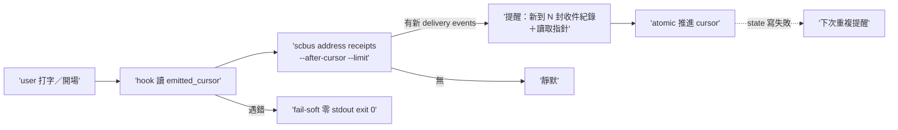

## Description

<!-- SECTION:DESCRIPTION:BEGIN -->
架構 A 落地（三方收斂：muse＋codex web＋codex native astra 三腿全支持；設計權威 .agent-tmp/mail-arch/verdict-*.md）。依賴：sc-router `address receipts` 唯讀 timeline face（提案信已寄 sc-router-marshal）——face 未落地前可 stub-first 開發（mock runner RED 先行）。

做什麼：①AIR-225.1 hook 查詢核心重寫——**移除** direct maildir 讀取（addresses_root/receipt_acked/cur_unacked 全段，iteration 2 的 downstream domain-logic 重做被 upstream face 取代）；改為 `scbus address receipts --address <addr> --after-cursor <cursor> --limit N` 消費。②emitted_cursor 狀態（consumer-owned，XDG_STATE_HOME ai-guide 路徑，atomic advance-after-emit；語義＝reminder emitted 非 AI seen——advisory badge 非責任結清點）。③monitor eligibility gate（hook 推進 cursor 前先判定合法 monitor invocation——workspace 鎖最低限度；防錯誤 session 吃掉 watermark）。④bootstrap/cutover：--since-us 一次性 seed＋冷啟動只建 cursor 不告警（防歷史洪水）＋cursor 損壞顯性 reconcile。〔修復工單補註：--since-us 一次性 seed 併入 face 落地後整合驗證待辦（全 timeline 掃描冷啟動等效防洪水——本卡以等效方案交付）〕⑤輸出語義修正：「新增收件紀錄 N 封」（accepted 不等於送達 UI 不等於 body 可讀）＋可執行讀取指針。⑥ownership doc monitor 段升級：monitor 資料源從 mailbox snapshot 改為 delivery-event timeline（架構 invariant：三軸互不代理——transport ack／human seen/done／AI notification 各持 cursor）。

不做：ack/recv/lease 操作；route grammar；SC extension 改動（southchariot 零 card——其 human lifecycle unseen/seen/done 已正確分層）；雙版本兼容（不用向後相容，face 落地後 filesystem workaround 退場）。

<!-- SECTION:DESCRIPTION:END -->

## Implementation Plan

<!-- SECTION:PLAN:BEGIN -->
〔Planning Contract——AIR-233（standard tier——hook 消費面重寫＋governance doc，boundary classification；架構 A 三方收斂定稿）〕
**Baseline**：main @ 9b8b7a02。**已決策勿重辯**：①receipts face 消費取代 maildir 讀取（iteration 2 interim workaround 退場）②emitted_cursor consumer-owned（XDG_STATE_HOME；reminder emitted 非 AI seen）③monitor eligibility gate（cwd 鎖最低限度）④count-only 禁 body。
**Scope**：動＝hooks/scbus-address-pending-reminder.py（重寫）＋governance/scbus-address-ownership.md＋tests。不動＝sc-router canonical hook、compact-restore group、registrations、route grammar、SC extension。
**驗收式**：mock runner 全情境（pending>0 注入／=0 靜默／face 缺席 fail-soft／cursor 推進）＋rg maildir 零殘留＋套件綠。
<!-- SECTION:PLAN:END -->

## Acceptance Criteria

- [x] hook 查詢核心重寫——`scbus address receipts` face 消費＋runner 注入 stub-first（上游未落地真機跑＝degraded 靜默，設計如此）
- [x] emitted_cursor consumer-owned state（XDG_STATE_HOME atomic advance-after-emit；冷啟動只建不告警；損壞顯性 reconcile）
- [x] monitor eligibility gate（cwd 鎖；sibling 邊界測試；card WT 取捨註記）
- [x] 輸出語義修正（收件紀錄≠送達 UI≠body 可讀＋讀取指針）
- [x] ownership doc 三軸互不代理 invariant 落地
- [x] 76＋2817 passed（fresh/muse 各自獨立重現）
- [x] 雙腿審查（muse GO-WITH-FIXES＋fresh GO-WITH-FIXES）＋judge F1-F7 修復落地

## Implementation Notes

<!-- SECTION:NOTES:BEGIN -->
live acceptance（退役閘兩 lane 實證→退役 scbus watch＋bash 輪詢哨）歸 AIR-224.1 觀察窗同批——hooks 已 install（zcode config 兩條目），face 落地前真機跑＝degraded 靜默（設計如此）。上游依賴：sc-router `address receipts` face（提案信 d838120e 已寄 sc-router-marshal，face 卡歸 sc-router repo）。
<!-- SECTION:NOTES:END -->

## Final Summary

<!-- SECTION:FINAL_SUMMARY:BEGIN -->
**as-built 終態**（main @ b1c188d8＋修復輪）：門牌信監看資料源從 mailbox snapshot 升級為 delivery-event timeline（架構 invariant：三軸互不代理）——hook 查詢核心改 `scbus address receipts --after-cursor` 消費＋emitted_cursor consumer-owned state（XDG atomic advance-after-emit）＋monitor eligibility gate（cwd 鎖）＋count-only 禁 body 語義修正。face 未落地前真機＝degraded 靜默（fail-soft），face 落地後即插即用。

<!-- SECTION:FINAL_SUMMARY:END -->
