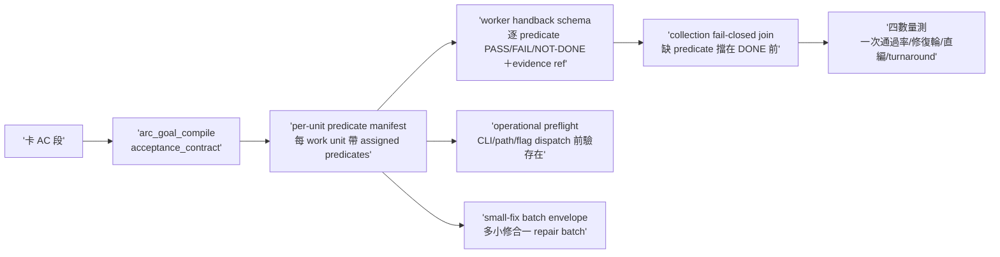

## Description

<!-- SECTION:DESCRIPTION:BEGIN -->
雙腿收斂（muse＋codex marshal mode tri；5.3 裁卡切 2 張——P2 observation 併進 P0 驗收、P1 settle queue 等數據後另開）。頭號破口＝handback seam 缺兩個 join：card AC→work unit（工單不從 acceptance_contract 編譯，worker 不知道哪些 AC 分派給它）＋worker DONE→assigned predicates（自報 DONE 沒逐 predicate 附證據，collection 無法機械判定缺項）。

做什麼：①沿 AIR-135.1.1 compiler 產 per-unit assigned-predicate manifest（每個 work unit 帶著它負責的 AC predicates 清單）②worker handback schema（逐 predicate 回 PASS/FAIL/NOT-DONE＋evidence ref；缺任何 assigned predicate＝transport 可 terminal 但不得進 DONE/READY_FOR_REVIEW）③collection fail-closed join（collector 用 manifest 做 machine join——缺 predicate 即擋在 DONE 前）④operational preflight（工單內可機械查的 CLI/path/flag/section 在 dispatch 前驗存在；不能低成本驗的假設明標 assumption，worker 第一階段先 verify——AIR-232 journal 有工單 section 不存在實證）⑤small-fix batch envelope（同 authority 同 read-set 多個小修合一個 impl-lite repair batch——消 spawn overhead 不偷回主座席）⑥semantic boundary 四行例示（agents/AGENTS.md 註 b：tests＝spawn 一行也算／純錯字格式＝直做但跑機械閘／卡面結構＝本職但須過 validator／累積熔斷＝同弧直編≥3 次改 spawn）⑦最小量測四數（first_handback_complete／repair_rounds／marshal_direct_impl_violation／settle_wait——手工記 dogfood 卡 notes）。

不做：完整 ArcPlan 自動生成；settle queue（歸 P1 另卡）；telemetry 大系統；judge 本體自動化；AI_seen stage 加進 sc-router receipt。

<!-- SECTION:DESCRIPTION:END -->
