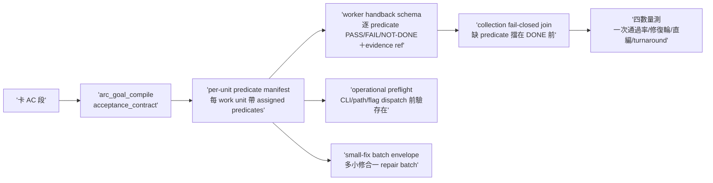
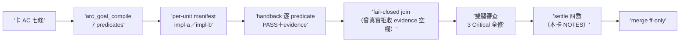

## Description

<!-- SECTION:DESCRIPTION:BEGIN -->
雙腿收斂（muse＋codex marshal mode tri；5.3 裁卡切 2 張——P2 observation 併進 P0 驗收、P1 settle queue 等數據後另開）。頭號破口＝handback seam 缺兩個 join：card AC→work unit（工單不從 acceptance_contract 編譯，worker 不知道哪些 AC 分派給它）＋worker DONE→assigned predicates（自報 DONE 沒逐 predicate 附證據，collection 無法機械判定缺項）。

做什麼：①沿 AIR-135.1.1 compiler 產 per-unit assigned-predicate manifest（每個 work unit 帶著它負責的 AC predicates 清單）②worker handback schema（逐 predicate 回 PASS/FAIL/NOT-DONE＋evidence ref；缺任何 assigned predicate＝transport 可 terminal 但不得進 DONE/READY_FOR_REVIEW）③collection fail-closed join（collector 用 manifest 做 machine join——缺 predicate 即擋在 DONE 前）④operational preflight（工單內可機械查的 CLI/path/flag/section 在 dispatch 前驗存在；不能低成本驗的假設明標 assumption，worker 第一階段先 verify——AIR-232 journal 有工單 section 不存在實證）⑤small-fix batch envelope（同 authority 同 read-set 多個小修合一個 impl-lite repair batch——消 spawn overhead 不偷回主座席）⑥semantic boundary 四行例示（agents/AGENTS.md 註 b：tests＝spawn 一行也算／純錯字格式＝直做但跑機械閘／卡面結構＝本職但須過 validator／累積熔斷＝同弧直編≥3 次改 spawn）⑦最小量測四數（first_handback_complete／repair_rounds／marshal_direct_impl_violation／settle_wait——手工記 dogfood 卡 notes）。

不做：完整 ArcPlan 自動生成；settle queue（歸 P1 另卡）；telemetry 大系統；judge 本體自動化；AI_seen stage 加進 sc-router receipt。

<!-- SECTION:DESCRIPTION:END -->

## Implementation Plan

<!-- SECTION:PLAN:BEGIN -->
本弧同時是 AIR-135.1.2 排定的真實卡全 lifecycle dogfood：Plan Preview（arc_goal_compile 編 acceptance_contract）→ 帶 per-unit predicate manifest 派工 → handback 逐 predicate 回 PASS/FAIL/NOT-DONE＋evidence ref → collection fail-closed join → Settle。

兩 work unit 平行（介面契約釘死在工單：CLI 名＋manifest/handback JSON schema，雙方對同一契約實作）：
- impl-a（code，TDD）：scripts/arc_manifest.py（acceptance_contract→per-unit manifest；set 不變式 union=all／intersection=∅ 違反 fail-loud）＋scripts/arc_handback_join.py（manifest×handback 機械 join；缺 verdict／非三值／evidence 空＝exit 2 逐行列缺項）＋tests／fixtures
- impl-b（instructions）：skills/_common/work-order.md 增 handback schema＋operational preflight 兩段；skills/agent-workflow/SKILL.md 收線 join 接線＋small-fix batch envelope；agents/AGENTS.md 註 b 四行例示

收線全鏈（arc-plan v2 顯式 work units，supersedes v1——v1 只列 impl＋settle 被 user 指正）：**post-build**（handback fail-closed join——impl-a 首收 marshal 手動、impl-b 用交付工具；WT CR graph build——WT 起 graph-absent、canonical graph 不覆蓋 WT 新檔；ledger lint）→ **雙腿 review 平行**（fresh＝in-harness code-reviewer；cross＝bridge muse/codex 依 availability；per-leg CR receipt 照 AIR-224 語法）→ **judge**（主 session decision work unit 不 agent 化；需修復走 repair batch envelope）→ **commit-merge**（/commit receipt-gate＋控制面 merge 前回執四欄覆核＋ff-only merge 回 main＋branch 收線；push 恆停）→ **settle**（四數記卡＋Final Summary＋結案兩步——翻 Done 恆 user 拍板）。
<!-- SECTION:PLAN:END -->

## Acceptance Criteria

- [x] #1 per-unit manifest 投影——acceptance_contract＋unit 分派表輸入，產 per-unit manifest（assigned predicates 帶 ac_id；unit 分派違 set 不變式 fail-loud） `uv run python scripts/arc_manifest.py tests/fixtures/air-234/contract.json --units tests/fixtures/air-234/units.json --out-dir .agent-tmp/air-234/manifests` → exit 0 且每 unit 一檔 predicates 非空
- [x] #2 handback fail-closed join——assigned predicate 缺 verdict／verdict 非三值／evidence 空即拒收（transport terminal 不等於 DONE） `uv run python scripts/arc_handback_join.py --manifest tests/fixtures/air-234/manifests/impl-a.json --handback tests/fixtures/air-234/handback-missing.json` → exit 2
- [x] #3 兩工具測試覆蓋——manifest set 不變式（union=all／intersection=∅／未知 ac_id）＋join 三態與 pass path＋schema 邊界 `uv run pytest tests/test_arc_manifest.py tests/test_arc_handback_join.py` → exit 0 全綠
- [x] #4 work-order 模板兩段——handback schema（逐 predicate PASS/FAIL/NOT-DONE＋evidence ref；缺項不得進 DONE/READY_FOR_REVIEW）＋operational preflight（dispatch 前驗 CLI/path/flag/section；不能低成本驗的標 assumption 由 worker 第一階段 verify；錯→CONTRACT_BLOCKED 禁照錯執行） `rg -c "handback" skills/_common/work-order.md` → ≥2
- [x] #5 agent-workflow 接線——collection 步帶 manifest machine join（缺項擋 DONE 前）＋small-fix batch envelope（同 authority 同 read-set 多小修合一 repair batch，逐 unit 收 verdict） `rg -c "repair batch" skills/agent-workflow/SKILL.md` → ≥1
- [x] #6 註 b 四行例示——tests＝spawn 一行也算／純錯字格式＝直做但跑機械閘／卡面結構＝本職但須過 validator／累積熔斷＝同弧直編 ≥3 次或任一次被閘退改 spawn `rg -c "熔斷" agents/AGENTS.md` → ≥1
- [x] #7 本弧四數量測記卡——first_handback_complete／repair_rounds／marshal_direct_impl_violation／settle_wait 手工記 NOTES `rg -c "first_handback_complete" "backlog/tasks/air-234 - Marshal-mode-強化-P0——compiled-work-order-closure（predicate-manifest＋handback-join＋operational-preflight）.md"` → ≥1

## Implementation Notes

<!-- SECTION:NOTES:BEGIN -->
**四數量測（settle 結算——⑦交付）**：
- first_handback_complete＝TRUE×2（impl-a、impl-b 首收 handback 皆 100% assigned predicates 帶 evidence——join 機驗 exit 0；repair batch 為審查修復輪不計首收）
- repair_rounds＝1（雙腿審查 findings → 單一 repair batch R1-R7 全數落地；AIR-237 弧另貢獻 repair_rounds＝2 的跨弧對照——evidence 空欄退補＋oracle 未同步，均為閘正確咬合）
- marshal_direct_impl_violation＝0（卡面/arc 產物/manifest 投影＝本職豁免；tests/oracle/instruction 修復全走 worker；唯一 WO 品質瑕疵＝§4.5 section 引用不精確，被 impl-b 以 D2 deviation 如實 flag——④ preflight 條文的設計行為實證）
- settle_wait：t_dispatch 1790945179 → t_ready_to_judge 1790947535（66min——含 plan v2 recompile／WT CR build／cross 腿 muse 失敗換 codex 重派）→ t_landed 1790948984（+24min 修復輪）；全程 107min

已知限制（judge 裁量接受）：fresh F2（contract 元素級 TypeError 走 traceback exit 1 非乾淨 exit 2）——Suggestion 級、不 false-pass、producer 契約保證形狀，接受為 degraded；contract predicates 內重複 ac_id 取後者＝既有行為未動。AC#7 verifier 量測弱（PLAN 段預有字樣）——以本 NOTES 實數為準（verifier 修復方向併 AIR-235 receipt grammar 面）。
<!-- SECTION:NOTES:END -->

## Final Summary

<!-- SECTION:FINAL_SUMMARY:BEGIN -->
**as-built 終態**（air-234 branch db5ff513）：compiled work-order closure 全鏈落地——①`scripts/arc_manifest.py`（acceptance_contract→per-unit manifest；set 不變式四條含檔名碰撞；judgment_required 投影＋satisfied passthrough）②`scripts/arc_handback_join.py`（manifest×handback 結構 join；缺項/malformed 逐行 exit 2；語義分離——FAIL/NOT-DONE 仍 exit 0）③work-order「Handback closure」＋「Operational preflight」兩附錄節 ④agent-workflow 5c repair batch envelope＋「ArcPlan 弧 handback join」collection 條 ⑤agents/AGENTS.md 註 b 四行例示（熔斷分支拆寫版）⑥四數量測記卡（本 NOTES）。全弧本身即 AIR-135.1.2 排定的 lifecycle dogfood：Plan Preview（v1→v2 recompile）→帶 manifest 派工→handback join（含一次真實拒收）→雙腿審查（fresh live-cr:MCP／cross codex degraded 如實記）→repair batch→landing。

<!-- SECTION:FINAL_SUMMARY:END -->
