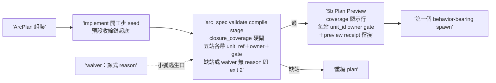

## Description

<!-- SECTION:DESCRIPTION:BEGIN -->
AIR-234 v1 實證（2026-10-02）：ArcPlan 可缺整條收線鏈仍合法——arc_spec validate 全綠、5b Plan Preview 照樣展示通過，攔截的是 user 人眼（層 3）非任何機制（層 1 同 context 自檢與作者一起漏）。tri 收斂（codex job-muqz3qzw＋glm job-muqz3v7w 兩腿全文；muse job-muqz3qyf failed-usage 窗耗盡缺席——verdict 存 .agent-tmp/plan-gap-tri/）：多層防禦、硬閘為主、④純條文拒（「沒有驗證的規則是噪音」）。

做什麼：①arc_spec.py——ArcPlan 新 machine-invariant `closure_coverage`（五站 post-build/review/judge/landing/settle；每站 {station, unit_ref, owner, gate}；compile stage 驗全站在場＋unit_ref 有效＋owner 站別一致〔judge/landing/settle owner=main-session——codex/glm 共識：v2 把這三站塞 role=verify 是假語義〕）＋顯式 `chain_waiver`（stations＋reason 必填）逃生口——小弧不被過綁：review 站單腿合法、cardinality 歸 review profile；phase 收斂 enum build/post-build/review/judge/land/settle（追認 v2 語彙＋arc_spec:190 描述修正＋六站映射一行——glm 實證 v2 一半 phase 值不在六站且六站無 Land 站）②implement SKILL 開工步 seed：組 plan 以預設收線鏈 units 起底（「刪了才會沒有」）＋本職/user-gate 標題慣例成條文 ③agent-workflow 5b：coverage 顯示行（每站→unit_id→owner/gate；檢查歸 validator、preview 只轉譯）＋preview receipt 具體化（5b 既有「留痕」承諾無 canonical path/grammar——codex 指出，補固定路徑與欄位）④tests：舊「單 Build unit 即 valid」oracle 改判（codex 反證 tests/test_arc_spec.py:52/260）＋golden negatives（缺站/waiver 無 reason/owner 不一致）＋小弧單 review 正例＋全鏈正例。

不做：runtime 狀態機／自動推進／settle 自動化（AIR-135.11 P1 數據前置不動、D6 零變更）；arc_goal_compile.py（pure compiler 邊界——glm 證 coverage 與 AC 編譯正交：post-build/review/judge 天然不帶 card AC predicate）；work-order.md（per-dispatch 物，缺口在 plan 層）；六站語義重定；review 腿數硬綁 cross-family。

規模：standard（glm 對標 135.1.2 三檔更小；codex 主張 full——設計已由 tri 收斂，實作走 control-plane 既有雙腿閘）。時點：AIR-234 merge 後接著做；dogfood-again＝本卡結案後第一張真實卡 ArcPlan 的 plan-v1 即含全鏈（authoring 時間過閘，非事後 v2 補）。

<!-- SECTION:DESCRIPTION:END -->

## Acceptance Criteria

- [ ] #1 缺站 plan fail-loud（AIR-234 v1 實形 golden negative） `uv run python scripts/arc_spec.py validate --kind arc-plan --stage compile tests/fixtures/arc-plan/missing-closure.json` → exit 2 且輸出列缺站名
- [ ] #2 waiver 正例（無 reason 版由 pytest 覆蓋 exit 2） `uv run python scripts/arc_spec.py validate --kind arc-plan --stage compile tests/fixtures/arc-plan/chain-waiver-valid.json` → exit 0
- [ ] #3 小弧不被過綁（單 review 腿、無 bridge 正例） `uv run python scripts/arc_spec.py validate --kind arc-plan --stage compile tests/fixtures/arc-plan/single-review-valid.json` → exit 0
- [ ] #4 測試套（缺站/全鏈/waiver 深檢/owner 不一致 negatives＋phase enum） `uv run pytest tests/test_arc_spec.py` → exit 0
- [ ] #5 條文接線錨點（implement seed＋5b 顯示行＋receipt 路徑） `rg -c "closure_coverage|收線鏈" skills/implement/SKILL.md skills/agent-workflow/SKILL.md` → 兩檔各 ≥1
- [ ] #6 dogfood-again（本卡結案後第一張真實卡 ArcPlan） plan-v1 authoring 時間過 coverage 閘 `uv run python scripts/arc_spec.py validate --kind arc-plan --stage compile .agent-tmp/arcplan/<下一張真實卡>/plan-v1.json` → exit 0 且五站在場非 waiver
