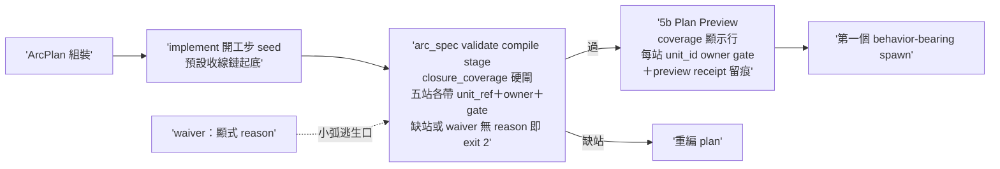
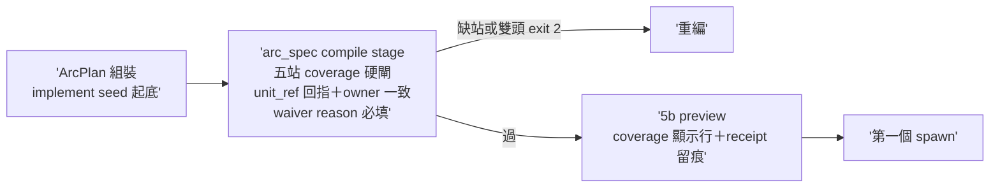

## Description

<!-- SECTION:DESCRIPTION:BEGIN -->
AIR-234 v1 實證（2026-10-02）：ArcPlan 可缺整條收線鏈仍合法——arc_spec validate 全綠、5b Plan Preview 照樣展示通過，攔截的是 user 人眼（層 3）非任何機制（層 1 同 context 自檢與作者一起漏）。tri 收斂（codex job-muqz3qzw＋glm job-muqz3v7w 兩腿全文；muse job-muqz3qyf failed-usage 窗耗盡缺席——verdict 存 .agent-tmp/plan-gap-tri/）：多層防禦、硬閘為主、④純條文拒（「沒有驗證的規則是噪音」）。

做什麼：①arc_spec.py——ArcPlan 新 machine-invariant `closure_coverage`（五站 post-build/review/judge/landing/settle；每站 {station, unit_ref, owner, gate}；compile stage 驗全站在場＋unit_ref 有效＋owner 站別一致〔judge/landing/settle owner=main-session——codex/glm 共識：v2 把這三站塞 role=verify 是假語義〕）＋顯式 `chain_waiver`（stations＋reason 必填）逃生口——小弧不被過綁：review 站單腿合法、cardinality 歸 review profile；phase 收斂 enum build/post-build/review/judge/land/settle（追認 v2 語彙＋arc_spec:190 描述修正＋六站映射一行——glm 實證 v2 一半 phase 值不在六站且六站無 Land 站）②implement SKILL 開工步 seed：組 plan 以預設收線鏈 units 起底（「刪了才會沒有」）＋本職/user-gate 標題慣例成條文 ③agent-workflow 5b：coverage 顯示行（每站→unit_id→owner/gate；檢查歸 validator、preview 只轉譯）＋preview receipt 具體化（5b 既有「留痕」承諾無 canonical path/grammar——codex 指出，補固定路徑與欄位）④tests：舊「單 Build unit 即 valid」oracle 改判（codex 反證 tests/test_arc_spec.py:52/260）＋golden negatives（缺站/waiver 無 reason/owner 不一致）＋小弧單 review 正例＋全鏈正例。

不做：runtime 狀態機／自動推進／settle 自動化（AIR-135.11 P1 數據前置不動、D6 零變更）；arc_goal_compile.py（pure compiler 邊界——glm 證 coverage 與 AC 編譯正交：post-build/review/judge 天然不帶 card AC predicate）；work-order.md（per-dispatch 物，缺口在 plan 層）；六站語義重定；review 腿數硬綁 cross-family。

規模：standard（glm 對標 135.1.2 三檔更小；codex 主張 full——設計已由 tri 收斂，實作走 control-plane 既有雙腿閘）。時點：AIR-234 merge 後接著做；dogfood-again＝本卡結案後第一張真實卡 ArcPlan 的 plan-v1 即含全鏈（authoring 時間過閘，非事後 v2 補）。

<!-- SECTION:DESCRIPTION:END -->

## Acceptance Criteria

- [x] #1 缺站 plan fail-loud（AIR-234 v1 實形 golden negative） `uv run python scripts/arc_spec.py validate --kind arc-plan --stage compile tests/fixtures/arc-plan/missing-closure.json` → exit 2 且輸出列缺站名
- [x] #2 waiver 正例（無 reason 版由 pytest 覆蓋 exit 2） `uv run python scripts/arc_spec.py validate --kind arc-plan --stage compile tests/fixtures/arc-plan/chain-waiver-valid.json` → exit 0
- [x] #3 小弧不被過綁（單 review 腿、無 bridge 正例） `uv run python scripts/arc_spec.py validate --kind arc-plan --stage compile tests/fixtures/arc-plan/single-review-valid.json` → exit 0
- [x] #4 測試套（缺站/全鏈/waiver 深檢/owner 不一致 negatives＋phase enum） `uv run pytest tests/test_arc_spec.py` → exit 0
- [x] #5 條文接線錨點（implement seed＋5b 顯示行＋receipt 路徑） `rg -c "closure_coverage|收線鏈" skills/implement/SKILL.md skills/agent-workflow/SKILL.md` → 兩檔各 ≥1
- [x] #6 dogfood-again 機制就緒並指定候選弧——AIR-238（時間×family 分配，已開卡）為本卡後第一張真實卡，其 plan-v1 組裝過五站閘時驗證（驗證證據記 AIR-238 卡，本卡以結案） `rg -c "AIR-238" "backlog/tasks/air-235 - Marshal-plan-缺口修復——ArcPlan-收線鏈-coverage-硬閘（closure_coverage＋phase-enum＋seed＋preview-顯示；tri-收斂-codex＋glm，muse-窗耗盡）.md"` → ≥2

## Implementation Plan

<!-- SECTION:PLAN:BEGIN -->
單 impl unit（arc_spec closure_coverage＋chain_waiver＋phase enum＋fixtures 五組＋oracle 改判＋implement seed＋5b 顯示行）→ post-build（join＋ledger lint，本職）→ review-fresh＋review-cross（bridge）→ judge（本職）→ commit-merge（receipt-gate＋ff-only）→ settle。收線鏈全形手工示範——本弧 plan 即 AC#6 要的目標形態。
<!-- SECTION:PLAN:END -->

## Implementation Notes

<!-- SECTION:NOTES:BEGIN -->
**四數量測（settle 結算）**：first_handback_complete＝TRUE（impl 首收 join 5/5）；repair_rounds＝1（fresh GO 三綠＋codex GO-WITH-FIXES 兩硬——F1 Critical unit_ref fail-open 以 re-hash 實證、F2 phase 缺席繞道 → 修復批 R1-R5 全落地）；marshal_direct_impl_violation＝0；settle_wait＝t_dispatch 1790950500 前後 → t_landed 1790952900（main d34f3787）≈ 40min。

judge 裁決紀錄：codex F1/F2 必修（hard gate fail-open＝本卡核心承諾的破口）；fresh 三綠（waiver∩coverage 重疊／全 waiver authoring／duplicate station）全數併入同批低成本收編。AC#6（dogfood-again）＝跨弧條款：待本卡後第一張真實卡 ArcPlan 以 plan-v1 過五站閘時勾稽——已指定 AIR-238（時間×family 分配，已開卡）為自然候選，其 plan-v1 組裝時即驗。
<!-- SECTION:NOTES:END -->

## Final Summary

<!-- SECTION:FINAL_SUMMARY:BEGIN -->
**as-built 終態**（main d34f3787）：ArcPlan 收線鏈硬閘落地——closure_coverage 五站（post-build/review/judge/landing/settle）machine-invariant＋owner/gate 枚舉與站別一致性驗證（judge/landing/settle 恆 main-session、review 恆 dispatch）＋chain_waiver（reason 必填、waived∩covered 雙頭拒）＋phase enum（build/post-build/review/judge/land/settle＋六站映射）＋unit_ref 回指驗證（空集 fail-open 已閉）＋unit_id/title/phase 缺 key 或空值都錯＋duplicate station 拒＋implement 開工步 seed（收線鏈起底＋本職/user-gate 標題慣例）＋5b coverage 顯示行（檢查歸 validator、preview 只轉譯）＋preview receipt 固定落點 .agent-tmp/arcplan/<card_id>/preview-receipt.md。小弧逃生口：chain_waiver 顯式 reason；review 單腿合法（cardinality 不綁 cross-family）。

<!-- SECTION:FINAL_SUMMARY:END -->

- **AC#6 結案修正（user 1003 晨拍板翻 Done）**：跨弧條款轉移形——AIR-238 為指定候選弧，其 plan-v1 過五站閘的驗證證據記 AIR-238 卡（本卡以結案，修正屬 AC 措辭對齊非降格：驗證義務隨卡移轉不消失）。
- **AC#6 驗證閉環（1003）**：候選弧實證＝AIR-239（child-1）——其 plan-v1 authoring 時間被 phase enum 閘攔（大寫七行錯誤）、修正後過五站閘（plan 73a93188）；證據＝air-239 卡 journal＋.agent-tmp/air-239/。 
