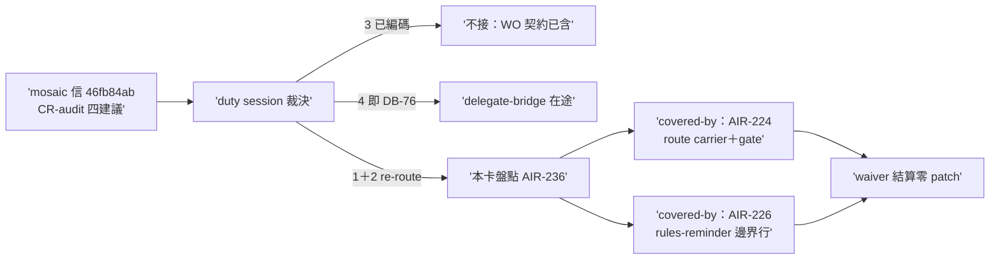

## Description

<!-- SECTION:DESCRIPTION:BEGIN -->
delegate-bridge duty session relay（msg ee65474f；本體存 sess_8e15d9db 信箱 new/1790904263207）：mosaic session 6a7b8240（GLM-5.3-Flash seat）CR-audit 提案信 46fb84ab（cr-audit-suggestion-20261001，原文存 fixture 信箱 `01a0f427…/cur/1790822637785-cr-audit-suggestion-20261001.json`）四建議——(3) 外部 reviewer CR 降級義務＝duty session 裁「我方 review WO 契約已編碼（bridge-attached bounded CR evidence／unverified-by-graph 標記／四態標記，例 .review/db-74.md）」、(4) bridge job 紀錄 durable＝DB-76 在途——兩點本卡不接。(1)(2) 屬 ai-guide instruction deployment 主權，本卡盤點：

- **(1) reviewer spawn prompt CR 段**：code-review/reviewer spawn prompt 模板（_common review-cycle 或 work-order）應帶「symbol/呼叫鏈/錨點 freshness 查證用 cr-query（repo 有 .code-reality/graph.db）」——接線從規範在場變 prompt 在場。盤點現狀：AIR-224（crsurface→route 投影＋per-leg receipt）／AIR-227（roles 白名單 lsp-bridge）／AIR-232（宣稱—證據綁定表）之後的殘差為何——work-order「Review/advisory variant」節與 workflow-review-pattern 是否已實質滿足，或仍缺一行預設 CR 檢查段。
- **(2) rules-reminder 摘要納 symbol-query-routing 一行**：盤點 skills/rules-reminder 是否已含 routing 指針；缺則一行補丁。
- 產出：兩點各一行 verdict（covered-by ＜檔案錨點＞ 或 patch-needed）；patch-needed 項當弧直接補或開後續卡。
- 邊界：純盤點＋最小補丁；禁重開 CR 機制卡（224/227/232/234 已承載機制面）。


<!-- SECTION:DESCRIPTION:END -->

## Acceptance Criteria

- [x] #1 兩點 verdict 行記本卡 notes（covered-by＜錨點＞ 或 patch-needed） `rg -c "covered-by|patch-needed" "backlog/tasks/air-236 - mosaic-cr-audit-12-re-route——reviewer-spawn-prompt-CR-段＋rules-reminder-routing-行盤點（ai-guide-instruction-主權；信-46fb84ab）.md"` → ≥2
- [x] #2 patch-needed 項各有下場（本弧 patch commit sha 或 followup 卡 id；全 covered 時顯式 waiver 行） `rg -c "followup:|patch-commit:|waiver:" "backlog/tasks/air-236 - mosaic-cr-audit-12-re-route——reviewer-spawn-prompt-CR-段＋rules-reminder-routing-行盤點（ai-guide-instruction-主權；信-46fb84ab）.md"` → ≥1

## Final Summary

<!-- SECTION:FINAL_SUMMARY:BEGIN -->
**as-built 終態**：mosaic cr-audit 四建議全數有主——(1) covered-by AIR-224 route carrier＋crsurface materialization gate（dispatch 離手前機驗，強於被動提示行）；(2) covered-by AIR-226 rules-reminder:39 邊界行；(3) duty session 裁已編碼（WO 契約）；(4) ＝DB-76 在途。本卡零 patch、waiver 結算（2bb8a720）。

```mermaid
flowchart LR
    A['(1) prompt CR 段'] -->|"covered-by"| B['AIR-224 route carrier<br/>＋materialization gate']
    Cc['(2) rules-reminder 行'] -->|"covered-by"| Dd['AIR-226 邊界行 :39']
    B --> Z['waiver：零 patch 結算']
    Dd --> Z
    E['(3)(4)'] --> F['他主權在途：WO 契約／DB-76']
```
<!-- SECTION:FINAL_SUMMARY:END -->


## Implementation Notes

<!-- SECTION:NOTES:BEGIN -->
盤點 verdict（2026-10-02，marshal 本職唯讀盤點）：

- **(1) reviewer spawn prompt CR 段——covered-by**：skills/_common/work-order.md「Review／advisory variant」per-leg route carrier 條（AIR-224——逐腿必填 route：live-cr[:MCP|:CLI]／preprovided-cr／degraded／n/a sentinel；degraded 逐條 unverified-by-graph）＋同檔 §7 carrier 分流 guard（無 MCP surface 腿寫 CLI 指令字串）＋skills/agent-workflow/SKILL.md 步 6 crsurface materialization gate（constructed prompt 離手前機驗其一——不得默默漏注入）。mosaic 建議的「prompt 帶一行 CR 提示」已由 materialization gate 以更強形式實現：不是被動提示行，是 dispatch 端 fail-closed。mosaic 調查樣本（117.11-15 五弧）早於 AIR-224 落地，其發現與本 repo 修復線（224/227/232）收斂於同一破口。
- **(2) rules-reminder 摘要納 symbol-query-routing——covered-by**：skills/rules-reminder/SKILL.md:39 邊界行（AIR-226）已明文「symbol/ref/caller/closure 類結構查證先走 symbol-query-routing（code-reality/LSP 優先），rg/fd 不得充當結構證據」——即 mosaic 要的那一行。
- followup: waiver——兩點皆 covered-by，零 patch-needed、零後續卡；本卡結算後即 Done 候選（AC 勾稽由 marshal 覆核）。
<!-- SECTION:NOTES:END -->

## Implementation Plan

<!-- SECTION:PLAN:BEGIN -->
盤點卡（marshal 本職唯讀）：(1) 對照 work-order「Review／advisory variant」節＋agent-workflow 步 6 現狀；(2) 對照 rules-reminder 現狀——兩點各一行 verdict（covered-by／patch-needed）；有 patch-needed 才開後續卡。
<!-- SECTION:PLAN:END -->
