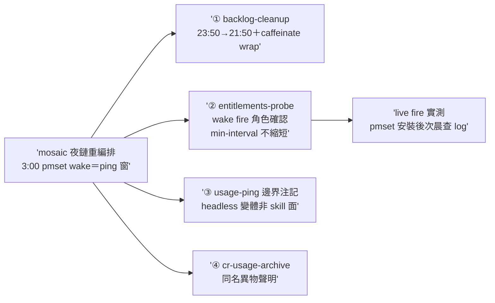
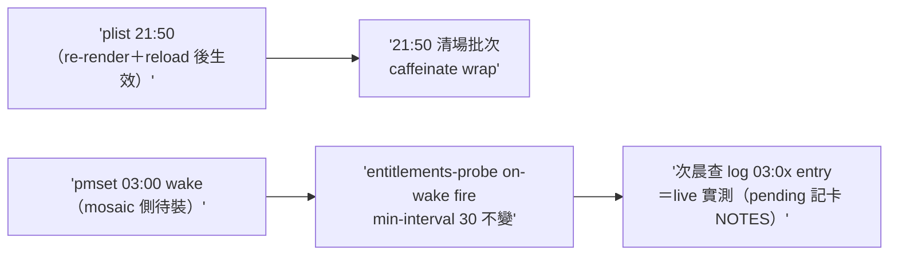

## Description

<!-- SECTION:DESCRIPTION:BEGIN -->
mosaic 排程重編排 tri 收斂案移交（msg 7bdf4316→ai-guide-primary；sender ea1f3ae9；設計全文 mosaic_alpha/.agent-tmp/schedule-redesign/consolidated-design.md）。user 目標：半夜 3 點 pmset 喚醒跑 usage ping 就好、ZCode 不長駐防睡眠。user 授權時移裁量（原話「時移隨你裁決」）。

**時移裁決＝前移案（muse）**：3:00 窗只留 ping（3–5min）符合 user 原話語義；glm 不動案的 nightly catch-up 佔 ~20min 且自己標注「風扇噪屬臥室體感」，違反原意。ai-guide 側唯一 plist 異動＝backlog-cleanup 23:50→21:50（mosaic 側 2 顆 plist mosaic 自行做）。

四項：
① deploy/backlog-cleanup.plist Hour 23→21＋deploy/scripts/run-backlog-cleanup.sh 補 caffeinate -is wrap（guard＋exec 防 re-exec；兩腿共識缺口——睡眠中啟動的清場批次跑一半斷電＝半套 git 狀態；mosaic 側同款修改 mosaic 自行做——twin 註記同步）
② entitlements-probe wake 角色確認：StartInterval 3600 的 on-wake fire＝launchd 對睡眠逾時 interval 補 fire 一次（coalesce 單次——man launchd.plist＋glm 案註解雙源）；**--min-interval 裁決不縮短**——它是防連續重複 fire 閘（預設 30min），wake 前 machine 已睡數小時、age 恆過閘不擋 wake fire；縮短只增加無謂 probe 成本。03:00 窗快照最壞 ~40min 舊（GLM 5h 窗粒度可接受）。**live wake-fire 實測待 mosaic 側 pmset 03:00 wake 安裝後的次晨**——查 ~/.mosaic/logs/ops/launchagent-ai-guide-entitlements-probe.log 是否有 03:0x entry（本卡 NOTES 記結果）
③ skills/usage-ping/SKILL.md 增邊界注記：夜鏈 03:00 launchd claude -p 屬 headless 變體、非本 skill 排程面（CronCreate）；skill 的 session 綁定／host 關閉 skipped 不補跑語義不變——此語義是 mosaic 設計的關鍵依據，文檔明文化
④ scripts/cr_usage_archive.py 同名異物聲明：cr-usage＝code-reality 工具呼叫量測（AIR-206④），與 usage-ping／LLM 配額無關、無需接 ping log——docstring 明文化。「夜間機器不睡」假設段落掃描：rg skills/ rules/ scripts/ deploy/ 僅 harness_waiter.py 的 SM-7 睡眠會計邏輯（睡眠感知扣除——正確語義非假設），ai-guide 文檔零「不睡」假設、無需修改

<!-- SECTION:DESCRIPTION:END -->

## Implementation Plan

<!-- SECTION:PLAN:BEGIN -->
移交批（repair batch envelope）：①plist Hour 23→21＋②script caffeinate guard wrap＋③usage-ping 邊界注記＋④cr-usage-archive 聲明——單一 impl-lite 承作（P1-P4 逐項 handback）；裁量與掃描腿（min-interval／夜間不睡）＝marshal 本職；live wake-fire 實測＝mosaic pmset 安裝後次晨（pending 交接 NOTES）。
<!-- SECTION:PLAN:END -->

## Acceptance Criteria

- [x] #1 backlog-cleanup plist 前移 21:50 且 XML 可解析 `uv run python -c "import plistlib; plistlib.load(open('deploy/backlog-cleanup.plist','rb')); print('ok')"` → exit 0 且 Hour integer 為 21
- [x] #2 清場腳本 caffeinate wrap（guard 防 re-exec＋twin 註記同步） `rg -c "caffeinate -is" deploy/scripts/run-backlog-cleanup.sh` → ≥1 且 `bash -n deploy/scripts/run-backlog-cleanup.sh` → exit 0
- [x] #3 usage-ping 邊界注記（headless 變體非 skill 排程面＋skipped 不補跑語義不變） `rg -c "headless" skills/usage-ping/SKILL.md` → ≥1
- [x] #4 cr-usage-archive 同名異物聲明（與 usage-ping／LLM 配額無關） `rg -c "usage-ping" scripts/cr_usage_archive.py` → ≥1
- [x] #5 ②的裁量與 live-test 計畫記卡 NOTES（min-interval 不縮短理由＋pmset 安裝後次晨查 log 步驟） `rg -c "min-interval" "backlog/tasks/air-237 - mosaic-夜鏈重編排移交——ai-guide-側四項（backlog-cleanup-前移＋caffeinate-wrap／entitlements-probe-wake-角色確認／usage-ping-邊界注記／cr-usage-archive-同名異物聲明；時移已裁前移案）.md"` → ≥1（NOTES 段）

## Implementation Notes

<!-- SECTION:NOTES:BEGIN -->
結算（2026-10-02）：P1–P4 worker 全 PASS＋marshal 獨立複核（plistlib parse／Hour=21／bash -n／rg 三錨點／diff 目檢）＋fail-closed join OK 4 predicates（首收被拒——evidence 空欄，退補一輪後過；repair_rounds 真實數據＋1）。

min-interval 裁決理由（AC#5）：--min-interval（預設 30min）＝防連續重複 fire 閘；wake fire 前機器已睡數小時、latest age 恆 ≥ 閘值，不擋 on-wake fire——縮短只增加無謂 probe 成本。03:00 窗快照最壞 ~40min 舊（GLM/codex 配額 5h 窗粒度可接受）。

live wake-fire 實測步驟（pending——待 mosaic 側 pmset 03:00 wake 安裝）：次晨 `rg "03:0" ~/.mosaic/logs/ops/launchagent-ai-guide-entitlements-probe.log` 應有 wake 窗 entry；結果補記本節。安裝面提醒：plist 時刻變更須 user 手動 re-render＋reload LaunchAgent 才生效（AIR-110 形態）。

**live wake-fire 實測結果（2026-10-04 晨補記——PASS）**：兩夜皆 fire。10-03 03:04:18（`20261002T190418Z`，pmset 安裝首窗）與 10-04 03:46:26（`20261003T194626Z`，無 session 夜＋AIR-237 夜測窗）各四 probe 全 fire（codex/glm status=ok failure_class=none、muse unsupported 如常）。**節奏細節**：fire 時刻對齊 StartInterval 的 `:46` 邊界（非 03:0x 整點）——10-04 機器 03:00 pmset 喚醒後 job 在 03:46 邊界觸發；卡面原判「03:00 窗快照最壞 ~40min 舊」的包絡實證成立。機制面（wake→fire 延遲 ~46min 的 launchd 排程細節）如需精化屬 mosaic 夜鏈設計側裁量，ai-guide 側 probe 角色驗證完成。
<!-- SECTION:NOTES:END -->

## Final Summary

<!-- SECTION:FINAL_SUMMARY:BEGIN -->
**as-built 終態**（main @ 4f9f9828）：mosaic 夜鏈重編排的 ai-guide 側四項全數落地——backlog-cleanup 排程 23:50→21:50（前移案；3:00 pmset 窗只留 ping）＋清場腳本 caffeinate -is guard wrap（防睡眠半套執行）＋usage-ping skill headless 變體邊界注記（session 綁定語義不變＝mosaic 設計依據明文化）＋cr-usage-archive 同名異物聲明（CR 工具量測≠LLM 配額）。G5 plist 形狀 oracle 同步 Hour 21（guard 測試腿抓的遺漏）。

驗收：AC 五勾（plistlib parse／bash -n／rg 三錨點／NOTES）＋guard 全套 2817 passed＋fail-closed join OK 4 predicates。待辦交接：live wake-fire 實測隨 mosaic pmset 安裝後次晨執行，結果補卡 NOTES。
<!-- SECTION:FINAL_SUMMARY:END -->
