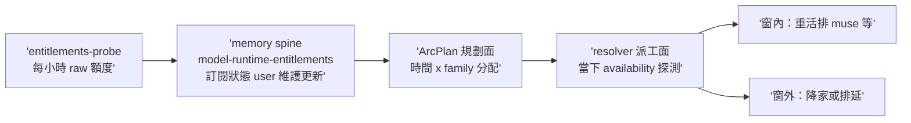

## Description

<!-- SECTION:DESCRIPTION:BEGIN -->
user 補充（2026-10-02 夜，概念逐字）：「另外 arc plan 應該要利用 memory spine 規劃怎樣根據時間分配使用的 llm model, 概念是這樣, 那邊會更新目前訂閱狀況」——ArcPlan 的 dispatch 規劃應具備時間維度：依 memory spine 維護的目前訂閱狀態（`model-runtime-entitlements` 等 spine 條目）把 legs 排進各 family 的可用窗（muse 5h 訂閱窗／codex webgpt vs native 額度面／glm provider 帳號面），窗耗盡前降家或排延。

**現狀與缺口**：model-routing resolver 於派工當下 JIT 探測 availability（當下快照，無時間前瞻）；entitlements-probe 每小時落地 `~/.agents/probe-entitlements/`（raw 額度數據）；spine 條目由 ai-guide session 讀 probe 校驗後手寫。本夜實證：muse 窗耗盡四次 failed-usage（含 tri 腿自身） 都是「派工當下才知道」——plan 層若知窗，可排延或先派他家。缺口＝plan/dispatch 層無時間×family 的分配視野，spine 資料也無機械消費面。

**候選方向（供 tri 攻擊）**：(a) ArcPlan budget_context 擴 per-family time-window constraints（窗內排重活、窗外排延/降家）；(b) resolver 增 spine 讀取腿——dispatch 時查 entitlements 給「現在可用＋下一窗重置」建議（與既有 availability snapshot 當下探測的關係要釐清：spine=計畫面慢資料、探測=派工面快事實）；(c) deep-work 批量模式依 spine 排卡序（窗對齊）；(d) entitlements-probe→spine 同步半自動化（現為 session 手寫——資料新鮮度是 (a)(b) 的前置）。

**邊界**：禁自動化訂閱/付費變更；model-routing resolver 契約變更＝該 skill owner 面需審；spine 寫手契約（ai-guide session）不變。

**流程**：明早 muse＋codex tri（概念已凍結於本卡）→ Plan Preview → 實作。本夜不動工——兩線（235／135.11）與 model-routing 高影響面。

<!-- SECTION:DESCRIPTION:END -->

## Implementation Plan

<!-- SECTION:PLAN:BEGIN -->
**tri 定稿（1003 晨；codex job-murfan77 完備＋glm job-murfksif 地形圖；muse 四度 failed-usage 缺席）**：多層防禦、每層單一 authority——
1. **ArcPlan＝時間意圖＋引用**：work unit 級 preferred_family／planned_not_before／on_unavailable={delay,fallback}＋entitlement_snapshot_ref/hash/as_of——**易爛 quota 真值禁寫進 plan**（volatile truth 進 versioned artifact＝幾小時後腐爛）
2. **EntitlementWindowSnapshot（新）＝規劃面證據**：probe raw＋quota-event parser（retryable_at 唯一源）＋spine 慢事實 → normalized {source/observed_at/freshness/state/retryable_at}；衝突序＝fresh probe > 舊 spine、stale 一律 unknown、provider reset 時間戳 > 週期推算
3. **AvailabilitySnapshot＝派工當下唯一 live authority**（resolver 七步、fallback、no-silent-downgrade、explicit-only 全不動）；validator 只驗形不代 resolver 做「選」（evaluator-not-router 邊界）
- **muse 誠實條款**：probe 對 muse unsupported、無結構化重置源——無 anchor 時 next_window=unknown，禁從 5h 週期硬推（GLM 的 nextResetTime 在場、codex web 池 pool_visibility=none——各 family 能力不齊，禁統一演算法假設）
- **spine 寫手契約不動**：probe→snapshot 機械化；probe→spine 維持半自動候寫（僅 durable 事件吸收）
- **卡切（parent＋2 bounded child＋1 後接）**：child-1＝EntitlementWindowSnapshot 資料面（freshness normalization）；child-2＝ArcPlan temporal schema＋compile 驗證＋DispatchSlice carry-through；deep-work 批量排序第三張等前兩 contract 穩定後接
- **glm 地形圖三大發現收編**：①FAMILIES enum 縫（arc_spec 四值無 grok、catalog 五值無 local/grok——child-2 須裁決擴 enum 或 grok 腿不走 slice）②implement SKILL.md:116「開工資源規劃簡報」＝本概念現行人工版（AIR-238 是機械化升級非新發明）③availability_snapshot.py 為 snapshot 近親（child-1 裁決擴它或平行新檔）
- 改動面：scripts/entitlement_window_snapshot.py（新）＋probe_entitlements.py（保留 raw，補 normalized export）＋arc_spec.py（temporal fields＋freshness validation＋DispatchSlice carry-through）＋model-routing SKILL.md 補 planning-vs-dispatch authority contract（窄改——七步/catalog/presets 不動）＋三份 tests

**AC 定稿**：parent 卡收斂於下（AC#1 tri 定稿＝本節）；實作 AC 隨 child 卡（codex AC1-AC4 草案已被全採——snapshot provenance／compile freshness／dispatch authority／source contracts 四條 grammar 形）。
<!-- SECTION:PLAN:END -->

## Acceptance Criteria

- [x] #1 tri 收斂 verdict 存檔＋方案定稿（含 AC grammar 草案）記本卡（tri 後結算時判定本條最終形） `rg -c "定稿" "backlog/tasks/air-238 - ArcPlan-時間×模型分配規劃——dispatch-依-memory-spine-訂閱狀態排-family-model-時窗（user-概念凍結；明早-tri）.md"` → ≥1
- [x] #2 卡切落地——child-1（EntitlementWindowSnapshot 資料面）＋child-2（ArcPlan temporal schema）兩卡開立並帶各自的 grammar AC `rg -c "AIR-239|AIR-240" "backlog/tasks/air-238 - ArcPlan-時間×模型分配規劃——dispatch-依-memory-spine-訂閱狀態排-family-model-時窗（user-概念凍結；明早-tri）.md"` → ≥2
