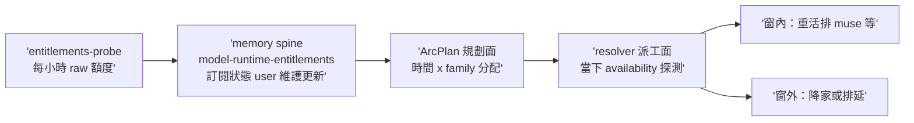

## Description

<!-- SECTION:DESCRIPTION:BEGIN -->
user 補充（2026-10-02 夜，概念逐字）：「另外 arc plan 應該要利用 memory spine 規劃怎樣根據時間分配使用的 llm model, 概念是這樣, 那邊會更新目前訂閱狀況」——ArcPlan 的 dispatch 規劃應具備時間維度：依 memory spine 維護的目前訂閱狀態（`model-runtime-entitlements` 等 spine 條目）把 legs 排進各 family 的可用窗（muse 5h 訂閱窗／codex webgpt vs native 額度面／glm provider 帳號面），窗耗盡前降家或排延。

**現狀與缺口**：model-routing resolver 於派工當下 JIT 探測 availability（當下快照，無時間前瞻）；entitlements-probe 每小時落地 `~/.agents/probe-entitlements/`（raw 額度數據）；spine 條目由 ai-guide session 讀 probe 校驗後手寫。本夜實證：muse 窗耗盡四次 failed-usage（含 tri 腿自身） 都是「派工當下才知道」——plan 層若知窗，可排延或先派他家。缺口＝plan/dispatch 層無時間×family 的分配視野，spine 資料也無機械消費面。

**候選方向（供 tri 攻擊）**：(a) ArcPlan budget_context 擴 per-family time-window constraints（窗內排重活、窗外排延/降家）；(b) resolver 增 spine 讀取腿——dispatch 時查 entitlements 給「現在可用＋下一窗重置」建議（與既有 availability snapshot 當下探測的關係要釐清：spine=計畫面慢資料、探測=派工面快事實）；(c) deep-work 批量模式依 spine 排卡序（窗對齊）；(d) entitlements-probe→spine 同步半自動化（現為 session 手寫——資料新鮮度是 (a)(b) 的前置）。

**邊界**：禁自動化訂閱/付費變更；model-routing resolver 契約變更＝該 skill owner 面需審；spine 寫手契約（ai-guide session）不變。

**流程**：明早 muse＋codex tri（概念已凍結於本卡）→ Plan Preview → 實作。本夜不動工——兩線（235／135.11）與 model-routing 高影響面。

<!-- SECTION:DESCRIPTION:END -->

## Implementation Plan

<!-- SECTION:PLAN:BEGIN -->
capture 卡：本夜只凍結概念＋現狀缺口＋候選方向；AC 待 tri 收斂後於 Plan Preview 前補（帶 grammar verifier）。tri 腿＝muse＋codex（bridge）；參考材料＝skills/model-routing/SKILL.md（resolver／availability snapshot）＋scripts/probe_entitlements.py＋spine `model-runtime-entitlements` 條目＋本夜 muse failed-usage 兩實證（AIR-235／AIR-135.11 journal）。
<!-- SECTION:PLAN:END -->

## Acceptance Criteria

- [ ] #1 tri 收斂 verdict 存檔＋方案定稿（含 AC grammar 草案）記本卡（tri 後結算時判定本條最終形） `rg -c "定稿" "backlog/tasks/air-238 - ArcPlan-時間×模型分配規劃——dispatch-依-memory-spine-訂閱狀態排-family-model-時窗（user-概念凍結；明早-tri）.md"` → ≥1
