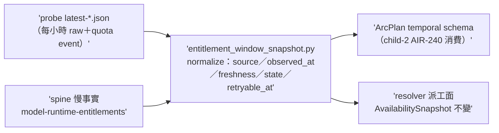

## Description

<!-- SECTION:DESCRIPTION:BEGIN -->
AIR-238 parent 卡切 child-1（實 id 順序＝AIR-239；tri 收斂 codex job-murfan77＋glm job-murfksif，muse 四度 failed-usage 缺席；verdicts 存 .agent-tmp/air-238/）。做什麼：`scripts/entitlement_window_snapshot.py`（新）——讀 `~/.agents/probe-entitlements/latest-*.json`＋quota-event（probe_entitlements.py 既有 parser 的 retryable_at）＋spine `model-runtime-entitlements` 慢事實，normalize 成 per family/pool 的 `{source, observed_at, freshness, state, retryable_at}` planning 證據（--json 輸出）。

設計契約（tri 定稿）：①衝突序＝fresh direct probe/event > 較舊 spine observation；stale 一律降 unknown；帶 provider reset timestamp 的事件 > 依週期推算 ②**muse 誠實條款**——probe 對 muse unsupported、無 anchor 時 state=unknown/retryable_at 缺席，禁從 5h 週期合成 reset ③與 availability_snapshot.py 的關係＝child-1 設計期決策（擴它或平行新檔——它已讀 spine＋catalog 做 tri-state，evaluator-not-router 邊界不變）④spine 寫手契約不動（本卡純讀）。不做：ArcPlan schema 動（child-2＝AIR-240）；deep-work 排序；spine 機械寫入。

<!-- SECTION:DESCRIPTION:END -->

## Implementation Plan

<!-- SECTION:PLAN:BEGIN -->
單 impl unit（TDD）：snapshot evaluator＋tests（fixtures 用 probe 實檔＋合成 quota event）；設計期先裁決「擴 availability_snapshot.py 或平行新檔」（記 journal）；不做 schema/排序面。
<!-- SECTION:PLAN:END -->

## Acceptance Criteria

- [ ] #1 planning snapshot provenance `uv run python scripts/entitlement_window_snapshot.py --probe-dir ~/.agents/probe-entitlements --json` → exit 0 且每 family/pool 帶 source/observed_at/freshness/state/retryable_at；muse structured source 缺席時必為 unknown 不得合成 reset
- [ ] #2 衝突序與 stale 行為測試（fresh probe>舊 spine／stale→unknown／provider reset 時間戳>週期推算） `uv run pytest tests/test_entitlement_window_snapshot.py` → exit 0
- [ ] #3 muse 誠實 unknown 否證（無 anchor 時合成 reset 的 mutation 會紅） `rg -c "unknown" tests/test_entitlement_window_snapshot.py` → ≥2
- [ ] #4 quota-event retryable_at（僅唯一 reset 時間戳才生成；無則缺席） `rg -c "retryable_at" scripts/entitlement_window_snapshot.py` → ≥1 且 pytest 覆蓋
- [ ] #5 設計決策記 journal（擴 availability_snapshot 或平行；evaluator-not-router 邊界不變聲明） `rg -c "evaluator-not-router" scripts/entitlement_window_snapshot.py .agent-tmp/air-239/journal-impl.md 2>/dev/null || rg -c "evaluator-not-router" scripts/entitlement_window_snapshot.py` → ≥1
