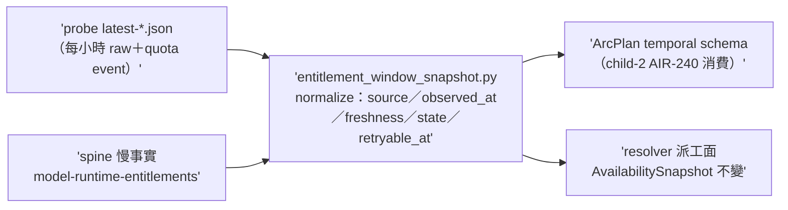
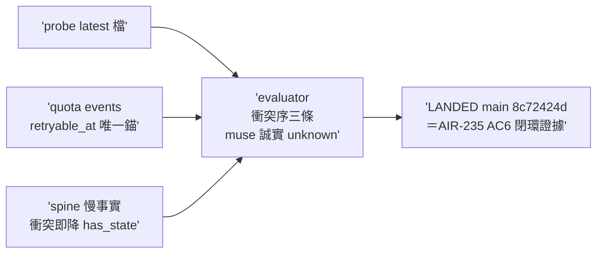

## Description

<!-- SECTION:DESCRIPTION:BEGIN -->
AIR-238 parent 卡切 child-1（實 id 順序＝AIR-239；tri 收斂 codex job-murfan77＋glm job-murfksif，muse 四度 failed-usage 缺席；verdicts 存 .agent-tmp/air-238/）。做什麼：`scripts/entitlement_window_snapshot.py`（新）——讀 `~/.agents/probe-entitlements/latest-*.json`＋quota-event（probe_entitlements.py 既有 parser 的 retryable_at）＋spine `model-runtime-entitlements` 慢事實，normalize 成 per family/pool 的 `{source, observed_at, freshness, state, retryable_at}` planning 證據（--json 輸出）。

設計契約（tri 定稿）：①衝突序＝fresh direct probe/event > 較舊 spine observation；stale 一律降 unknown；帶 provider reset timestamp 的事件 > 依週期推算 ②**muse 誠實條款**——probe 對 muse unsupported、無 anchor 時 state=unknown/retryable_at 缺席，禁從 5h 週期合成 reset ③與 availability_snapshot.py 的關係＝child-1 設計期決策（擴它或平行新檔——它已讀 spine＋catalog 做 tri-state，evaluator-not-router 邊界不變）④spine 寫手契約不動（本卡純讀）。不做：ArcPlan schema 動（child-2＝AIR-240）；deep-work 排序；spine 機械寫入。

<!-- SECTION:DESCRIPTION:END -->

## Implementation Plan

<!-- SECTION:PLAN:BEGIN -->
單 impl unit（TDD）：snapshot evaluator＋tests（fixtures 用 probe 實檔＋合成 quota event）；設計期先裁決「擴 availability_snapshot.py 或平行新檔」（記 journal）；不做 schema/排序面。
<!-- SECTION:PLAN:END -->

## Acceptance Criteria

- [x] #1 planning snapshot provenance `uv run python scripts/entitlement_window_snapshot.py --probe-dir ~/.agents/probe-entitlements --json` → exit 0 且每 family/pool 帶 source/observed_at/freshness/state/retryable_at；muse structured source 缺席時必為 unknown 不得合成 reset
- [x] #2 衝突序與 stale 行為測試（fresh probe>舊 spine／stale→unknown／provider reset 時間戳>週期推算） `uv run pytest tests/test_entitlement_window_snapshot.py` → exit 0
- [x] #3 muse 誠實 unknown 否證（無 anchor 時合成 reset 的 mutation 會紅） `rg -c "unknown" tests/test_entitlement_window_snapshot.py` → ≥2
- [x] #4 quota-event retryable_at（僅唯一 reset 時間戳才生成；無則缺席） `rg -c "retryable_at" scripts/entitlement_window_snapshot.py` → ≥1 且 pytest 覆蓋
- [x] #5 設計決策記 journal（擴 availability_snapshot 或平行；evaluator-not-router 邊界不變聲明） `rg -c "evaluator-not-router" scripts/entitlement_window_snapshot.py .agent-tmp/air-239/journal-impl.md 2>/dev/null || rg -c "evaluator-not-router" scripts/entitlement_window_snapshot.py` → ≥1

## Implementation Notes

<!-- SECTION:NOTES:BEGIN -->
**四數量測（settle 結算）**：first_handback_complete＝TRUE（impl 首收 join 4/4）；repair_rounds＝1（fresh NO-GO 2 Critical＋codex GO-WITH-FIXES 2 Important → 修復批 R1-R4；兩腿在 spine 衍生與時鐘綁定兩核心完全重合，fresh 以真 spine 實測更狠——今晨 spine 更新意外成 F1 live 顯形劑）；marshal_direct_impl_violation＝0；settle_wait＝t_dispatch 1790955000 前後 → t_landed 1790979651 約 68min（含雙腿＋修復批；Plan Preview 被自家 phase enum 閘攔一次＝AIR-235 AC6 dogfood-again 首證）。

judge 裁決紀錄：fresh F1 spine 複合可用行 word-boundary 誤判（canonical 衝突檢查未移植）→移植＋降 has_state＋WARN；codex F1 同域（unsupported 被 spine 升格）→unsupported 無 anchor 恆 unknown＋翻轉錯 oracle；F2 兩套時鐘 time-bomb→單一 now 穿透三 loader；F3/F4 較小併批。未解決（judge 裁量接受）：probe ok 加 raw limit_reached 時 row available 的語義縫（新發現，歸 AIR-240 地形）；quota-events.jsonl writer 弧不存在（如實披露）。
<!-- SECTION:NOTES:END -->

## Final Summary

<!-- SECTION:FINAL_SUMMARY:BEGIN -->
**as-built 終態**（main 8c72424d）：EntitlementWindowSnapshot 資料面落地——三源 normalize（probe latest＋quota-event retryable_at＋spine 慢事實）成 per family/pool 五欄 planning 證據；衝突序三條釘死（fresh probe 大於舊 spine／stale 必 unknown／provider reset 時間戳大於週期推算）；muse 誠實條款全防線（unsupported 無 anchor 恆 unknown、spine 禁升格、複合可用行限制詞共現降 has_state、缺可用行禁造 unavailable、禁 5h 週期合成）；單一 now 穿透全 loader。**AIR-235 AC6 dogfood-again 完成**：本弧 plan-v1 authoring 時間被 phase enum 閘攔（大寫七行）修正後過五站閘——證據本卡 journal 加 .agent-tmp/air-239/。真數據實證：muse＝unknown（停用至 10-05）、codex-native retryable_at＝2026-10-08（provider 真時間戳）。

<!-- SECTION:FINAL_SUMMARY:END -->
