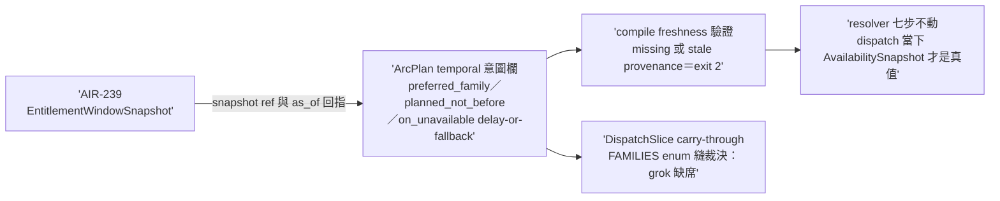

## Description

<!-- SECTION:DESCRIPTION:BEGIN -->
AIR-238 parent 卡切 child-2（實 id 順序＝AIR-240；依賴 AIR-239 snapshot 資料面）。ArcPlan 加 temporal 意圖欄（preferred_family／planned_not_before／on_unavailable＋entitlement_snapshot_ref/hash/as_of）＋compile stage freshness 驗證（missing/stale provenance exit 2）＋DispatchSlice carry-through；FAMILIES enum 縫裁決（grok 缺席）。resolver 七步/explicit-only/no-silent-downgrade 不動。AC 詳卡面（tri 後補 grammar）。

<!-- SECTION:DESCRIPTION:END -->

## Implementation Plan

<!-- SECTION:PLAN:BEGIN -->
依賴 AIR-239 已落地（snapshot 資料面在場）。單 impl unit：①ArcPlan temporal 意圖欄（work-unit 級 preferred_family／planned_not_before／on_unavailable={delay,fallback}＋entitlement_snapshot_ref/hash/as_of——**snapshot 檔存在＋freshness 驗證，missing/stale provenance exit 2**；易爛真值禁入 plan）②DispatchSlice carry-through（同欄投影）③FAMILIES enum 縫裁決（grok 有 bridge binding 無 slice 值——本卡裁決擴 enum 並補一致性測試釘 arc_spec×catalog 關係）④model-routing SKILL 補 planning-vs-dispatch authority contract（窄改：七步/catalog/presets 不動）。收線鏈全形（五站閘必過——239 前例）。
<!-- SECTION:PLAN:END -->

## Acceptance Criteria

- [ ] #1 ArcPlan temporal 意圖欄＋compile 驗證——fresh snapshot ref＋合法 policy 過閘 `uv run python scripts/arc_spec.py validate --kind arc-plan --stage compile tests/fixtures/arc-plan/temporal-valid.json` → exit 0
- [ ] #2 missing/stale provenance fail-loud `uv run python scripts/arc_spec.py validate --kind arc-plan --stage compile tests/fixtures/arc-plan/temporal-stale-provenance.json` → exit 2 且明列原因
- [ ] #3 DispatchSlice carry-through＋resolver 契約 regression（preferred unavailable 時 delay 產生 zero-dispatch；fallback 只落 qualified＋available＋explicitly allowed；stale/unknown 永不派） `uv run pytest tests/test_arc_spec.py tests/test_availability_snapshot.py` → exit 0
- [ ] #4 FAMILIES enum 縫裁決落地＋一致性測試釘 arc_spec×catalog 關係（擴 grok 或裁決記錄，兩者皆有一條明文測試） `uv run pytest tests/test_arc_spec.py -k families` → exit 0
- [ ] #5 model-routing SKILL 補 planning-vs-dispatch authority contract `rg -c "EntitlementWindowSnapshot|planning.*authority|authority.*planning" skills/model-routing/SKILL.md` → ≥1
- [ ] #6 本弧 settle-state 全程轉移史終態 LANDED `uv run python scripts/arc_settle_state.py show --arc AIR-240 --dir .agent-tmp/settle-queue` → exit 0 且 state 為 LANDED
