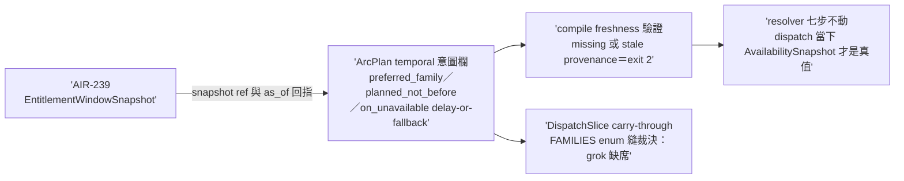
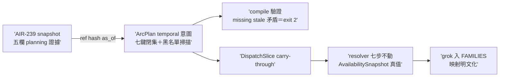

## Description

<!-- SECTION:DESCRIPTION:BEGIN -->
AIR-238 parent 卡切 child-2（實 id 順序＝AIR-240；依賴 AIR-239 snapshot 資料面）。ArcPlan 加 temporal 意圖欄（preferred_family／planned_not_before／on_unavailable＋entitlement_snapshot_ref/hash/as_of）＋compile stage freshness 驗證（missing/stale provenance exit 2）＋DispatchSlice carry-through；FAMILIES enum 縫裁決（grok 缺席）。resolver 七步/explicit-only/no-silent-downgrade 不動。AC 詳卡面（tri 後補 grammar）。

<!-- SECTION:DESCRIPTION:END -->

## Implementation Plan

<!-- SECTION:PLAN:BEGIN -->
依賴 AIR-239 已落地（snapshot 資料面在場）。單 impl unit：①ArcPlan temporal 意圖欄（work-unit 級 preferred_family／planned_not_before／on_unavailable={delay,fallback}＋entitlement_snapshot_ref/hash/as_of——**snapshot 檔存在＋freshness 驗證，missing/stale provenance exit 2**；易爛真值禁入 plan）②DispatchSlice carry-through（同欄投影）③FAMILIES enum 縫裁決（grok 有 bridge binding 無 slice 值——本卡裁決擴 enum 並補一致性測試釘 arc_spec×catalog 關係）④model-routing SKILL 補 planning-vs-dispatch authority contract（窄改：七步/catalog/presets 不動）。收線鏈全形（五站閘必過——239 前例）。
<!-- SECTION:PLAN:END -->

## Acceptance Criteria

- [x] #1 ArcPlan temporal 意圖欄＋compile 驗證——fresh snapshot ref＋合法 policy 過閘 `uv run python scripts/arc_spec.py validate --kind arc-plan --stage compile tests/fixtures/arc-plan/temporal-valid.json` → exit 0
- [x] #2 missing/stale provenance fail-loud `uv run python scripts/arc_spec.py validate --kind arc-plan --stage compile tests/fixtures/arc-plan/temporal-stale-provenance.json` → exit 2 且明列原因
- [x] #3 DispatchSlice carry-through＋resolver 契約 regression（preferred unavailable 時 delay 產生 zero-dispatch；fallback 只落 qualified＋available＋explicitly allowed；stale/unknown 永不派） `uv run pytest tests/test_arc_spec.py tests/test_availability_snapshot.py` → exit 0
- [x] #4 FAMILIES enum 縫裁決落地＋一致性測試釘 arc_spec×catalog 關係（擴 grok 或裁決記錄，兩者皆有一條明文測試） `uv run pytest tests/test_arc_spec.py -k families` → exit 0
- [x] #5 model-routing SKILL 補 planning-vs-dispatch authority contract `rg -c "EntitlementWindowSnapshot|planning.*authority|authority.*planning" skills/model-routing/SKILL.md` → ≥1
- [x] #6 本弧 settle-state 全程轉移史終態 LANDED `uv run python scripts/arc_settle_state.py show --arc AIR-240 --dir .agent-tmp/settle-queue` → exit 0 且 state 為 LANDED

## Implementation Notes

<!-- SECTION:NOTES:BEGIN -->
**四數量測（settle 結算）**：first_handback_complete＝TRUE（impl 首收 join 5/5）；repair_rounds＝1（fresh GO-WITH-FIXES 三黃＋codex GO-WITH-FIXES 三 Important——兩腿在「易爛真值只封 block」與「generated_at fail-open」完全重合 → 修復批 R1-R5 全落地）；marshal_direct_impl_violation＝0；settle_wait＝t_dispatch 1790981617 → t_landed 1790989053 ≈ 124min（impl 本身 59 分＝全 session 最重 worker——10.7M tokens）。

judge 裁決紀錄：J1 volatile 真值繞道（fresh 機驗 errors:0＋codex 判 contract 窄於 WO）→裁黑名單掃描路線（不關擴充面）＋docstring 精確圈範；J2 generated_at fail-open（兩腿重合）→存在＋可解析＋UTC 三重 prerequisite＋無條件 equality；J3 receipt grok loud→silent→同形 raise；J4 AC#3 claim 過寬（resolver decision 無 code 閘）→收窄記錄＋oracle 歸 follow-up；J5 producer-attested freshness 邊界明文化（非防偽）。worker 偏差 D1-D3 judge 全核可（bridge-binding-token 映射／stale 閾值歸 producer／receipt_normalize ripple）。
<!-- SECTION:NOTES:END -->

## Final Summary

<!-- SECTION:FINAL_SUMMARY:BEGIN -->
**as-built 終態**（main 54a6a3d4）：ArcPlan temporal schema 落地——temporal_allocation 七鍵閉集（易爛真值禁令＋VOLATILE_TRUTH_STEMS 黑名單掃頂層與 work-unit sibling）＋provenance 機驗三件（ref 存在／sha256 canonical／as_of 綁 generated_at 且非未來）＋DispatchSlice carry-through 三欄＋FAMILIES 擴 grok（bridge-binding 映射明文化＋一致性測試釘 arc_spec×catalog）＋矛盾 policy 三條＋model-routing「Planning vs dispatch authority」契約節。**producer-attested freshness 邊界明文**（自簽自驗非防偽——真閘＝dispatch JIT AvailabilitySnapshot）。三層 authority 定稿全通：ArcPlan 意圖→EntitlementWindowSnapshot 證據→AvailabilitySnapshot 真值。

<!-- SECTION:FINAL_SUMMARY:END -->
