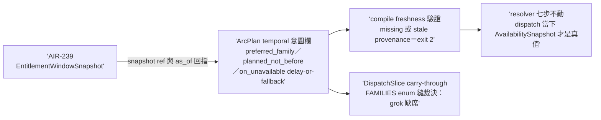

## Description

<!-- SECTION:DESCRIPTION:BEGIN -->
AIR-238 parent 卡切 child-2（實 id 順序＝AIR-240；依賴 AIR-239 snapshot 資料面）。ArcPlan 加 temporal 意圖欄（preferred_family／planned_not_before／on_unavailable＋entitlement_snapshot_ref/hash/as_of）＋compile stage freshness 驗證（missing/stale provenance exit 2）＋DispatchSlice carry-through；FAMILIES enum 縫裁決（grok 缺席）。resolver 七步/explicit-only/no-silent-downgrade 不動。AC 詳卡面（tri 後補 grammar）。

<!-- SECTION:DESCRIPTION:END -->
