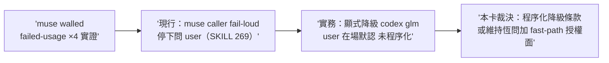
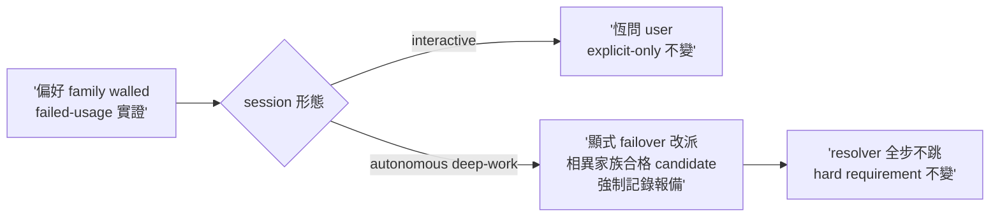

## Description

<!-- SECTION:DESCRIPTION:BEGIN -->
skills/model-routing/SKILL.md:269 觀察（前弧標記另卡）：解析表 muse caller 恆 fail-loud 停下問 user，但本 session 實證 muse 窗耗盡連四度、實務都走顯式降級 codex/glm（user 在場默認）——條文與實務的接縫（walled 場景的顯式程序化）＋AIR-230 grok 候選資格認證進度對解析表候選清單的影響，需政策卡走審查閘。詳見卡面。

muse walled 場景（本 session 四度實證）的顯式降級程序化＋grok 候選資格認證對解析表的影響。

<!-- SECTION:DESCRIPTION:END -->

## Implementation Plan

<!-- SECTION:PLAN:BEGIN -->
user 裁決＝場景分岔（1003 晨）：interactive 恆問不變；autonomous/deep-work 場景 muse walled（failed-usage 實證）→顯式降級至相異家族合格 candidate＋強制記錄＋completion report 報備——禁靜默。單 impl unit 改 model-routing SKILL:269 區＋drift 掃描；收線鏈全形＋雙腿（政策語義變更走完整閘）。
<!-- SECTION:PLAN:END -->

## Acceptance Criteria

- [x] #1 場景分岔條款落地（interactive 恆問保留＋autonomous 顯式降級路徑） `rg -c "walled" skills/model-routing/SKILL.md` → ≥1
- [x] #2 三要素在場（顯式降級／強制記錄／報備） `rg -c "報備" skills/model-routing/SKILL.md` → ≥1
- [x] #3 禁靜默語義不破（既有 no-silent-downgrade 條文零改動） `uv run pytest tests/test_sync_agents.py` → exit 0
- [x] #4 drift 掃描執行並記 journal（fail-loud／explicit-only 引用面前後對照） `rg -n "fail-loud" skills/model-routing/SKILL.md` → exit 0

## Implementation Notes

<!-- SECTION:NOTES:BEGIN -->
**四數量測（settle 結算）**：first_handback_complete＝TRUE（impl 首收 join 4/4）；repair_rounds＝1（codex 抓措辭衝突——顯式降級撞 explicit-only 與 65 行同詞兩義；fresh 抓跨檔 drift——state-review 21 行重刻 stale 語義；兩腿互補全收）；marshal_direct_impl_violation＝0；settle_wait＝t_dispatch 1790983000 前後 → t_landed 1790992000 前後約 150min（多弧並行佔資源）。

judge 裁決紀錄：R1 措辭修正（failover 改派取代降級——65 行同詞兩義解消加 standing-policy 例外 precedence 句）；R2 跨檔同步（state-review 21 行重刻改 pointer 單一源加 AIR-230 形漏同步防線——新條款在深審腿鏈可達）。worker 偏差：R1 測試子項 CONTRACT_BLOCKED（禁碰 tests 與恰兩檔衝突）→rg 契約六條承載錨定詞（核可）；殘留標記 model-routing 397 行與 state-review 37 行仍用降級指 failover 語義——judge 裁量接受記 follow-up（非 operative 條款）。
<!-- SECTION:NOTES:END -->

## Final Summary

<!-- SECTION:FINAL_SUMMARY:BEGIN -->
**as-built 終態**（main d4333da5）：model-routing 跨家族解析表 walled 場景分岔條款落地——偏好 family walled（failed-usage 實證）時：interactive session 恆問 user 不變；autonomous 與 deep-work session 顯式 failover 改派至相異家族合格 candidate（precedence 句明示＝前條 explicit-only 的場景化例外，user 裁決授權；hard requirement 不變）加強制記錄與 completion report 報備禁靜默。跨檔同步：state-review 21 行重刻語義 pointer 化單一源（AIR-230 形漏同步防線）。昨夜 muse 四度 walled 的實證接縫正式程序化。

<!-- SECTION:FINAL_SUMMARY:END -->
__zcode_status=$?
if [ "$__zcode_status" -eq 0 ]; then pwd -P > '/var/folders/h8/q6jpct1x4d1g4xt_7g2r06080000gp/T/zcode-2099ed9a-4423-4006-919e-6af79173f37c-cwd'; fi
exit "$__zcode_status"