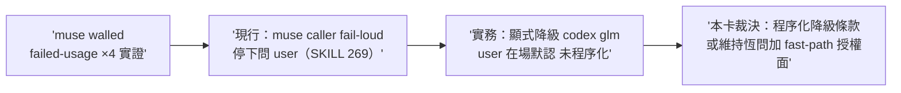

## Description

<!-- SECTION:DESCRIPTION:BEGIN -->
skills/model-routing/SKILL.md:269 觀察（前弧標記另卡）：解析表 muse caller 恆 fail-loud 停下問 user，但本 session 實證 muse 窗耗盡連四度、實務都走顯式降級 codex/glm（user 在場默認）——條文與實務的接縫（walled 場景的顯式程序化）＋AIR-230 grok 候選資格認證進度對解析表候選清單的影響，需政策卡走審查閘。詳見卡面。

muse walled 場景（本 session 四度實證）的顯式降級程序化＋grok 候選資格認證對解析表的影響。

<!-- SECTION:DESCRIPTION:END -->

## Implementation Plan

<!-- SECTION:PLAN:BEGIN -->
user 裁決＝場景分岔（1003 晨）：interactive 恆問不變；autonomous/deep-work 場景 muse walled（failed-usage 實證）→顯式降級至相異家族合格 candidate＋強制記錄＋completion report 報備——禁靜默。單 impl unit 改 model-routing SKILL:269 區＋drift 掃描；收線鏈全形＋雙腿（政策語義變更走完整閘）。
<!-- SECTION:PLAN:END -->

## Acceptance Criteria

- [ ] #1 場景分岔條款落地（interactive 恆問保留＋autonomous 顯式降級路徑） `rg -c "walled" skills/model-routing/SKILL.md` → ≥1
- [ ] #2 三要素在場（顯式降級／強制記錄／報備） `rg -c "報備" skills/model-routing/SKILL.md` → ≥1
- [ ] #3 禁靜默語義不破（既有 no-silent-downgrade 條文零改動） `uv run pytest tests/test_sync_agents.py` → exit 0
- [ ] #4 drift 掃描執行並記 journal（fail-loud／explicit-only 引用面前後對照） `rg -n "fail-loud" skills/model-routing/SKILL.md` → exit 0

