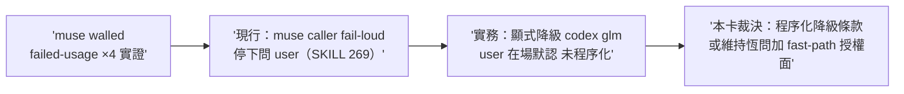

## Description

<!-- SECTION:DESCRIPTION:BEGIN -->
skills/model-routing/SKILL.md:269 觀察（前弧標記另卡）：解析表 muse caller 恆 fail-loud 停下問 user，但本 session 實證 muse 窗耗盡連四度、實務都走顯式降級 codex/glm（user 在場默認）——條文與實務的接縫（walled 場景的顯式程序化）＋AIR-230 grok 候選資格認證進度對解析表候選清單的影響，需政策卡走審查閘。詳見卡面。

muse walled 場景（本 session 四度實證）的顯式降級程序化＋grok 候選資格認證對解析表的影響。

<!-- SECTION:DESCRIPTION:END -->
