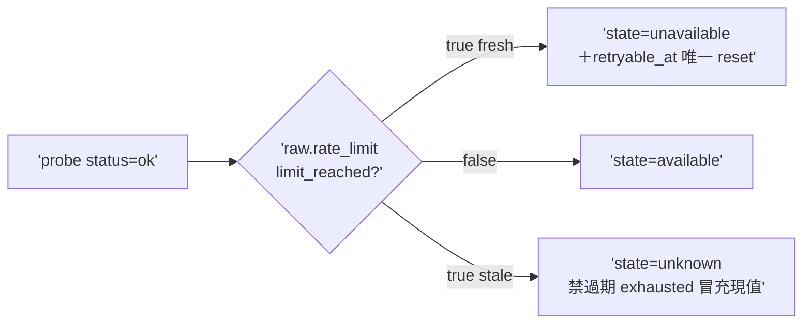

## Description

<!-- SECTION:DESCRIPTION:BEGIN -->
codex 審核 #1（真 bug confirmed——本日 probe 實檔兩筆 limit_reached:true 命中）。entitlement_window_snapshot.py:311 status=ok 直接 available 不讀 raw.rate_limit.limit_reached。scope 只修 truth normalization：ok+limit_reached=true→unavailable（fresh＋唯一 reset 帶 retryable_at）／false→available／stale 的 exhausted→unknown 禁冒充現值。AC 詳卡面。

## Implementation Plan

<!-- SECTION:PLAN:BEGIN -->
單 impl unit（TDD）：entitlement_window_snapshot.py truth normalization 修＋fixtures（本日雙實檔 limit_reached:true 為基底）＋既有 precedence 不退化測。收線鏈全形＋fresh 腿（真 bug 修復面小——單腿足）。
<!-- SECTION:PLAN:END -->

## Acceptance Criteria

- [ ] #1 status=ok＋limit_reached=true → state=unavailable `uv run pytest tests/test_entitlement_window_snapshot.py -k 'limit_reached'` → exit 0
- [ ] #2 反例：limit_reached=false → available `rg -c "limit_reached" tests/test_entitlement_window_snapshot.py` → ≥3
- [ ] #3 stale 的 exhausted → unknown（禁過期冒充現值） `uv run pytest tests/test_entitlement_window_snapshot.py` → exit 0
- [ ] #4 既有 muse/spine/event precedence 不退化 `uv run pytest tests/test_entitlement_window_snapshot.py tests/test_arc_settle_state.py` → exit 0
<!-- SECTION:DESCRIPTION:END -->
