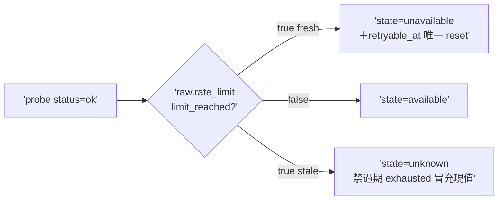
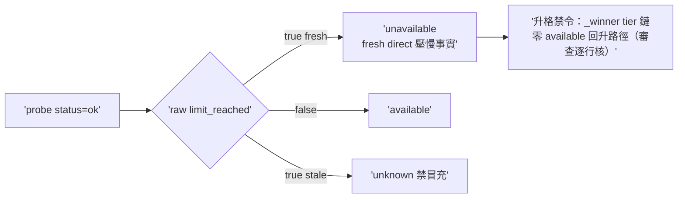

## Description

<!-- SECTION:DESCRIPTION:BEGIN -->
codex 審核 #1（真 bug confirmed——本日 probe 實檔兩筆 limit_reached:true 命中）。entitlement_window_snapshot.py:311 status=ok 直接 available 不讀 raw.rate_limit.limit_reached。scope 只修 truth normalization：ok+limit_reached=true→unavailable（fresh＋唯一 reset 帶 retryable_at）／false→available／stale 的 exhausted→unknown 禁冒充現值。AC 詳卡面。

## Implementation Plan

<!-- SECTION:PLAN:BEGIN -->
單 impl unit（TDD）：entitlement_window_snapshot.py truth normalization 修＋fixtures（本日雙實檔 limit_reached:true 為基底）＋既有 precedence 不退化測。收線鏈全形＋fresh 腿（真 bug 修復面小——單腿足）。
<!-- SECTION:PLAN:END -->

## Acceptance Criteria

- [x] #1 status=ok＋limit_reached=true → state=unavailable `uv run pytest tests/test_entitlement_window_snapshot.py -k 'limit_reached'` → exit 0
- [x] #2 反例：limit_reached=false → available `rg -c "limit_reached" tests/test_entitlement_window_snapshot.py` → ≥3
- [x] #3 stale 的 exhausted → unknown（禁過期冒充現值） `uv run pytest tests/test_entitlement_window_snapshot.py` → exit 0
- [x] #4 既有 muse/spine/event precedence 不退化 `uv run pytest tests/test_entitlement_window_snapshot.py tests/test_arc_settle_state.py` → exit 0
<!-- SECTION:DESCRIPTION:END -->

## Implementation Notes

<!-- SECTION:NOTES:BEGIN -->
**四數量測（settle 結算）**：first_handback_complete＝TRUE（impl 首收 join 4/4）；repair_rounds＝0（fresh 腿 GO 零必修——真值表三態＋升格禁令＋retryable 唯一 reset 全數機械重現）；marshal_direct_impl_violation＝0；settle_wait＝t_dispatch 1790999000 前後 → t_landed 1790995000 前後約 55min。

**結案複核附記（fresh F1 綠建議）**：limit_reached null／非 bool 暫歸 available——provider schema 恆 bool 風險低；後續弧碰同檔時補 null 釘死測或改判 unknown（顯式化契約）。verdict：GO（全文存 .agent-tmp/air-243/ fresh 腿回執）。
<!-- SECTION:NOTES:END -->

## Final Summary

<!-- SECTION:FINAL_SUMMARY:BEGIN -->
**as-built 終態**（main 78150abe）：probe truth normalization 落地——status=ok 必讀 raw.rate_limit.limit_reached：true fresh→unavailable（fresh direct 壓 spine/event 禁升格，_winner tier 鏈零升格路徑經 fresh 腿逐行核）／stale exhausted→unknown（過期禁冒充）／false→available 保留；真檔 fixtures（本日雙 limit_reached:true 實檔）。真數據實證：codex/codex-native=unavailable（retryable_at 歧義→null）、muse=unknown、glm/codex-web=available 零誤傷。

<!-- SECTION:FINAL_SUMMARY:END -->
__zcode_status=$?
if [ "$__zcode_status" -eq 0 ]; then pwd -P > '/var/folders/h8/q6jpct1x4d1g4xt_7g2r06080000gp/T/zcode-a76c12f8-a0f9-40a5-af0d-8bbd86029407-cwd'; fi
exit "$__zcode_status"