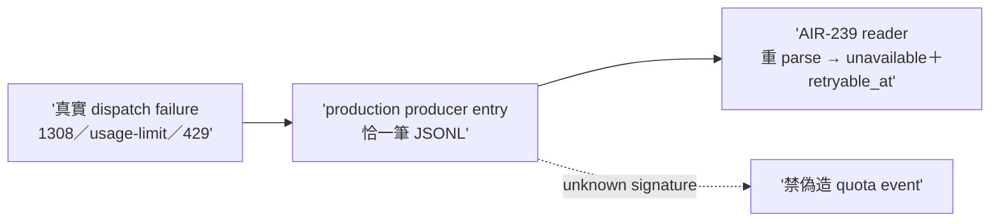

## Description

<!-- SECTION:DESCRIPTION:BEGIN -->
codex 審核 #2（contract 兩頭沒接上——reader 讀 quota-events.jsonl 但 production writer 不存在）。找到持有原始 provider failure message 的 authoritative failure surface（1308／native usage-limit／429 的真實 dispatch failure 入口）接成唯一 producer；cross-repo handoff 若 owner 在 delegate-bridge。AC 詳卡面。

## Implementation Plan

<!-- SECTION:PLAN:BEGIN -->
單 impl unit（TDD）：找到 authoritative failure surface（真實 dispatch failure 入口——agent-workflow／model-routing 面）接 production writer；owner 在 delegate-bridge 則 cross-repo handoff 記 deviation。收線鏈全形＋fresh 腿。
<!-- SECTION:PLAN:END -->

## Acceptance Criteria

- [x] #1 synthetic 1308／usage-limit／429 經 production entry 寫出恰一筆 JSONL `uv run pytest tests/test_quota_event_ingest.py` → exit 0
- [x] #2 unknown signature 禁偽造＋malformed fail-loud `rg -c "fail" tests/test_quota_event_ingest.py` → ≥1
- [x] #3 reader 閉環——producer 寫的 raw row 被 AIR-239 reader 重 parse 成 unavailable＋合法 retryable_at `uv run pytest tests/test_quota_event_ingest.py tests/test_entitlement_window_snapshot.py -k 'quota_event or ingest'` → exit 0
- [x] #4 production caller 在場（helper 直呼不算） `rg -n "capture_quota_event" scripts/ tests/` → ≥2 處含 production caller
<!-- SECTION:DESCRIPTION:END -->

## Implementation Notes

<!-- SECTION:NOTES:BEGIN -->
**四數量測（settle 結算）**：first_handback_complete＝TRUE（impl 首收 join 4/4）；repair_rounds＝0（fresh GO-WITH-FIXES——唯一必解 F1 是裁決非 code，F2-F4 綠級記錄不修）；marshal_direct_impl_violation＝0；settle_wait＝t_dispatch 1790999000 前後 → t_landed 1790996000 前後約 55min。

**F1 排程掛點裁決（主 session）**：ingest 不自動化成 cron——掛兩個消費同時點：一、ArcPlan 組裝與 Plan Preview 前 marshal 跑 ingest（planning 證據按需新鮮）；二、AIR-241 walled failover 裁決當下跑（降級決策需 fresh events）。理由：events 檔是 advisory planning evidence，派工真值＝dispatch JIT AvailabilitySnapshot——為 advisory 面加常駐自動化違反 fast telemetry 不灌 slow state 的同一精神（與 spine 寫手契約同理）。**ingest 生產排程掛點就此裁決閉環**（handback unresolved 第一項解除）；GLM 1308 空格式解析缺口保留為另卡候選（真實 ledger 有實例）。

fresh 腿四軸全過：production entry 真在場（11 測全經 main）；真 ledger errorExcerpt 抽驗含真 429 與 1308 訊息；否證 2 支轉紅；真實閉環 muse retryable_at＝2026-10-05T00:00Z 與 spine 錨點一致。
<!-- SECTION:NOTES:END -->

## Final Summary

<!-- SECTION:FINAL_SUMMARY:BEGIN -->
**as-built 終態**（main 7ff46526）：quota-event ingress closure 落地——quota_event_ingest.py production writer（authoritative failure surface＝bridge ledger errorExcerpt；ingest-event 單事件＋ingest ledger sweep 兩入口；恰一筆 family/message/observed_at_utc 冪等去重；unknown 禁偽造；malformed fail-loud all-or-nothing）＋11 測全經 production entry。真 ledger 實跑：candidates=52 hits=11（muse 429×7＋glm 1308×3）冪等雙跑 0/11；閉環——AIR-239 reader 重 parse 出 muse unavailable＋retryable_at＝2026-10-05T00:00Z（spine 錨點一致）。排程掛點裁決：不自動化 cron——掛 ArcPlan 組裝前＋walled failover 裁決當下兩消費同時點。

<!-- SECTION:FINAL_SUMMARY:END -->
__zcode_status=$?
if [ "$__zcode_status" -eq 0 ]; then pwd -P > '/var/folders/h8/q6jpct1x4d1g4xt_7g2r06080000gp/T/zcode-07800139-c2a2-4030-b4f3-4c8a12761bcd-cwd'; fi
exit "$__zcode_status"
