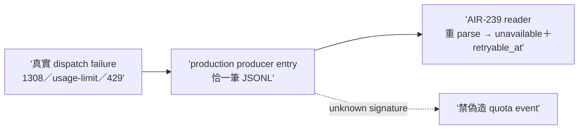

## Description

<!-- SECTION:DESCRIPTION:BEGIN -->
codex 審核 #2（contract 兩頭沒接上——reader 讀 quota-events.jsonl 但 production writer 不存在）。找到持有原始 provider failure message 的 authoritative failure surface（1308／native usage-limit／429 的真實 dispatch failure 入口）接成唯一 producer；cross-repo handoff 若 owner 在 delegate-bridge。AC 詳卡面。

## Implementation Plan

<!-- SECTION:PLAN:BEGIN -->
單 impl unit（TDD）：找到 authoritative failure surface（真實 dispatch failure 入口——agent-workflow／model-routing 面）接 production writer；owner 在 delegate-bridge 則 cross-repo handoff 記 deviation。收線鏈全形＋fresh 腿。
<!-- SECTION:PLAN:END -->

## Acceptance Criteria

- [ ] #1 synthetic 1308／usage-limit／429 經 production entry 寫出恰一筆 JSONL `uv run pytest tests/test_quota_event_ingest.py` → exit 0
- [ ] #2 unknown signature 禁偽造＋malformed fail-loud `rg -c "fail" tests/test_quota_event_ingest.py` → ≥1
- [ ] #3 reader 閉環——producer 寫的 raw row 被 AIR-239 reader 重 parse 成 unavailable＋合法 retryable_at `uv run pytest tests/test_quota_event_ingest.py tests/test_entitlement_window_snapshot.py -k 'quota_event or ingest'` → exit 0
- [ ] #4 production caller 在場（helper 直呼不算） `rg -n "capture_quota_event" scripts/ tests/` → ≥2 處含 production caller
<!-- SECTION:DESCRIPTION:END -->
