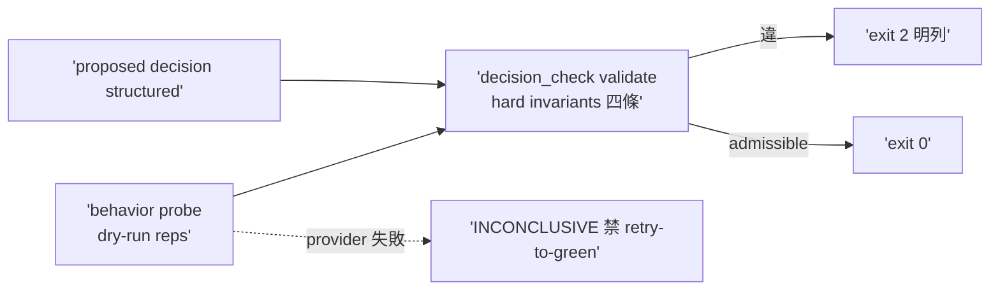
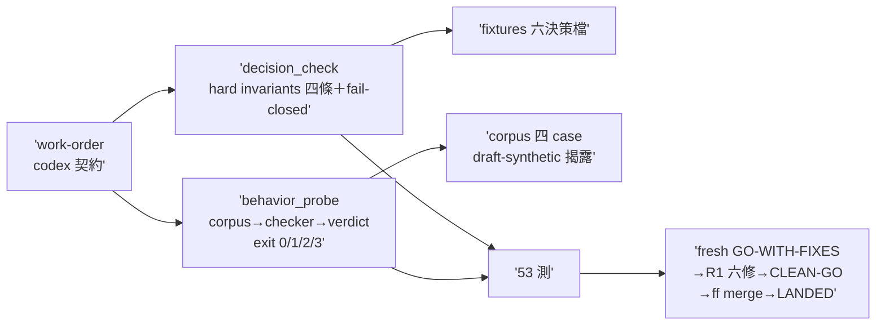

## Description

<!-- SECTION:DESCRIPTION:BEGIN -->
codex 審核 #4＋#5 合併。scripts/resolver_decision_check.py：驗 proposed DispatchPlan/Trace 的 hard invariants（delay+preferred unavailable=zero dispatch／fallback 須在 explicit set＋qualified＋live available／stale unknown 永不 selected／hard requirement 不降）＋soft ranking 同候選集判 admissible 不比 winner＋behavior probe lane（dry-run×reps→structured decision→checker；INCONCLUSIVE 禁 retry-to-green）。AC 詳卡面。

## Implementation Plan

<!-- SECTION:PLAN:BEGIN -->
單 impl unit（TDD）：scripts/resolver_decision_check.py（hard invariants 四條＋admissible 不比 winner）＋scripts/resolver_behavior_probe.py（dry-run corpus lane）＋fixtures。依賴 A（freshness 標籤消費）。收線鏈全形＋fresh 腿。
<!-- SECTION:PLAN:END -->

## Acceptance Criteria

- [x] #1 delay＋preferred unavailable → zero dispatch `uv run python scripts/resolver_decision_check.py validate tests/fixtures/resolver/delay-zero-dispatch.json` → exit 0（fresh＋followup 兩腿重跑）
- [x] #2 stale selected 拒 `uv run python scripts/resolver_decision_check.py validate tests/fixtures/resolver/fallback-stale-selected.json` → exit 2（訊息含「stale/unknown 不可 dispatch」）
- [x] #3 explicit set 外拒 `uv run python scripts/resolver_decision_check.py validate tests/fixtures/resolver/fallback-outside-explicit-set.json` → exit 2（訊息含顯式集合明列）
- [x] #4 checker 測試 `uv run pytest tests/test_resolver_decision_check.py` → exit 0（R1 後 53 passed）
- [x] #5 behavior probe lane `uv run python scripts/resolver_behavior_probe.py --corpus tests/fixtures/resolver-behavior --reps 5` → exit 0（15 admissible／inconclusive=5 如實；INCONCLUSIVE 無 retry 路徑 rg 證實）
<!-- SECTION:DESCRIPTION:END -->

## Implementation Notes

<!-- SECTION:NOTES:BEGIN -->
## 結案 receipt（1003 午後）

**四數**：impl c456560b（30 檔＋2127 行，49 測）＋repair R1 8ea0efc5（25 檔＋867/−197，53 測）＋followup CLEAN-GO（六項獨立否證全過）＋全套件 3097 passed, 1 skipped。LANDED seq=9；ff-only 已吸 main、branch/WT 已收（wt-close 4cc721a6 前）。

**fresh 腿**：GO-WITH-FIXES——核心閘（四 invariants／禁 ranking／fail-closed／INCONCLUSIVE 契約）行為正確；🟡×3＋🟢×4。judge 六項全收→修復批 R1（F1 exit 3 契約／F2 escalation 入 hard 欄／F3 invariant-1 stderr 否證／F4 雙缺 fail-closed／F5 死常數／F7 generics）。

**followup 腿**：CLEAN-GO——F1 /tmp M4 repro exit 3＋NO-COMPLETED-SAMPLE；F2 合成缺 escalation exit 2；F3 M1 mutation 恰新測試一紅；F4 雙缺/雙空 exit 2；F5/F7 rg 0 hits；scope fence 零夾帶；worker 四偏差（independence:null 連帶／exit 3 新碼／既有測試 0→3／JSON re-indent）逐一核可。殘餘觀察（非阻塞）：混合 corpus 1-of-N 綠仍 exit 0——屬 INCONCLUSIVE 語義內政策選擇，留真實 corpus 階段。

**as-built**：見 Final Summary。

**依賴鏈**：A=243 ✓→C=本弧 ✓→D=246 可開（最後一張）。
<!-- SECTION:NOTES:END -->

## Final Summary

<!-- SECTION:FINAL_SUMMARY:BEGIN -->
**as-built 終態**（main 8ea0efc5，LANDED seq=9）：resolver decision invariant checker＋behavior oracle 落地——`resolver_decision_check.py`（schema resolver-decision/1；hard invariants 四條：delay＋preferred unavailable⇒zero dispatch／fallback 須在 explicit set＋qualified＋live fresh available／advisory planning rows 恆非 live authority／hard requirement 八欄含 escalation 不降；fail-closed 輸入驗證含雙缺 hard 欄 INPUT ERROR；admissible 不比 winner）＋`resolver_behavior_probe.py`（corpus→checker 單一源→verdict；exit 契約 0/1/2/3——全-inconclusive⇒3＋NO-COMPLETED-SAMPLE 禁 silent green；INCONCLUSIVE 禁 retry-to-green）＋fixtures 六決策檔＋corpus 四 case（draft-synthetic 如實揭露，真 fresh-agent 重捕屬後續弧）。審查閉環：fresh GO-WITH-FIXES（🟡×3＋🟢×4）→judge 六項全收→修復批 R1（8ea0efc5）→followup CLEAN-GO（六項獨立否證全過、scope fence 零夾帶）。全套件 3097 passed, 1 skipped。

<!-- SECTION:FINAL_SUMMARY:END -->
