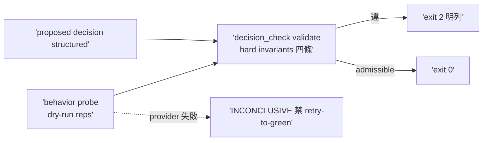

## Description

<!-- SECTION:DESCRIPTION:BEGIN -->
codex 審核 #4＋#5 合併。scripts/resolver_decision_check.py：驗 proposed DispatchPlan/Trace 的 hard invariants（delay+preferred unavailable=zero dispatch／fallback 須在 explicit set＋qualified＋live available／stale unknown 永不 selected／hard requirement 不降）＋soft ranking 同候選集判 admissible 不比 winner＋behavior probe lane（dry-run×reps→structured decision→checker；INCONCLUSIVE 禁 retry-to-green）。AC 詳卡面。

## Implementation Plan

<!-- SECTION:PLAN:BEGIN -->
單 impl unit（TDD）：scripts/resolver_decision_check.py（hard invariants 四條＋admissible 不比 winner）＋scripts/resolver_behavior_probe.py（dry-run corpus lane）＋fixtures。依賴 A（freshness 標籤消費）。收線鏈全形＋fresh 腿。
<!-- SECTION:PLAN:END -->

## Acceptance Criteria

- [ ] #1 delay＋preferred unavailable → zero dispatch `uv run python scripts/resolver_decision_check.py validate tests/fixtures/resolver/delay-zero-dispatch.json` → exit 0
- [ ] #2 stale selected 拒 `uv run python scripts/resolver_decision_check.py validate tests/fixtures/resolver/fallback-stale-selected.json` → exit 2
- [ ] #3 explicit set 外拒 `uv run python scripts/resolver_decision_check.py validate tests/fixtures/resolver/fallback-outside-explicit-set.json` → exit 2
- [ ] #4 checker 測試 `uv run pytest tests/test_resolver_decision_check.py` → exit 0
- [ ] #5 behavior probe lane `uv run python scripts/resolver_behavior_probe.py --corpus tests/fixtures/resolver-behavior --reps 5` → exit 0（INCONCLUSIVE 禁 retry-to-green）
<!-- SECTION:DESCRIPTION:END -->
