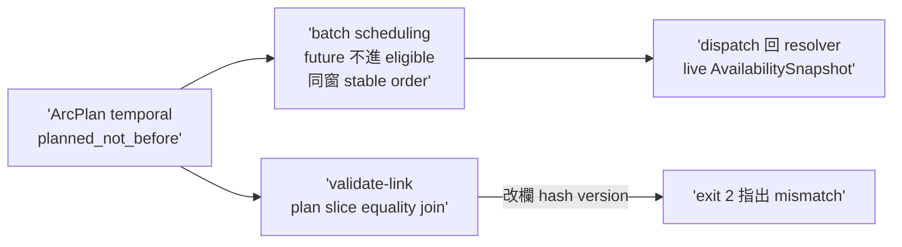

## Description

<!-- SECTION:DESCRIPTION:BEGIN -->
codex 審計 #6＋#3 合併。planned_not_before／preferred_family 參與 batch scheduling（future arc 不進 eligible set；同窗 stable order 禁變新 priority engine）＋arc_spec validate-link（plan↔slice equality join：改 preferred/on_unavailable/fallback/hash/version 即 exit 2）＋dispatch 仍回 resolver live AvailabilitySnapshot（stale unknown 禁繞 C checker）。首次真實 multi-arc dogfood 只驗 correctness。依賴：A＋C 落地後。AC 詳卡面。

## Implementation Plan

<!-- SECTION:PLAN:BEGIN -->
單 impl unit（TDD）：arc_spec validate-link 子命令＋deep-work batch scheduling deterministic semantics＋fixtures。依賴 A＋C 落地。首次真實 multi-arc dogfood 只驗 correctness receipt。收線鏈全形＋fresh 腿。
<!-- SECTION:PLAN:END -->

## Acceptance Criteria

- [ ] #1 validate-link 一致過 `uv run python scripts/arc_spec.py validate-link --plan tests/fixtures/arc-plan/link-valid-plan.json --slice tests/fixtures/arc-plan/link-valid-slice.json` → exit 0
- [ ] #2 竄改即拒 `uv run python scripts/arc_spec.py validate-link --plan tests/fixtures/arc-plan/link-tampered-plan.json --slice tests/fixtures/arc-plan/link-valid-slice.json` → exit 2 指出 mismatch
- [ ] #3 future planned_not_before 不進 eligible set（時間到才進；stable order） `uv run pytest tests/test_batch_scheduling.py` → exit 0
- [ ] #4 live stale/unknown 時 zero dispatch 禁繞 C checker `uv run pytest tests/test_arc_spec.py tests/test_arc_settle_state.py tests/test_batch_scheduling.py` → exit 0
<!-- SECTION:DESCRIPTION:END -->
