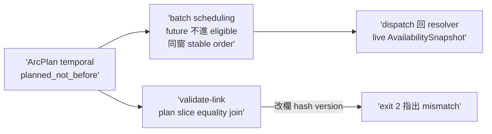
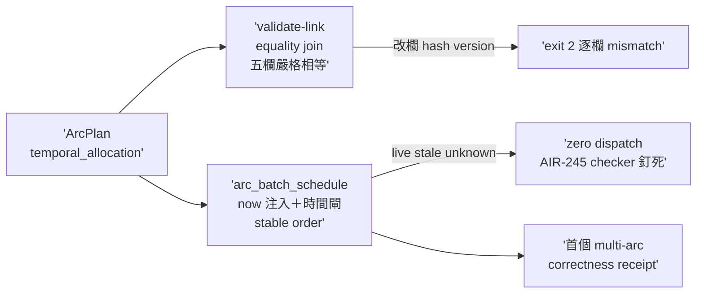

## Description

<!-- SECTION:DESCRIPTION:BEGIN -->
codex 審計 #6＋#3 合併。planned_not_before／preferred_family 參與 batch scheduling（future arc 不進 eligible set；同窗 stable order 禁變新 priority engine）＋arc_spec validate-link（plan↔slice equality join：改 preferred/on_unavailable/fallback/hash/version 即 exit 2）＋dispatch 仍回 resolver live AvailabilitySnapshot（stale unknown 禁繞 C checker）。首次真實 multi-arc dogfood 只驗 correctness。依賴：A＋C 落地後。AC 詳卡面。

## Implementation Plan

<!-- SECTION:PLAN:BEGIN -->
單 impl unit（TDD）：arc_spec validate-link 子命令＋deep-work batch scheduling deterministic semantics＋fixtures。依賴 A＋C 落地。首次真實 multi-arc dogfood 只驗 correctness receipt。收線鏈全形＋fresh 腿。
<!-- SECTION:PLAN:END -->

## Acceptance Criteria

- [x] #1 validate-link 一致過 `uv run python scripts/arc_spec.py validate-link --plan tests/fixtures/arc-plan/link-valid-plan.json --slice tests/fixtures/arc-plan/link-valid-slice.json` → exit 0（LINK OK version 1 unit AIR-246#W1；fresh 腿重跑）
- [x] #2 竄改即拒 `uv run python scripts/arc_spec.py validate-link --plan tests/fixtures/arc-plan/link-tampered-plan.json --slice tests/fixtures/arc-plan/link-valid-slice.json` → exit 2 指出 mismatch（五欄逐行＋總計行；fresh 腿重跑）
- [x] #3 future planned_not_before 不進 eligible set（時間到才進；stable order） `uv run pytest tests/test_batch_scheduling.py` → exit 0（25 passed；mutation：移除時間閘 5 failed／移除 tiebreak 3 failed）
- [x] #4 live stale/unknown 時 zero dispatch 禁繞 C checker `uv run pytest tests/test_arc_spec.py tests/test_arc_settle_state.py tests/test_batch_scheduling.py` → exit 0（282 passed；authority 四釘抽 2 重跑過＋invariant-2/3 源碼核實）
<!-- SECTION:DESCRIPTION:END -->

## Implementation Notes

<!-- SECTION:NOTES:BEGIN -->
## 結案 receipt（1003 傍晚）

**四數**：impl afc70b1a（rebase 後 as-landed **81de508d**；7 檔＋1091 行：arc_spec validate-link＋arc_batch_schedule.py 新模組＋fixtures 三檔＋tests 35 測）＋fresh GO-WITH-FIXES（F1 🟡 receipt 命名＋F4 🟢×4）＋全套件 **3132 passed, 1 skipped**＋RED 證據（9 failed＋collection error）。

**F1 處置**（judge＝收件面正規化）：handback receipt ac_id `AC#N`→`N`（canonical AC_EXPLICIT_ID_RE）＋3 條加碼 verdicts 移出 receipt（evidence 留 journal）——修後 `arc_handback_join` **join OK: 4 predicates**（goal-compile 實編 manifest W1）。

**F2-F5 記錄不修碼**（分層涵蓋成立）：join 面 bool/int conflation（validate 層 :1409 兜）／雙側缺 plan_hash 過 join（validate 層 always-required 兜）／nil≡missing join 語義未言明／fixture 絕對路徑噪音。

**契約要點**：validate-link equality join 嚴格相等（含序、None vs 值、plan_hash 自洽擋 in-place 竄改——合成實證 exit 2）；batch scheduling `now` keyword-only、future 邊界含、stable order＝(-priority, temporal, 輸入序)、輸出僅 eligible/deferred **無 dispatch 決策欄**——preferred_family 不參與排序（非新 priority engine）；authority 邊界由 AIR-245 checker 釘死（planning evidence 繞不過 live check）。

**dogfood**：本弧收線即首個 multi-arc correctness receipt（A=243→C=245→D=246 全 Done；正確性面齊，窗利用率 tuning 留後續）。
<!-- SECTION:NOTES:END -->

## Final Summary

<!-- SECTION:FINAL_SUMMARY:BEGIN -->
**as-built 終態**（main 81de508d，LANDED seq=5）：deep-work temporal batch scheduling＋ArcPlan↔Slice machine join 落地——`scripts/arc_spec.py` 新增 `resolve_plan_temporal`（unit 級細化頂層預設、禁 merge）＋`validate_link`（plan↔slice equality join：unit 回指＋version/hash＋temporal triple 逐欄嚴格相等；plan_hash 自洽檔擋 in-place 竄改）＋CLI validate-link 子命令；`scripts/arc_batch_schedule.py` 新模組（deterministic：future planned_not_before 不進 eligible（邊界含）、`now` keyword-only 無預設、stable order＝(-priority, temporal tiebreak, 輸入序)、輸出僅排程面無 dispatch 決策欄）；fixtures 三檔（plan_hash 機算）＋tests 35 測（25 batch＋10 validate-link，mutation 否證力實證）。閉環：impl→fresh GO-WITH-FIXES（F1 receipt 命名收件面正規化→join OK）→LANDED。resolver 鏈 A(243)→C(245)→D(246) 收官。

<!-- SECTION:FINAL_SUMMARY:END -->
