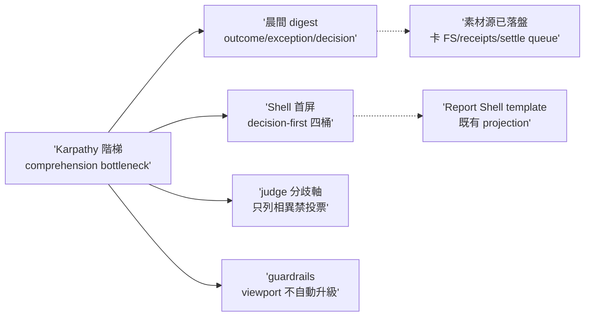

## Description

<!-- SECTION:DESCRIPTION:BEGIN -->
Karpathy 論點（production abundant、human comprehension/preference bandwidth 才是 bottleneck；disposable comprehension artifact 階梯）經 codex＋glm5.3 雙腿獨立討論，共識三案落地 ai-guide 既有軌道② viewport 體系：①值星晨間 digest——deep-work settle 時把多卡收線素材渲染成 outcome/exception/decision-points 人類頁（8 小時 autonomous → 5 分鐘判讀；素材源全部已落盤，零新基建）；②Report Shell 成果 brief 首屏 decision-first 四桶（Outcome／Exceptions／Decision points 0-5 個／Evidence 折疊；exceptions 與 outcome 同級不藏 drawer）；③judge-review 家族分歧軸——跨家族 verdict 只列相異項對照表，禁 majority vote／leaderboard。＋guardrails：viewport artifact 不因能生成而自動生成（debrief 維持 forensic pull model）。

不做：不新增 outcome command（projection concern 非 workflow stage——雙腿共識）；不做 explainer video／常駐 dashboard／自動排程聚合產物／第二份 outcome database；STATE.md 一字不動（單檔單受眾）；standup 與 digest 不合併（分歧裁決：採 glm——不同 workspace/素材源/受眾，分工寫死；codex 的 standup 長敘事收斂案 defer）。

defer（記候選非本卡）：跨弧月/季方向殼（glm P2，demand-driven）、UI mockup 互動樣張（消費端契約）。

雙腿 verdict 原文：.agent-tmp/karpathy-comprehension/{codex,glm}-verdict.md（主樹）。

<!-- SECTION:DESCRIPTION:END -->

## Acceptance Criteria
<!-- AC:BEGIN -->
- [ ] #1 deep-work SKILL.md settle 批量模式含晨間 digest 條款：骨架四段（一句話戰況／exception 放大／decision points 每項一句確認問題／下次起手）＋未收割源 fail-loud 清單＋STATE.md 一字不動條款（digest≠STATE，單檔單受眾）
- [ ] #2 Report Shell 成果 brief 首屏 decision-first 四桶：Outcome／Exceptions／Decision points（0-5 個）／Evidence 預設折疊；exceptions 與 outcome 同級不藏 drawer
- [ ] #3 judge-review 輸出格式含「⚖️ 家族分歧軸」小節：只列跨家族 verdict 相異 finding 對照（family A/B 結論＋證據差異＋judge 裁決理由），禁 majority vote／leaderboard；無分歧整節不顯示
- [ ] #4 guardrails 逐檔核對紀錄：debrief／illustrate／smell-detector 對「viewport artifact 不因能生成而自動生成（debrief=forensic pull model）」的既有涵蓋狀態——已涵蓋記 already-covered 不改、有缺口補一句硬化
<!-- AC:END -->

## Implementation Plan

<!-- SECTION:PLAN:BEGIN -->
baseline（已決策勿重辯）：雙腿 verdict 收斂三案＋YAGNI 清單（video/dashboard/自動排程聚合/outcome DB/投票全禁）；Report Shell template 既有 projection 身分不變（禁另造 source of truth）；STATE.md 單檔單受眾一字不動；standup 與 digest 不合併（裁 glm——不同 workspace/素材源/受眾）。範圍：skills/deep-work/SKILL.md（settle 批量模式＋晨間 digest 條款，落點 ai-analysis/reports/morning-YYYYMMDD.md＋open）；skills/_common/illustrate-html-mode.md＋illustrate-report-shell.html（首屏四桶）；skills/judge-review/SKILL.md（家族分歧軸小節）；guardrails 三檔核對（already-covered 原則）。驗證：instruction-testing＋consistency；純文檔免執行（must-execute 例外）；skills symlink 母鏈即時生效免 deploy。dogfood：今晚值星 settle 產首份晨間 digest。defer 非本卡：跨弧月/季方向殼、UI mockup 互動樣張。
<!-- SECTION:PLAN:END -->
