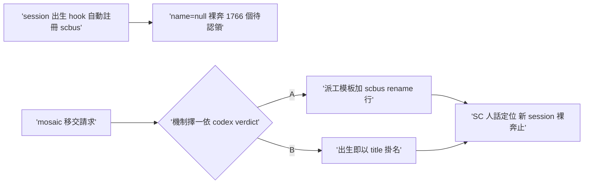
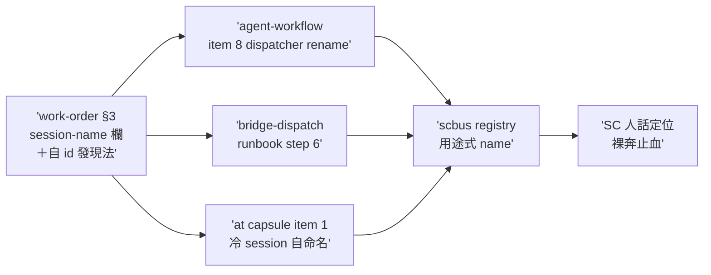

## Description

<!-- SECTION:DESCRIPTION:BEGIN -->
session 出生時 hook 自動向 scbus 註冊，但 name 永遠是 null——registry 裡 1766 個 session（跨全部 repo）在 SC extension 顯示「待認領」，人和 AI 都無法從名字知道這是誰、在幹嘛。mosaic 移交請求：兩機制擇一，讓 watcher／automation／被派工 session 有可定位的名字。

**做什麼**：擇一落地——A）派工類 workorder／spawn prompt 模板加一行 scbus rename --session-id <自己> --name <用途>；B）session 出生 hook 直接以 title 自動掛名。機制選擇以 codex 討論腿 verdict 為準（已收線：裁定 A 慣例行、不混合；user 程序裁決「codex 討論解法後再做」）。

**不做什麼**：不改 scbus 本體（rename 子命令已存在、零新機制）；不批量回填 1766 個歷史 null（枯萎 session 已由 mosaic 示範 end，存量 hygiene 另議）。

**現在到哪／等 user**：卡已點卡確認（user「可以」），進實作。

證據指針：codex verdict＝.agent-tmp/scbus-naming/codex-verdict.md；mosaic 移交信見 scbus 信箱（ai-guide-primary drain 記錄 1004 晨）。
<!-- SECTION:DESCRIPTION:END -->

## Acceptance Criteria
<!-- AC:BEGIN -->
- [x] #1 機制 A 落地——work-order.md §3 Baseline identity 新增 canonical session-name 用途欄（foreign-runtime 單一源） rg -c "session-name" skills/_common/work-order.md → ≥1
- [x] #2 agent-workflow SKILL.md 派工紀律加 item 8 session 掛名（dispatcher rename，名稱取 work unit＋role／用途） rg -c "scbus rename" skills/agent-workflow/SKILL.md → ≥1
- [x] #3 bridge-dispatch SKILL.md Canonical dispatch runbook 加 step 6（引用 session-name 欄；sessionId 首次可得即 rename） rg -c "scbus rename|session-name" skills/bridge-dispatch/SKILL.md → ≥1
- [x] #4 at SKILL.md Phase 3 capsule 冷 session 開場自命名 rg -c "scbus rename" skills/at/SKILL.md → ≥1（usage-ping 錨點不採——模板「禁止任何工具呼叫」＋冷 session 退化吸引子禁多步工具流，與 rename 矛盾；deviation 記 notes）
- [x] #5 hooks／rules 零命名邏輯（verdict 界定不加） rg -c "scbus rename" hooks/ rules/ → 0
- [x] #6 dogfood＋閉環回信：本 session scbus rename 實證（ai-guide-duty-1004morning 已掛）＋verdict 檔留存 .agent-tmp/scbus-naming/codex-verdict.md＋回信 mosaic-primary completed（機制選擇＋落地證據；回信於 ff merge 收線後發送，message_id 隨事後 notes append 補記）
<!-- AC:END -->

## Implementation Plan

<!-- SECTION:PLAN:BEGIN -->
〔baseline：ai-guide d58158c7〕
〔已決策勿重辯：①user 程序裁決（1004 晨）＝「codex 討論解法後再做」＋「一樣要開卡跑完整流程」——機制擇一以 codex verdict 為準，禁跳過討論腿直行；②mosaic 提案兩候選擇一即可（慣例行 vs hook 出生掛名）；③scbus rename 子命令已存在，零新機制、不改 scbus 本體；④不批量回填 1766 個歷史 null（存量 hygiene 另議）；⑤本卡半張（simple 級）〕
範圍：ai-guide 慣例面——依 codex verdict 擇一錨點（skills 派工模板／hooks birth hook／rules），單一機制落地＋dogfood 驗證＋回信 mosaic-primary。AC 具體 verifier 待 verdict 落地後補齊（開工前過 spec gate）。
<!-- SECTION:PLAN:END -->

## Implementation Notes

<!-- SECTION:NOTES:BEGIN -->
實作 receipt（1004 晨，WT ai-guide-air-248）：四錨點落地（work-order §3 session-name 欄單一源／agent-workflow item 8／bridge-dispatch runbook step 6／at capsule item 1 前綴 rename）；AC verifier 全跑（AC1-5 rg 值 1/1/1/1/0-0 合格）；drift sweep「session-name」全域四檔精確命中、無既有衝突慣例。deviations 兩筆（verdict 錨點微調，語義不變）：①work-order 欄位落 §3 Baseline identity 非 verdict 所寫 §2／Role contract——session 身份欄語義歸屬＋Role contract 子段「非 role 派發留空」會漏 ad-hoc 派工命名；②usage-ping 錨點不採——rung 模板「禁止任何工具呼叫」＋冷 context trigger 退化吸引子禁多步工具流，加 rename 違反該 skill 核心設計（ephemeral 單 turn session 由 cron title 承載用途，掛名無定位收益）。分類回執：classification=ordinary（程序性命名慣例；不觸 decision/authority/gate/authorization/acceptance 語義）／review=待 fresh-context 腿（本節補）／session-freshness=fresh／deployment-surfaces=healthy（skills symlink 母鏈即時生效）

審查閉環（1004 晨）：fresh-context 腿（code-reviewer，獨立 session）verdict＝GO-WITH-FIXES——F1 🔴 capsule rename 缺 required --session-id（scbus 無 self-face：whoami 需 env id、出生 hook 未注入，冷 session 必 argparse 失敗被「續行不阻塞」靜默吸收）／F2 🟡 in-harness 腿缺 id 發現 fallback／F3 🟢 {session_name} 值來源未定義／F4 🟢 steps 5-6 前導空格 spurious 修改／F5 🟢 deviation 揭露缺第三筆。修復批全收：F1＝自 id 發現法入 work-order §3 單一源（scbus list 對照 harness＋workspace_root 最新註冊；並列無法唯一確立＝不掛禁猜 id）＋capsule item 1 改引該法＋帶 --session-id；F2＝agent-workflow item 8 補 list fallback＋「id 無法確立＝跳過」自洽；F3＝capsule invariants 補 {session_name} arm 端自填語義；F4＝去前導空格；F5＝本筆即補。deviations 第三筆（F5）：verdict ③ 錨點「dispatch preview 內」實落為獨立 item 8（preview 是派前列印、rename 是 spawn 後動作——語義歸屬不同段）。回執四欄：classification=ordinary／review=fresh-context（in-harness code-reviewer 獨立 session）GO-WITH-FIXES→F1-F5 修復批全收／session-freshness=fresh／deployment-surfaces=healthy（skills symlink 母鏈即時生效）。外審腿（跨家族 second-opinion）額度已用於本弧 codex 討論腿（verdict 檔）；ordinary 分類 baseline＝一條獨立 context 腿已滿足。

AC#6 閉環回執（post-merge）：ff merge 收線 main @ e34f6fbb（arc 三 commit 31110c19／6563a6f7／e34f6fbb 全在 main——結案前驗 code commit in main 檢查通過）；wt-close full 完成零殘留（WT＋branch 已滅）。mosaic completed 回執已寄（message_id 8fc0d119-8bcf-4962-851b-5961f499fb34，queued-awaiting-holder——mosaic-primary 無活躍 holder，下次對方 drain 時送達）。CR freshness：trunk 前進，graph stale 提醒在案（下次 review 前 rebuild，非本弧義務）。
<!-- SECTION:NOTES:END -->

## Final Summary

<!-- SECTION:FINAL_SUMMARY:BEGIN -->
**as-built 終態**（機制 A 慣例行，branch air-248）：session-name canonical 欄住 work-order §3（foreign-runtime 單一源，含自 id 發現法——scbus 無 self-face 的如實處理：scbus list 對照 harness＋workspace_root 最新註冊、並列無法唯一確立＝不掛禁猜 id）；agent-workflow item 8（dispatcher rename，in-harness＋bridge 兩腿 id 路徑對稱）＋bridge-dispatch runbook step 6＋at capsule item 1 冷 session 自命名；usage-ping 錨點不採（模板禁工具呼叫矛盾，deviation 記 notes）。hooks／rules 零命名邏輯（verdict 界定）。閉環：codex 討論腿 verdict＝A→四錨點落地→fresh-context GO-WITH-FIXES（F1 🔴 scbus self-face 缺口／F2-F5）→修復批全收→LANDED。dogfood：本 session 掛名 ai-guide-duty-1004morning 實證。回執四欄齊：classification=ordinary／review=fresh-context GO-WITH-FIXES→修復／session-freshness=fresh／deployment-surfaces=healthy。

<!-- SECTION:FINAL_SUMMARY:END -->
