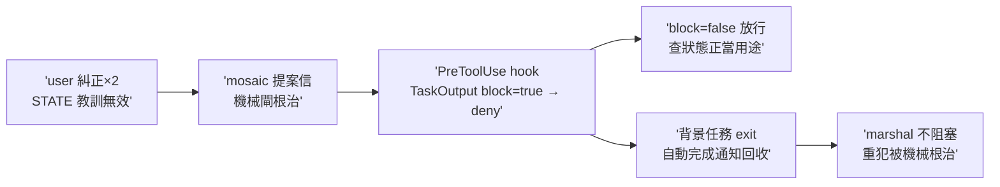
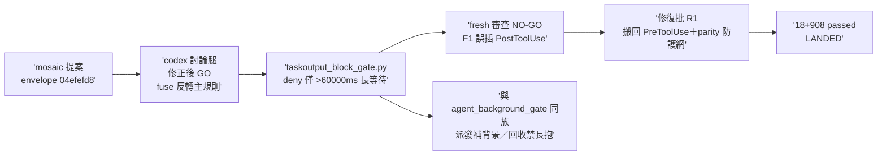

## Description

<!-- SECTION:DESCRIPTION:BEGIN -->
marshal 派完背景任務後，用 TaskOutput(block=true) 抱著 turn 死等——user 同日糾正兩次、教訓寫進 STATE 也治不了（記憶面對重犯無效）。mosaic 側提案（mos-171 session，信件 envelope 04efefd8）：加機械閘根治——背景任務結束時本來就會自動發完成通知（今天值星 session 實證），阻塞等待從非必要操作。

**做什麼**：PreToolUse hook 掛 TaskOutput——input.block == true 一律 deny，deny 訊息固定指引（「背景任務由完成通知回收；查狀態用 block=false；請結束 turn 或做不重疊工作」）。落地件：hook 腳本＋測試＋governance manifest 註冊＋ZCode ~/.zcode/cli/config.json user-level hooks 註冊（merge subtree 非整檔覆蓋）＋RED/GREEN 驗收 probe（block:true 被 deny／block:false 放行）。

**不做什麼**：不治判斷形狀的失誤（派工後沒找平行工作——那是判斷不是工具形狀，提案方誠實聲明的覆蓋邊界）；不部署 CC 端（CC face 已退役 AIR-215）；不改 TaskOutput 本體（harness 內建）。

**現在到哪／等 user**：Description 先行待點卡確認；初評已過三判準（單一入口／無語義例外／純機械），instruction owner 已存在（rules/tool-discipline.md 背景執行節）——hook 是既有規則的 enforcement。確認後補 AC/Plan 再實作。

<!-- SECTION:DESCRIPTION:END -->

## Acceptance Criteria
<!-- AC:BEGIN -->
- [x] #1 hook 可編譯 uv run python -m py_compile hooks/taskoutput_block_gate.py → exit 0
- [x] #2 deny 判準單元測試全綠（uv run pytest tests/test_taskoutput_block_gate.py）：block=true+timeoutMs=60001→deny exit 2＋JSON schema；block=true+timeoutMs=60000→allow；block=true 無 timeoutMs→allow；block=false→allow；block="true" 字串→allow；壞 JSON→allow；tool 非 TaskOutput→allow；deny 零副作用（無檔寫入）
- [x] #3 governance manifest 註冊 rg -c "taskoutput_block_gate" governance/manifest.toml → ≥1
- [x] #4 ZCode 註冊模板 rg -c "taskoutput_block_gate" governance/registrations/zcode.json → ≥1
- [x] #5 hooks/AGENTS.md 同步 rg -c "taskoutput" hooks/AGENTS.md → ≥1
- [x] #6 機械 probe 實跑：deny-case payload 管線輸入 → exit 2；allow-case → exit 0（管線 probe 非 live session）
- [x] #7 live 註冊：~/.zcode/cli/config.json 含 entry＋JSON 可解析＋改前 .bak 備份在場；in-session live 觸發驗證＝新 session 首用時補（per-session 快照限制，notes 記錄；安裝於 merge 後自 canonical 執行——governance guard 要求，回執隨 post-merge notes 補記）
- [x] #8 回信 mos-171 completed（result_pointer 指向 hook commit）＋卡 notes 補 message_id（回信於 merge 收線後發送，message_id 隨事後 notes append 補記）
<!-- AC:END -->

## Implementation Plan

<!-- SECTION:PLAN:BEGIN -->
〔baseline：ai-guide c9dd4b72〕
〔已決策勿重辯：①機制＝PreToolUse hook 掛 TaskOutput，deny 僅當 block==true（boolean）且 timeoutMs>60000——codex 討論腿 verdict「修正後 GO」：blanket deny 被否證（block=true 是 ZCode 正式等待語義、mid-turn 短等待與 completed 即返正當），原提案保險絲反轉為主規則；②fail-open 紀律閘（腳本異常放行＋stderr 診斷，kanban-skill-gate 同慣例）；③instruction owner 已存在＝rules/tool-discipline.md 背景執行節——hook 是 enforcement 非新規則；④CC 端 face 已退役（AIR-215）不部署；⑤提案源＝mosaic mos-171 信（envelope 04efefd8，user 指示 codex 討論後落地）；⑥字串 "true"／malformed 輸入＝fail-open 放行非 deny；⑦60000 邊界含（>60000 才擋）〕
範圍：hooks/taskoutput_block_gate.py（新）＋tests/test_taskoutput_block_gate.py（RED 先行）＋governance/manifest.toml surfaces.hooks 註冊＋governance/registrations/zcode.json PreToolUse matcher TaskOutput＋hooks/AGENTS.md 同步一行＋live 註冊（~/.zcode/cli/config.json 經 governance installer，.bak 備份先行）。verdict 檔＝.agent-tmp/taskoutput-gate/codex-verdict.md。
<!-- SECTION:PLAN:END -->

## Implementation Notes

<!-- SECTION:NOTES:BEGIN -->
codex 討論腿收線（job-mutuoblo-ittztp，watcher exit 0＋sink 機驗 .agent-tmp/taskoutput-gate/codex-verdict.md）：verdict＝修正後 GO——①零誤判主張被否證（block=true 是 ZCode 正式等待語義；mid-turn running task 短等待＋completed 即返皆正當），blanket deny 不採，原提案保險絲反轉為主規則（deny 僅 timeoutMs>60000，60000 邊界含＝放行）；②fail-open（crash／malformed／"true" 字串皆放行）；③deny 文案＝原因＋block=false 指引＋完成通知回收＋短 wait 例外；④部署＝manifest＋registrations/zcode.json＋hooks/AGENTS.md 同步＋新 session live 驗；⑤probe 增 timeout 邊界／completed／malformed／字串／alias／crash fail-open／deny 零副作用；⑥覆蓋邊界＝僅 PreToolUse 可見的 TaskOutput 形狀（不保證通知、worker 活性）。設計 pivot 記錄（值星初評被糾正）：初評支持 blanket deny＋丟 fuse——被 codex 否證，fuse 保留為主規則。

審查閉環（1004 夜）：fresh-context 腿 verdict＝NO-GO→修復批全收後收斂——F1 🔴 TaskOutput matcher 誤插 PostToolUse 陣列（錨在 kanban-skill-gate Read 腿後——jq 實證；閘成靜默死碼 enforcement 0%）→搬回 PreToolUse 陣列尾（marshal Edit|Write 群後）＋放置驗證；F2 🟡 無機械防護攔 event 區段錯置→新增 test_registered_hooks_event_section_parity（code 斷言 event ⊆ 範本註冊 event 區段——一般化 matcher parity，本形態防再生）；F3 🟢 sys.path 改 os.path.dirname(abspath) 家族形；F4 🟢 bool timeoutMs 測試補（isinstance(True,int) 陷阱點）；F5 🟢 docstring「三條」字面改「routing 兩條＋tool_input 三條」。修後 18 passed（含新 parity）＋hook/governance 切片 908 passed。回執四欄：classification=ordinary（紀律閘 enforcement，owner 已存在非新規則）／review=fresh-context NO-GO→F1-F5 修復批全收（R1=35ae0753）／session-freshness=fresh／deployment-surfaces=healthy（merge 後 canonical 安裝——guard 要求 WT 關閉前不安裝，.bak 已備份）。live 觸發驗證＝新 session 首用時補（per-session 快照）。
<!-- SECTION:NOTES:END -->

## Final Summary

<!-- SECTION:FINAL_SUMMARY:BEGIN -->
**as-built 終態**（branch air-249，impl 44137a49＋修復批 35ae0753）：TaskOutput 阻塞等待紀律閘落地——`hooks/taskoutput_block_gate.py`（PreToolUse matcher TaskOutput；deny 僅 block==true ∧ timeoutMs>60000——有界短等待 ≤60000/缺席（預設 30s）放行；blanket deny 經 codex 討論腿否證，fuse 反轉主規則）＋stateless 零副作用＋fail-open 全異常面；部署三面＝manifest surfaces.hooks＋registrations/zcode.json PreToolUse 陣列（F1 修復：原誤插 PostToolUse，reviewer jq 抓出）＋hooks/AGENTS.md 同族節（緊鄰 zcode_agent_background_gate——派發面補背景 vs 回收面禁長抱）；F2 防護網＝test_registered_hooks_event_section_parity（event 區段錯置防再生）。15 hook 測＋4 parity 測＋切片 908 passed。閉環：mosaic 提案（envelope 04efefd8）→user 授權 codex 討論後落地→codex 修正後 GO→TDD RED 先行→fresh NO-GO（F1 死接線）→修復批全收→LANDED。live 安裝＝merge 後 canonical 執行＋新 session 首用驗證。

<!-- SECTION:FINAL_SUMMARY:END -->
