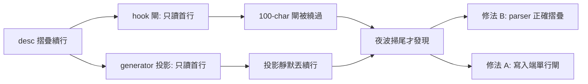
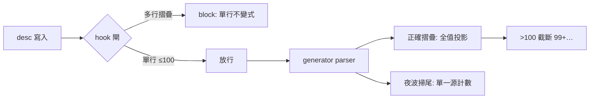

## Description

<!-- SECTION:DESCRIPTION:BEGIN -->
記憶池條目的 description 若寫成多行（YAML 摺疊續行），三個計數面各說各話：寫入閘與投影只讀首行（100-char 閘被繞過、續行靜默丟棄），只有夜波人工掃尾看得到全值——積壓 8-12 夜才被發現（真實案例：9 檔 desc 超限積壓＋37 檔存量摺疊）。

**做什麼**：B＝generator 與 hook 的 desc 解析改成正確摺疊（只針對 description 做 scalar collector，不動 metadata 巢狀；`>-` block marker 清空；接縫空格）——閘量到真值、投影吃全值。A＝寫入端擋「新增/改成多行 desc」（存量 37 檔不溯及，body-only 編輯放行）。配套＝夜波計數單一源（import 池內 parser、禁 ad-hoc regex）＋memory-audit skill desc 文法段加單行規則。

**不做什麼**：不抽共用 module（hook import generator——部署耦合）；不把摺疊列 errs（召回斷裂）；不改其他 hooks/skills。

**規矩**：控制面 full tier——ephemeral WT＋TDD（codex 測試矩陣）＋fresh review 腿＋回執四欄。

<!-- SECTION:DESCRIPTION:END -->

## Acceptance Criteria
<!-- AC:BEGIN -->
- [x] #1 1. generator parse_frontmatter：摺疊 desc（plain 續行＋>- block）全值抽出，projection 吃全值（TRUNCATE_DESC 截斷接手）；metadata.type/rank 巢狀回歸測試綠 2. hook extract_desc 與 generator canonical desc 逐 case 相同（parity 測試矩陣全綠）3. hook A 規則：新增/改 desc 成多行→block（訊息單行不變式措辭）；存量摺疊 body-only Edit→放行 4. memory-audit SKILL desc 文法段載單行規則＋夜波計數單一源行 5. 全套 pytest 綠（lifecycle＋hook_suffix＋回歸）6. fresh review 腿 verdict 無未解 blocker＋回執四欄齊
<!-- AC:END -->

## Implementation Plan

<!-- SECTION:PLAN:BEGIN -->
〔baseline：ai-guide 17507fed（EP 掛卡時）→實作 8c83d2ab 起分支〕
〔已決策勿重辯：①A+B 都做（codex job-muufhibk＋GLM-5.3 job-muufhiqw converged）②B 收窄＝description scalar collector 禁泛化③>- marker 清空④接縫空格⑤A 存量不溯及（值等比鏡像 :286）⑥共用 module 抽取否決⑦摺疊列 errs 否決⑧docstring 同步⑨只掃尾不修碼否決——全套細節單一源＝EP（ai-analysis/_tasks/10-05-desc-fold-fix/ep.md，TC 凍結表 10 條）〕
〔範圍：generator＋hook＋memory-audit SKILL＋兩測試檔；不動其他 hooks/skills/cron prompt〕
<!-- SECTION:PLAN:END -->

## Implementation Notes

<!-- SECTION:NOTES:BEGIN -->
EP Review Cycle 完成：fresh needs-attention（F1/F2 TC 凍結表修正）＋intent aligned——九項 findings 全採納回寫 EP，帳本全 terminal＝EP accepted
<!-- SECTION:NOTES:END -->

## Final Summary

<!-- SECTION:FINAL_SUMMARY:BEGIN -->
desc 摺疊 collector 落地——hook/generator 計數單語義（A＋B：寫入端單行不變式＋讀端正確摺疊；TC 10 條矩陣 RED 17→GREEN 260 passed、全套 3173；fresh review approve 0H/M；main 6632d4df；池投影吃全值 65,069）。

驗收：TC-B1-B7/A1-A3 全對帳（fresh review 報告）；metadata 巢狀回歸錨綠；池投影 377 條 65,069 chars、resident gate PASS；EP Review 帳本九項＋fresh 四項全 terminal。
<!-- SECTION:FINAL_SUMMARY:END -->
