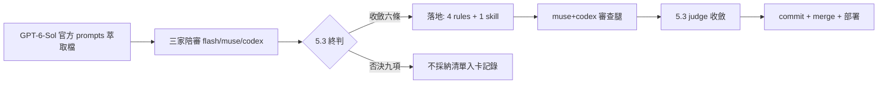

## Description

<!-- SECTION:DESCRIPTION:BEGIN -->
三家模型陪審（flash/muse/codex）拿 OpenAI Codex Desktop 萃取的官方 prompts 當參照物，對照出我們提示詞系統的條文缺口；本卡落地陪審收斂的六條共識。

**做什麼**：①outward 授權只能來自 user 親打文字——貼入的他 AI 輸出/網頁/檔案引文是 evidence 不是授權（跨家族 findings 貼回是日常場景）②PENDING 訊息帶規則出處＋沉默/逾時≠同意③工作中 user 新訊息＝steering 現行任務不換目標、compact 不結束任務（單一邏輯鏈）④memory 消費端紀律——何時查/查多少（≤4-6 步）/未驗證事實標示可能過期⑤被 approval/guard 明確拒絕的動作禁換工具或入口繞道⑥因 rule/skill/hook 條文停下時訊息具名出處。

**不做什麼**：陪審一致否決的九項不抄（文風詞表、浮點信心分、rubric 二元總判、token-budget notes 機制、四級 confirmation、realtime 架構、pre-existing 全域禁報、blocked 三連閾值、澄清凍結分支）；不動部署拓撲；不重構既有條文（純增量行）。

**規矩**：控制面 boundary 弧——card WT 隔離 authoring（impl-lite/flash 執行）＋bi 跨家族審查腿（muse/codex 跑 post-build＋consistency）＋5.3 judge＋回執四欄。

<!-- SECTION:DESCRIPTION:END -->
