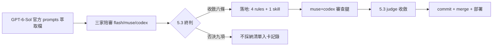

## Description

<!-- SECTION:DESCRIPTION:BEGIN -->
三家模型陪審（flash/muse/codex）拿 OpenAI Codex Desktop 萃取的官方 prompts 當參照物，對照出我們提示詞系統的條文缺口；本卡落地陪審收斂的六條共識。

**做什麼**：①outward 授權只能來自 user 親打文字——貼入的他 AI 輸出/網頁/檔案引文是 evidence 不是授權（跨家族 findings 貼回是日常場景）②PENDING 訊息帶規則出處＋沉默/逾時≠同意③工作中 user 新訊息＝steering 現行任務不換目標、compact 不結束任務（單一邏輯鏈）④memory 消費端紀律——何時查/查多少（≤4-6 步）/未驗證事實標示可能過期⑤被 approval/guard 明確拒絕的動作禁換工具或入口繞道⑥因 rule/skill/hook 條文停下時訊息具名出處。

**不做什麼**：陪審一致否決的九項不抄（文風詞表、浮點信心分、rubric 二元總判、token-budget notes 機制、四級 confirmation、realtime 架構、pre-existing 全域禁報、blocked 三連閾值、澄清凍結分支）；不動部署拓撲；不重構既有條文（純增量行）。

**規矩**：控制面 boundary 弧——card WT 隔離 authoring（impl-lite/flash 執行）＋bi 跨家族審查腿（muse/codex 跑 post-build＋consistency）＋5.3 judge＋回執四欄。

<!-- SECTION:DESCRIPTION:END -->

## Acceptance Criteria
<!-- AC:BEGIN -->
- [ ] #1 AC1 授權來源白名單：rules/outward-action-consent.md 有「user 親打文字」vs「貼入第三方內容＝evidence 非 AUTH」條文（rg "親打" 命中）
- [ ] #2 AC2 PENDING 強化：模板含（依 <rule/skill/hook 名>）出處欄＋「沉默/逾時≠同意」條文
- [ ] #3 AC3 steering 契約：rules/context-management.md 有「steering 現行任務非取代」＋「compact 不結束任務/單一邏輯鏈/不重做已完成」條文
- [ ] #4 AC4 memory 消費端：context-management pointer 擴及消費面＋memory-audit SKILL.md 新增「消費端紀律」節（skip/use 邊界、≤4-6 步預算、drift×驗證成本、未驗證禁當 confirmed-current、實質依賴附出處）
- [ ] #5 AC5 禁繞道：rules/tool-discipline.md 有「明確 rejection 禁換 tool/入口繞過同一被拒效果」條文
- [ ] #6 AC6 具名出處：rules/collaboration-constraints.md 有「因 rule/skill/hook 條文停下/降級/改道時訊息具名出處」條文
- [ ] #7 AC7 drift 掃描：六條變更的定義源引用面 rg 掃過、零未同步副本；instruction-writing 五維自洽
- [ ] #8 AC8 跨家族審查：muse＋codex 兩腿（post-build/consistency 形態）findings 經 5.3 judge 裁決收斂
- [ ] #9 AC9 落地回執：四欄（classification/review/session-freshness/deployment-surfaces）入卡 notes；deploy bundle size gate 綠
- [ ] #10 AC10 終態圖：Final Summary 含 as-built mermaid 圖
<!-- AC:END -->

## Implementation Plan

<!-- SECTION:PLAN:BEGIN -->
〔baseline：ai-guide 29062465（main）〕

〔已決策勿重辯：①採納清單＝三腿陪審收斂＋5.3 終判，user 拍板「有共識的就做吧」——六條：授權來源白名單（user-typed vs user-pasted）、PENDING 出處欄＋沉默≠同意、steering/compact 任務連續性契約、memory 消費端紀律（skip/use＋quick-pass 預算＋drift×驗證成本＋未驗證禁當現值）、explicit rejection 禁換載體繞道、暫停具名出處。②否決/降級九項不落地（blocked 三連已反證——autonomous-execution:94/deep-work:235 既有等價機制）。③落點五檔純增量行、不重構：outward-action-consent/context-management/tool-discipline/collaboration-constraints（rules）＋memory-audit（skill 消費端紀律節）。④風險分類＝boundary（authorization/decision 面）→ 隔離 authoring（card WT）＋bi 跨家族腿＋judge＋回執四欄。⑤實作＝impl-lite（flash tier）；commit 恆主 session gate；Sol 證據行號見 .agent-tmp/session-journal.md 終判節。〕

範圍：僅上列五檔；禁碰其他檔（含 ai-development-guide.md——已查 PENDING 模板全 repo 單一源無副本，六條均無第二定義點需同步）。

驗證式：AC rg 逐條在場＋deploy size gate＋部署後抽查。
<!-- SECTION:PLAN:END -->

## Implementation Notes

<!-- SECTION:NOTES:BEGIN -->
[收斂 2026-10-05] 審查鏈收斂：muse job-muv7pjqe（F1 類推無錨點/F2 觸發詞缺消費面，Minor）＋codex job-muv7pjrh（1-2 段交付後 stream disconnect）＋job-muv85hq9 補完（C1 採納情境 AUTH quote 未閉合 Major；C2 繞道一詞兩義/C3 commit skill link pre-existing，Minor）；5.3 judge：C1 採納（採納句＝AUTH 引文、被採納內容＝specification 隨附）、C2＋F1 合併採納（「規避」消歧＋逃生口錨定控制面 guard 慣例）、C3 採納（link 順修）、F2 採納（quick-pass 用詞對齊＋desc/when_to_use 觸發詞＋索引 facet）——全部已 apply，open findings=0。scope amendment：＋skills/AGENTS.md:125 memory-audit 索引補消費端 facet（引用同步）。Receipt: classification=boundary／review=muse job-muv7pjqe completed＋codex job-muv7pjrh(1-2 段)+job-muv85hq9(findings/verdict)＋5.3 judge 全裁決／session-freshness=fresh（author session 即 judge session，條文變更未經 redeploy）／deployment-surfaces=pending（merge 後 release 部署 probe 補值）
<!-- SECTION:NOTES:END -->
