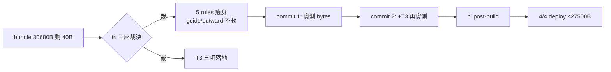

## Description

<!-- SECTION:DESCRIPTION:BEGIN -->
AIR-251 落地後四端 bundle 只剩 40B 餘量（下一條條文必撞 30KiB gate）；同一批 tri 討論也裁決了三個先前降級未做的修辞性殘留。本卡一次解決：把 rules 瘦身到有健康餘量，順手把 T3 三項收乾淨。

**做什麼**：①五檔 rules 瘦身——tool-discipline 投影下沉（機械禁令留 bootstrap）、context-management/design-thinking/quality-constraints/collaboration-constraints 壓縮可推導散文（深層下沉既有 skill）；guide 與 outward-action-consent 本弧不動（tri 裁決）②T3 三項——execution-plan 迷你壞例、acceptance-evidence 四態判定＋處置映射、outward 一行版確認請求形狀（risk+mechanism）③同弧雙 commit：先瘦身實測 bytes、再加 T3 二次實測。

**不做什麼**：不動 guide 本體（全域行為面，未來弧）；不動 AIR-251 六條（逐字保留）；不把 rule 壓成一行密碼（readability＝機器可解析）。

**規矩**：控制面 boundary 弧——card WT＋impl-lite 執行＋5.3 語義驗收＋bi 跨家族腿（muse/codex post-build docs-mode＋consistency＋語義保持 delta）。

<!-- SECTION:DESCRIPTION:END -->
