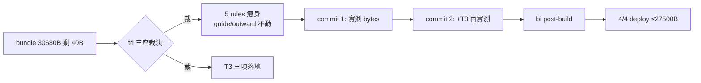

## Description

<!-- SECTION:DESCRIPTION:BEGIN -->
AIR-251 落地後四端 bundle 只剩 40B 餘量（下一條條文必撞 30KiB gate）；同一批 tri 討論也裁決了三個先前降級未做的修辞性殘留。本卡一次解決：把 rules 瘦身到有健康餘量，順手把 T3 三項收乾淨。

**做什麼**：①五檔 rules 瘦身——tool-discipline 投影下沉（機械禁令留 bootstrap）、context-management/design-thinking/quality-constraints/collaboration-constraints 壓縮可推導散文（深層下沉既有 skill）；guide 與 outward-action-consent 本弧不動（tri 裁決）②T3 三項——execution-plan 迷你壞例、acceptance-evidence 四態判定＋處置映射、outward 一行版確認請求形狀（risk+mechanism）③同弧雙 commit：先瘦身實測 bytes、再加 T3 二次實測。

**不做什麼**：不動 guide 本體（全域行為面，未來弧）；不動 AIR-251 六條（逐字保留）；不把 rule 壓成一行密碼（readability＝機器可解析）。

**規矩**：控制面 boundary 弧——card WT＋impl-lite 執行＋5.3 語義驗收＋bi 跨家族腿（muse/codex post-build docs-mode＋consistency＋語義保持 delta）。

<!-- SECTION:DESCRIPTION:END -->

## Acceptance Criteria
<!-- AC:BEGIN -->
- [ ] #1 AC1 tool-discipline 投影：frontmatter 帶 bundle-projection: pointer＋bootstrap-pointer；機械禁令（禁繞拒絕/uv run/禁 sed/Read-before-Edit/pipefail）逐字在 pointer 句投影內
- [ ] #2 AC2 四檔壓縮：context-management/design-thinking/quality-constraints/collaboration-constraints 判準句逐字在場、深層下沉指針在場
- [ ] #3 AC3 AIR-251 六條逐字不變：親打/沉默逾時/steering/單一邏輯鏈/規避/具名出處/quick-pass 全 bundle 在場
- [ ] #4 AC4 B1 負例：execution-plan skill 迷你壞例在場且帶 ❌ 反例圍欄＋退回判準一句
- [ ] #5 AC5 B2 四態：acceptance-evidence skill 四態＋處置映射＋too weak/missing 定義在場
- [ ] #6 AC6 B3 一行：outward-action-consent risk+mechanism/what-who-why/material change 不重問（限同一未決 action）在場
- [ ] #7 AC7 尺寸：slimming commit 後 dry-run ≤27,500B；T3 commit 後仍 ≤27,700B；四端一致
- [ ] #8 AC8 審查：bi 腿（muse＋codex docs-mode＋consistency＋語義保持 delta）findings 經 5.3 judge 收斂
- [ ] #9 AC9 回執四欄入卡 notes；正式 deploy 4/4 逐端 rg 抽查
- [ ] #10 AC10 終態圖：Final Summary 含 as-built mermaid
<!-- AC:END -->

## Implementation Plan

<!-- SECTION:PLAN:BEGIN -->
〔baseline：ai-guide 34ea1cf4（main）〕

〔已決策勿重辯：①tri 三座（muse job-muv9yx8x／codex job-muv9yxco／5.3）綜合裁決——混合策略：tool-discipline 投影下沉（bundle-projection: pointer frontmatter，hard rules 留 bootstrap：禁繞拒絕、skill 先讀、uv run、禁 sed、Read-before-Edit、gate pipefail、背景回收 owner）、context-management/design-thinking/quality-constraints/collaboration-constraints 壓縮（可推導散文刪、判準句逐字留、深層下沉既有 skill 指針）；guide 與 outward-action-consent 不動（muse 提砍 guide −2300B 被 5.3 否決——全域行為面風險；codex 否決動 outward——authority boundary）；AIR-251 六條逐字保留。②T3 三項改形態：B1 execution-plan「流程規模分級節」一個迷你壞例（❌ 反例圍欄）＋缺驗證策略→退回判準；B2 acceptance-evidence Claim→Evidence 節四態（proves/contradicts/too weak/missing）＋處置映射（accept/challenge/supplement/block）＋too weak/missing 定義一句；B3 outward 一行：「PENDING 補 risk（會發生什麼）＋mechanism（怎麼發生）；敏感傳輸補 what/who/why；同一未決 action 無 material change 不重問」。③同弧雙 commit（slimming→實測→T3→實測），目標瘦身後 ≤27,500B／餘量 ≥3,000B。④實作＝impl-lite 照 5.3 定稿 spec 落檔；語義保持驗收＋judge＝5.3；審查＝bi 腿。〕

範圍：rules/tool-discipline.md、rules/context-management.md、rules/design-thinking.md、rules/quality-constraints.md、rules/collaboration-constraints.md、skills/execution-plan/SKILL.md、skills/acceptance-evidence/SKILL.md、rules/outward-action-consent.md（僅 B3 一行）＋配套 skills/AGENTS.md 索引同步（如觸及）；guide（ai-development-guide.md）禁碰。

驗證式：每 commit 後 deploy dry-run bytes 實測＋AIR-251 六條 rg 逐字在場＋B1/B2/B3 在場＋bi 腿 findings 經 judge 收斂＋正式 deploy 4/4 逐端抽查。
<!-- SECTION:PLAN:END -->
