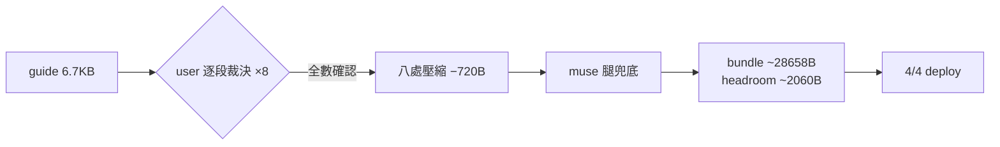

## Description

<!-- SECTION:DESCRIPTION:BEGIN -->
AIR-252 瘦身後 guide 本體（6.7KB）是最大單一槓桿；本弧由 user 逐段裁決八項壓縮（每項看過壓縮前後對照確認），安全回收約 720B。

**做什麼**：ai-development-guide.md 八處壓縮——驗證表→一句、文檔角色五項壓短、UC 段落頭與狀態流轉行合併、Marshal 執行鏈輕壓（判準句逐字不動）、AIR-135 條 2 消費面指針合併、開場入口行微壓、架構紀律尾句去重、量化鐵律尾巴短指針。

**不做什麼**：所有判準句（四類未決/三級分級/單向門恆停/invariant 判準/鐵律本體）逐字保留；不動其他檔案。

**規矩**：控制面 boundary 弧——**user 逐段裁決為本弧主要審查權威**（八項逐一確認）＋muse 腿機械/consistency 兜底＋5.3 judge。

<!-- SECTION:DESCRIPTION:END -->

## Acceptance Criteria
<!-- AC:BEGIN -->
- [ ] #1 AC1 八處壓縮逐項在場且與 user 確認版逐字一致
- [ ] #2 AC2 判準句保留清單逐字不變（rg 驗）
- [ ] #3 AC3 dry-run 四端 OK 且 ≤28,700B
- [ ] #4 AC4 muse 腿 consistency/drift 兜底收斂
- [ ] #5 AC5 回執四欄＋deploy 4/4＋as-built 終態圖
<!-- AC:END -->

## Implementation Plan

<!-- SECTION:PLAN:BEGIN -->
〔baseline：ai-guide 2dfba0a6（main）〕〔已決策勿重辯：八項壓縮全文＝user 於對話中逐項確認之 preview 版本（驗證表一句化/文檔角色壓短/UC 段頭合併/Marshal 輕壓/AIR-135 條2 指針合併/入口行微壓/架構尾句去重/量化鐵律短指針）；判準句逐字保留清單＝四類未決、三級分級、單向門恆停、outward 唯一準據、indexed identity 判準、鐵律本體四條、Summary Instructions 全段、跨 repo 主權、Solo 工作流、AIR-135 條 1/3/4。範圍：僅 ai-development-guide.md。審查形態：user 逐段裁決為主權威＋muse 腿機械/consistency 兜底。〕
<!-- SECTION:PLAN:END -->

## Implementation Notes

<!-- SECTION:NOTES:BEGIN -->
[收斂 2026-10-05] 八項壓縮全落地（guide 6,518→5,880B，實收 −638B；bundle 29,378→28,740B，headroom 1,980B）；審查權威＝user 逐段裁決（8/8 對話確認，含壓縮前後對照）＋muse 兜底腿 job-muvcg94b（consistency/drift/diff 三軸全過；3 個 🟢 findings 均為 user 已確認項，意圖已認）；判準句 rg 驗證全在。Receipt: classification=boundary（guide 語義壓縮）／review=user 逐段裁決 8/8＋muse job-muvcg94b 兜底 converged／session-freshness=fresh／deployment-surfaces=pending（merge 後補值）
<!-- SECTION:NOTES:END -->
