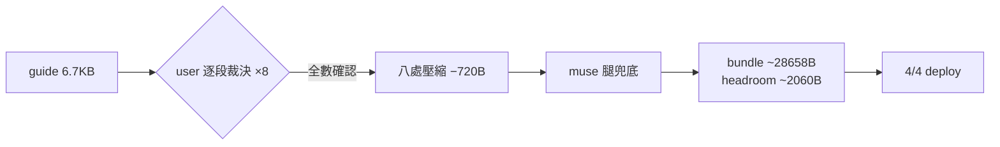

## Description

<!-- SECTION:DESCRIPTION:BEGIN -->
AIR-252 瘦身後 guide 本體（6.7KB）是最大單一槓桿；本弧由 user 逐段裁決八項壓縮（每項看過壓縮前後對照確認），安全回收約 720B。

**做什麼**：ai-development-guide.md 八處壓縮——驗證表→一句、文檔角色五項壓短、UC 段落頭與狀態流轉行合併、Marshal 執行鏈輕壓（判準句逐字不動）、AIR-135 條 2 消費面指針合併、開場入口行微壓、架構紀律尾句去重、量化鐵律尾巴短指針。

**不做什麼**：所有判準句（四類未決/三級分級/單向門恆停/invariant 判準/鐵律本體）逐字保留；不動其他檔案。

**規矩**：控制面 boundary 弧——**user 逐段裁決為本弧主要審查權威**（八項逐一確認）＋muse 腿機械/consistency 兜底＋5.3 judge。

<!-- SECTION:DESCRIPTION:END -->
