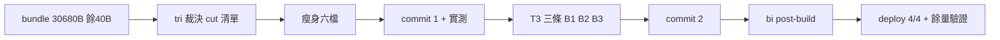

## Description

<!-- SECTION:DESCRIPTION:BEGIN -->
四端 bundle 只剩 40B 餘量（30,680/30,720B），下一條規則必撞牆；tri 陪審（muse＋codex＋5.3）同時裁決了堆著的三個 T3 殘留。本卡一次收拾：先瘦身、驗出餘量、再落 T3。

**做什麼**：①瘦身六檔（tool-discipline 投影下沉最大單項；context/design/quality/collab 壓縮；guide 去重；outward 與 AIR-251 六條判準句不動）目標 ≤27,000B ②T3 三條：execution-plan 迷你反例、acceptance-evidence 四態判定語言（skill 面零 bundle）、PENDING 確認形狀一句化（bundle +~200B）。

**不做什麼**：不動 outward-action-consent 主體、不動 acceptance/must-execute/edit-discipline 等已瘦檔、不整檔排除、不把決策核心推出 always-on 面。

**規矩**：同弧兩段式（瘦身 commit→實測→T3 commit）；實作 5.3 親自下刀；bi post-build（muse＋codex）收尾；控制面 boundary 弧全程 card WT。

<!-- SECTION:DESCRIPTION:END -->
