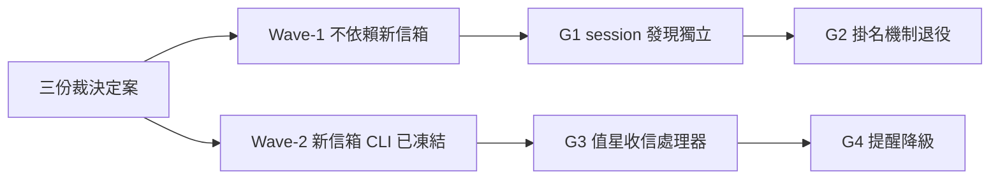

## Description

<!-- SECTION:DESCRIPTION:BEGIN -->
dutymail 是新的可信信箱系統（取代 sc-router 的 scbus），設計已在三份裁決文件定案（住 delegate-bridge repo）。這張母卡統籌 ai-guide 這側的四項接線：兩項不依賴新信箱即可做，兩項跟著新信箱 CLI 凍結（3.1.0 已出貨）落地。

**做什麼**：G1 把「目前有哪些 session 活著」的查詢從舊信箱 registry 抽出成獨立 discovery seam；G2 舊掛名機制（scbus rename）退役、人話標籤改由 discovery 擁有；G3 值星收信處理器（開場＋打字邊界收信→分診→處置後才 ack）；G4 舊提醒 hook 降級為 session 本地、閒置完全安靜。

**規矩**：信箱系統不吸收 session 註冊表；標籤是顯示名不是地址；自動處理 default-deny（class×action 表；只有可機械驗證的 inform/receipt 才自動；絕不宣稱工作已承接）。

**不改**：delegate-bridge repo 與 SC（South Chariot，另卡 80.5 範圍）。

<!-- SECTION:DESCRIPTION:END -->

## Implementation Plan

<!-- SECTION:PLAN:BEGIN -->
母卡統籌四子卡（.1 seam／.2 掛名退役／.3 收信處理器〔full tier，EP＝ai-analysis/_tasks/10-06-dutymail-receive-adapter/ep.md〕／.4 提醒降級）。〔baseline：2556afdd〕〔已決策勿重辯：三份裁決（address-model/inbox-uc/cutover-arch，住 delegate-bridge 00-tasks/2026-10/10-04-dutymail/references/）為共同契約；不變式＝mail plane 不吸收 session registry、label 是 display metadata 非 address、不改 bridge repo；自動處理 default-deny〕
<!-- SECTION:PLAN:END -->
