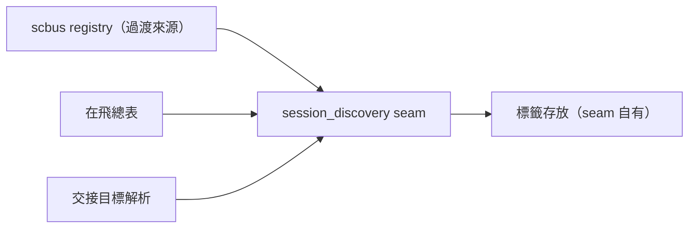
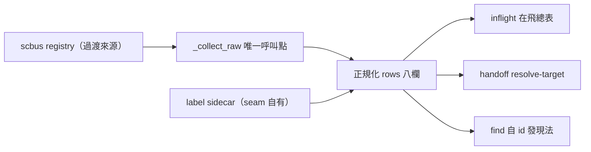

## Description

<!-- SECTION:DESCRIPTION:BEGIN -->
「現在有哪些 AI session 活著、在哪個 repo」這件事，目前綁在舊信箱系統（scbus）的 registry 裡。信箱要換新（dutymail），但 session 發現不是信箱職責——這卡把它抽成獨立的 seam：一份正常的 session 清單查詢＋seam 自有的顯示標籤存放處。

**做什麼**：新 seam script（清單／查找／掛標籤）；在飛總表產生器（inflight_snapshot）與交接目標解析（handoff resolve-target）改吃 seam，不再直接呼叫 scbus。舊信箱過渡期仍是 seam 的資料來源，但從此只有 seam 一個地方碰它——未來換來源只改 seam 一處。

**不做**：不碰交接的送信面（後續波次）；掛名退役是下一卡（254.2）。

<!-- SECTION:DESCRIPTION:END -->

## Acceptance Criteria
<!-- AC:BEGIN -->
- [x] #1 uv run pytest 三檔全綠（100 tests；repair 後 105）
- [x] #2 session_discovery CLI 真機：list --live --json 正規化八欄＋label 合併 sidecar
- [x] #3 label set/get 冪等＋sidecar 0600
- [x] #4 consumers 零直接 scbus 呼叫（rg 零命中）
- [x] #5 handoff SKILL target 解析改 seam（scbus list 樣態歸零；send 面不動）
<!-- AC:END -->

## Implementation Plan

<!-- SECTION:PLAN:BEGIN -->
〔baseline：ai-guide 2556afdd〕
〔已決策勿重辯：①seam＝scripts/session_discovery.py；v1 資料來源＝scbus registry（過渡——單一 choke point 函數，換源只改一處；SC 側未來共用此 seam 形狀）②label sidecar＝~/.agents/session-discovery/labels.json（seam 擁有，display metadata 非 address 語義——AIR-248 successor 裁定）③inflight_snapshot 路 2 與 handoff_delivery resolve-target 的 rows 改吃 seam 正規化形狀（session_id/harness/workspace_root/label/liveness/last_seen）④CLI 面：list --live --json／find --harness --workspace-root／label set|get／whoami（v1 委派 scbus whoami）⑤不碰 handoff 送信面（G5 波次）〕
範圍：
- 動：scripts/session_discovery.py（新）、scripts/inflight_snapshot.py（路 2）、scripts/handoff_delivery.py（resolve-target rows 形狀＋CLI）、skills/handoff/SKILL.md（Phase 5 target 解析命令塊）、tests/test_session_discovery.py（新）、tests/test_inflight_snapshot.py、tests/test_handoff_delivery.py
- 不動：scbus CLI 本體、AIR-233 hook（254.4）、work-order/rename 條文（254.2）、send 流程

AC：
1. uv run pytest tests/test_session_discovery.py tests/test_inflight_snapshot.py tests/test_handoff_delivery.py -v 全綠
2. uv run python scripts/session_discovery.py list --live --json 輸出正規化 rows（label 合併 sidecar）；--help exit 0
3. label set→sidecar 寫入且 list 反映（真實 id 或注入 runner 測試）
4. rg -n 'scbus' scripts/inflight_snapshot.py scripts/handoff_delivery.py → consumers 零直接 scbus 呼叫（模組 docstring 提及 seam 來源除外）；session_discovery 兩檔命中
5. skills/handoff/SKILL.md：rg session_discovery 命中；舊 'scbus list > .agent-tmp' 樣態歸零（send 面除外——送信仍 scbus，G5 範圍）
<!-- SECTION:PLAN:END -->

## Final Summary

<!-- SECTION:FINAL_SUMMARY:BEGIN -->
SessionDiscovery seam 落地：scripts/session_discovery.py＝scbus registry 全 repo 唯一讀取點（_collect_raw 單一 choke point，未來換源只改一處）＋label sidecar（~/.agents/session-discovery/，display metadata 非 address）；inflight_snapshot 路 2 與 handoff resolve-target 改吃 seam 正規化 rows（name→label）。100 tests；commit a741208a（repair 增補 sidecar pid-tmp＋損壞降級，773e630b）。

<!-- SECTION:FINAL_SUMMARY:END -->
