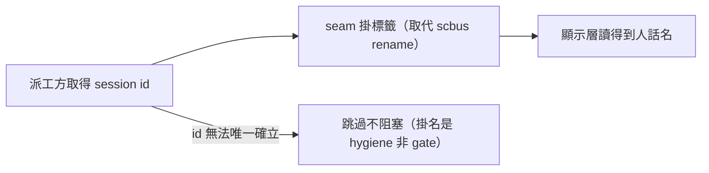

## Description

<!-- SECTION:DESCRIPTION:BEGIN -->
舊機制：被派工的 session 出生後，由派工方下 scbus rename 掛人話名（AIR-248）。裁定：session 命名不是信箱職責，rename 退役——人話標籤需求保留，改由 discovery seam（上一卡）擁有：標籤是顯示 metadata，不是地址。

**做什麼**：工單模板 §3 的 session-name 欄改為 session-label（掛標籤改走 seam 指令）；bridge 派工步驟 6、agent-workflow 第 8 條、/at 恢復膠囊裡的 rename 指令全部改為 seam 的標籤命令；掃全 repo 確認 rename 殘留歸零。

**不做**：不改 AIR-248 卡面（歷史 Done 留存）；不動 scbus 信件往返面。

<!-- SECTION:DESCRIPTION:END -->

## Implementation Plan

<!-- SECTION:PLAN:BEGIN -->
〔baseline：ai-guide 2556afdd；依賴 254.1 seam 落地（label/find 命令契約）〕
〔已決策勿重辯：①scbus rename 全面退役——work-order §3 session-name 欄改 session-label：掛標籤＝session_discovery.py label set；自 id 發現法單一源移入 seam（session_discovery.py find）②bridge-dispatch step 6／agent-workflow 條 8／at Phase 3 膠囊步驟 1 同步改寫（at 的 session_name 語義改 session_label）③保留語義三要件：名稱可定位用途禁通用值、id 無法唯一確立＝跳過不阻塞（hygiene 非 gate）、carrier 未註冊＝跳過④AIR-248 卡面不動（歷史 Done）〕
範圍：
- 動：skills/_common/work-order.md（§3 session-name 欄）、skills/bridge-dispatch/SKILL.md（step 6）、skills/agent-workflow/SKILL.md（條 8）、skills/at/SKILL.md（Phase 3 capsule 步驟 1＋capsule invariants 注記）
- 不動：AIR-248 卡面、rules/context-management.md（回信紀律指信件面——G5 範圍）、governance/conventions.md（訊息 schema——信件面）、model-routing skill（scbus 提及為歷史實證源標註非動作）

AC：
1. rg -n 'scbus rename' skills/ rules/ scripts/ hooks/ agents/ → 零命中
2. rg -n 'session_discovery' 四目標檔 → 皆命中
3. work-order §3 欄位三要件關鍵詞（可定位用途／禁通用值或禁猜 id／不阻塞）在場
4. 漂移掃描：rg -n 'session-name' → 活躍 instruction 面零命中（歷史卡面/裁決文件引用除外）
5. rg -n 'scbus list' skills/at/SKILL.md skills/agent-workflow/SKILL.md skills/bridge-dispatch/SKILL.md skills/_common/work-order.md → 零命中（發現法已移 seam）
<!-- SECTION:PLAN:END -->
