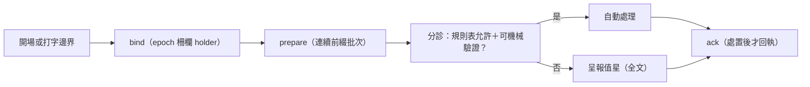

## Description

<!-- SECTION:DESCRIPTION:BEGIN -->
dutymail 信箱換裝後，ai-guide 需要一個「值星收信處理器」：session 開場與每次 user 打字的邊界，把 repo 信箱（ai-guide-marshal）的新信收進值星批次——先摘要（每類幾封、最舊多老），分診項才給全文；規則表允許且可機械驗證的自動處理，其餘呈報值星；處置完成後才回執（ack），絕不整批掃過就 ack。

**做什麼**：新 hook（bind→prepare→分診→ack 生命週期）＋自動處理規則表（default-deny 設定檔）＋一頁 round-trip 文件（寄信→收信→回執→承接→完成的完整旅程）。本地信箱開通（store 初始化＋建 ai-guide-marshal 門牌）＋真實信件往返驗證。

**規矩**：full tier——有獨立 child EP（references 指向）；同一信箱任一時刻只有一個消費權威（epoch-fenced holder）；自動處理絕不宣稱工作已承接。

**不做**：不接 SC（South Chariot）側——另卡 80.5 範圍；不動 scbus 送信面（後續波次）。

<!-- SECTION:DESCRIPTION:END -->

## Implementation Plan

<!-- SECTION:PLAN:BEGIN -->
full tier——實作計畫唯一源＝standalone EP：ai-analysis/_tasks/10-06-dutymail-receive-adapter/ep.md（references 已指）。〔baseline：2556afdd〕〔已決策勿重辯：見 EP 核心原則八條（invariants）；地址＝ai-guide-marshal＋epoch-fenced holder；絕不 flush-ack；自動處理 default-deny（class×action 表 config 非 code）；v1 絕不主動送信〕範圍與分段 AC＝EP S1/S2/S3。
<!-- SECTION:PLAN:END -->
