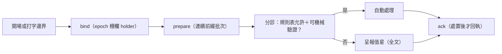
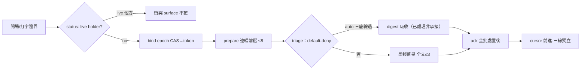

## Description

<!-- SECTION:DESCRIPTION:BEGIN -->
dutymail 信箱換裝後，ai-guide 需要一個「值星收信處理器」：session 開場與每次 user 打字的邊界，把 repo 信箱（ai-guide-marshal）的新信收進值星批次——先摘要（每類幾封、最舊多老），分診項才給全文；規則表允許且可機械驗證的自動處理，其餘呈報值星；處置完成後才回執（ack），絕不整批掃過就 ack。

**做什麼**：新 hook（bind→prepare→分診→ack 生命週期）＋自動處理規則表（default-deny 設定檔）＋一頁 round-trip 文件（寄信→收信→回執→承接→完成的完整旅程）。本地信箱開通（store 初始化＋建 ai-guide-marshal 門牌）＋真實信件往返驗證。

**規矩**：full tier——有獨立 child EP（references 指向）；同一信箱任一時刻只有一個消費權威（epoch-fenced holder）；自動處理絕不宣稱工作已承接。

**不做**：不接 SC（South Chariot）側——另卡 80.5 範圍；不動 scbus 送信面（後續波次）。

<!-- SECTION:DESCRIPTION:END -->

## Acceptance Criteria
<!-- AC:BEGIN -->
- [x] #1 EP S1：processor 核心測試全綠（80 tests；flush-ack 防護/default-deny/live 閂/invalidate 路徑釘住）
- [x] #2 EP S2：hook --help exit 0；註冊雙檔命中且原條目不減；hook 面 fail-soft/eligibility 測試綠
- [x] #3 EP S3：真實往返 receipt（.agent-tmp/dw-dutymail/s3-receipt.md）——三封信 cursor 0→3、無新信靜默、state 0600、hook 直接驅動、雙 session 衝突不搶、lease 到期換代
- [x] #4 roundtrip 文檔在場（transport ack/semantic accept/reply_address rg ≥3）
- [x] #5 v1 零 send/replies 呼叫（rg 驗證）
- [x] #6 repair 增補：importlib 載入／恆人工硬底線／空批收緊／年齡全批次（review 採納項）
<!-- AC:END -->

## Implementation Plan

<!-- SECTION:PLAN:BEGIN -->
full tier——實作計畫唯一源＝standalone EP：ai-analysis/_tasks/10-06-dutymail-receive-adapter/ep.md（references 已指）。〔baseline：2556afdd〕〔已決策勿重辯：見 EP 核心原則八條（invariants）；地址＝ai-guide-marshal＋epoch-fenced holder；絕不 flush-ack；自動處理 default-deny（class×action 表 config 非 code）；v1 絕不主動送信〕範圍與分段 AC＝EP S1/S2/S3。
<!-- SECTION:PLAN:END -->

## Final Summary

<!-- SECTION:FINAL_SUMMARY:BEGIN -->
值星收信處理器落地（full tier，EP=ai-analysis/_tasks/10-06-dutymail-receive-adapter/ep.md）：hooks/duty_receive.py＋scripts/duty_receive.py——bind（live 閘防搶＋epoch CAS）→prepare（bounded ≤8）→triage（default-deny：solicit/未列 class/恆人工名單 handoff+patrol+work-order 三層代碼硬底線）→ack（只在全批處置後，絕不 flush-ack）；config=governance/dutymail-processor.toml；roundtrip 一頁文件。S3 真實往返驗證：三封真信 cursor 0→3、fresh epoch-0 首綁、雙 session 衝突不搶、lease 到期換代（s3-receipt）。commits c0f04616＋773e630b（repair：importlib 載入、恆人工硬底線、空批收緊、年齡全批次）。

<!-- SECTION:FINAL_SUMMARY:END -->
