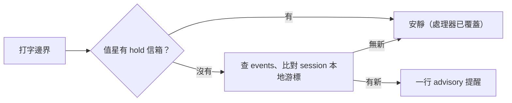
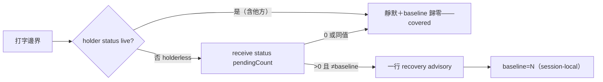

## Description

<!-- SECTION:DESCRIPTION:BEGIN -->
舊的信箱提醒 hook（AIR-233）查的 receipts 面從未落地（stub 先行、恆靜默）。裁定降級：提醒收斂為「本 session 提醒到哪」的 session 本地游標（不再是跨 session 共用檔）；SC 介面的未處理數字以信箱投影為源（不是 AI 的游標）；背景監看只在值星 session 在場時跑——閒置完全安靜。

**做什麼**：重寫提醒 hook——資料面改查 dutymail events；游標改 session 本地；僅當值星在場但沒 hold 信箱時給 recovery 提醒（值星已 hold 的話由收信處理器負責，提醒面安靜）。

**不做**：不做背景輪詢／watcher（裁定：閒置零背景處理）；badge 數字源是 SC 側（80.5）投影。

<!-- SECTION:DESCRIPTION:END -->

## Acceptance Criteria
<!-- AC:BEGIN -->
- [x] #1 uv run pytest tests/test_duty_mailbox_monitor.py 全綠（51 tests——repair 後語義）
- [x] #2 真實資料：holderless pending advisory 在場（計數=pendingCount）；holding/covered 靜默；同值防轟炸——receipt 落 .agent-tmp/dw-dutymail/
- [x] #3 rg 'scbus' hooks/ 零命中；'ai-guide-primary' governance/registrations/ 零命中；註冊面同步（marshal 收線 installer）
- [x] #4 舊全域 state 檔零讀取且未刪
<!-- AC:END -->

## Implementation Plan

<!-- SECTION:PLAN:BEGIN -->
〔baseline：ai-guide 2556afdd；依賴 254.3 落地（store＋ai-guide-marshal 門牌）〕
〔已決策勿重辯：①提醒游標＝session-local（~/.local/state/ai-guide/duty-monitor/<session_id>.json；舊全域 scbus-address-monitor.json 停用不刪——留歷史對帳）②資料面＝dutymail events/receive status/holder status 唯讀；monitor ≠ holder（禁 bind/prepare/ack——三軸不互代理）③本 session 已 hold ai-guide-marshal（duty-receive per-session state 有 token 且 holder status 對得上 epoch）→ 靜默＋游標推進至 head；未 hold → events 新事件計數 advisory 一行④閒置完全安靜＝無 hook 邊界零查詢（註冊面即邊界）；絕不背景輪詢/watcher⑤hook 改名 duty_mailbox_monitor.py（scbus 名退役），註冊＋安裝同步更新；badge 數字源是 SC 投影（80.5）非本 hook〕
範圍：
- 動：hooks/scbus-address-pending-reminder.py→hooks/duty_mailbox_monitor.py（重寫＋改名）、governance/registrations/zcode.json、governance/registrations/cc.json、hooks/AGENTS.md 提及處、tests/test_pending_reminder_hook.py→tests/test_duty_mailbox_monitor.py
- 不動：AIR-233 卡面、duty_receive.py（254.3）、SC 側

AC：
1. uv run pytest tests/test_duty_mailbox_monitor.py -v 全綠（session-local 游標／hold 靜默／未 hold advisory／degraded 靜默／eligibility gate）
2. 真實資料驗證（254.3 測試信箱）：未 hold 態 advisory 行在場；hold 態零 stdout——receipt 落 .agent-tmp/dw-dutymail/
3. rg -n 'scbus' hooks/ → 零命中；註冊兩檔更新且 ~/.zcode 安裝面同步（原條目不減）
4. 新代碼零讀取舊全域 state 檔（rg 驗證）；檔本身不刪
<!-- SECTION:PLAN:END -->

## Final Summary

<!-- SECTION:FINAL_SUMMARY:BEGIN -->
AIR-233 提醒降級重寫：hooks/duty_mailbox_monitor.py 取代 scbus-address-pending-reminder.py（dutymail 面）——review 修訂後語義＝holderless-only recovery window（裁定「bounded monitor reports holderless pending」忠實落地）：live=true（本 session 或他方 hold）→靜默歸零；live=false→receive status pendingCount>0 且變化才一行 advisory（session-local last_pending 防轟炸）；閒置完全安靜（註冊面即邊界）；ai-guide-primary 死條目移除。真機驗證：holderless advisory→同值靜默→值星處理閉環。commits 30f2bad1＋773e630b。

<!-- SECTION:FINAL_SUMMARY:END -->
