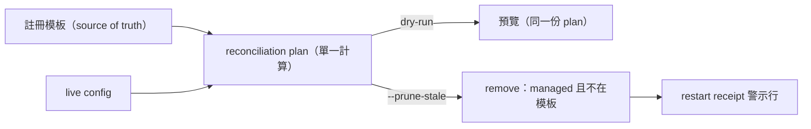
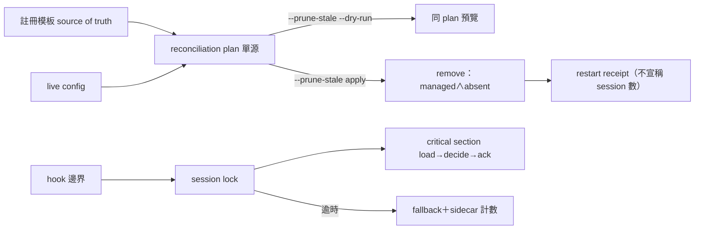

## Description

<!-- SECTION:DESCRIPTION:BEGIN -->
AIR-254 收線後續加固——依雙顧問（muse＋codex）討論裁定實作三項：①governance installer 學會 prune 退役 hook 註冊（ownership-aware：只刪可證明受管且不在現行模板的 group；顯式 flag 門控）＋removal 時輸出 restart receipt（S4）②duty_receive 併發防護（dedicated lock file＋重複呈報可觀測）③install 備份保留策略核對。

**做什麼**：installer 加 `--prune-stale` 顯式 flag（dry-run 同 plan 預覽；只刪「script 路徑在 repo hooks/ 受管目錄下」且「不在現行註冊模板」的 group；外部路徑只告警）；移除時印「已移除 X 條——既有 session 需重開生效」receipt；duty_receive 加 advisory lock（非阻塞短等待，逾時 fallback＋計數）；測試釘住 rename 場景（舊 group 殘留會被清）。

**不做**：不自動殺/restart session；不做 strict template diff（會刪用戶自訂 group——雙顧問同向拒絕）；不動 codex canary（另卡 AIR-256）。

<!-- SECTION:DESCRIPTION:END -->

## Acceptance Criteria
<!-- AC:BEGIN -->
- [x] #1 全套 3351 tests 綠（prune 17＋鎖 13＋repair 增 10；基線只增不減）
- [x] #2 真機複本演練：死引用→dry-run 預覽→apply 移除＋receipt＋backup；fixture 死引用歸零、用戶鍵保留
- [x] #3 prune 僅顯式路徑可達（無 flag install/check 行為逐字不變；fuzz 17K trials 零 mismatch）
- [x] #4 鎖 critical section 涵蓋 load→decide→ack；逾時 fallback 不擋 prompt；state 主檔零觸碰（sidecar 計數）
- [x] #5 快審 4 findings 全閉（F-1 演練面收斂/F-2+F-3 sidecar/F-4 例外不遮蔽）
<!-- AC:END -->

## Implementation Plan

<!-- SECTION:PLAN:BEGIN -->
〔baseline：ai-guide b8026cc0〕
〔已決策勿重辯（雙顧問合成——muse job-muvtw3gd-29v0o5／codex job-muvtw3hx-7fcl9o 全文存 .agent-tmp/dw-dutymail/）〕：
①Prune 語義＝ownership-aware diff（非「script 不存在」判準——漏 rename、誤刪用戶 group，雙顧問同向拒絕）：live group 為移除候選 ⇔（i）全部 script 路徑落 repo hooks/ 受管目錄（ownership fence；外部路徑只告警不刪）且（ii）不在現行註冊模板（identity 以 event+group scripts set 比對——涵蓋 rename 場景：舊 group 不在模板即使 script 仍在也移除）
②--prune-stale 顯式 flag 門控——永不預設執行；dry-run 與 apply 消費同一份 reconciliation plan（純計算 expected/add/update/remove，預覽與執行同源；禁兩套 heuristic）
③移除前備份＋移除後報告（removed=逐條）；removal 時輸出 restart receipt：「已移除 X 條 hook 引用——既有 ZCode sessions 可能仍持 startup snapshot，重開 session 前舊 session 每 prompt 可能報錯」（禁宣稱 N 個 running session——程序枚舉是啟發式會錯；禁自動殺／restart session）
④併發鎖（codex 設計＋muse 護欄合成）：dedicated per-session lock file（duty-receive/<safe_sid>.lock 固定路徑——禁鎖 state 檔本身：tmp+rename inode 更換＝假鎖）；critical section 覆蓋 load→decide→save，取鎖後 re-load state 重新判定（double-present 面也納入）；非阻塞短等待（≤2s）逾時走 bounded-duplication fallback（stderr 一行＋重複呈報計數遞增——不長阻塞 prompt 熱路徑、不因鎖失敗吞信或假裝已處理）；state 增計數欄（muse 可觀測性——重報率突增才複議更重的鎖）
⑤核對 install.py 備份保留策略（已有 _prune_glob keep N 則免，無則補）
範圍：governance/install.py、scripts/duty_receive.py、hooks/duty_receive.py（鎖整合點）、tests（test_duty_mailbox_monitor.py install-merge face 擴展＋test_duty_receive.py 鎖面）；不動註冊模板、monitor、規則面

AC：
1. uv run pytest tests/ -q 全綠（新測試：prune 只刪 managed＋absent——rename 場景／外部路徑告警不刪／用戶 group 保留／dry-run 同 plan／receipt 文案／鎖 critical section re-load／逾時 fallback 計數）
2. 真機：live config 複本偽造死引用→--prune-stale --dry-run 預覽正確→apply 移除且印 receipt、備份在場
3. rg 驗證 prune 僅顯式路徑可達（預設 install 零移除行為）
4. duty_receive 既有測試零回歸（3311 基線上只增不減）
<!-- SECTION:PLAN:END -->

## Final Summary

<!-- SECTION:FINAL_SUMMARY:BEGIN -->
AIR-254 收線後續加固落地（雙顧問 muse+codex 合成 spec）：①installer ownership-aware prune（--prune-stale 顯式旗標；managed∧不在模板才刪；dry-run 與 apply 同一 reconciliation plan；restart receipt）②duty_receive 併發鎖（dedicated .lock 檔、critical section 涵蓋 load→decide→ack、逾時 bounded-duplication fallback＋sidecar 計數）③快審 4 findings 修復（--zcode-config 演練面收斂、fallback sidecar、例外不遮蔽）。3341→3351 tests 綠；17K trials 等值 fuzz 零 mismatch；複本演練（fixture 死引用→prune→receipt→backup）真機驗證。commits：writer 輪＋9efd6ae7（repair）。

<!-- SECTION:FINAL_SUMMARY:END -->
