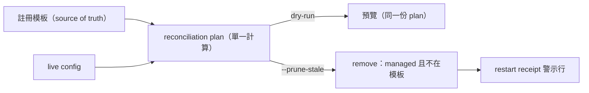

## Description

<!-- SECTION:DESCRIPTION:BEGIN -->
AIR-254 收線後續加固——依雙顧問（muse＋codex）討論裁定實作三項：①governance installer 學會 prune 退役 hook 註冊（ownership-aware：只刪可證明受管且不在現行模板的 group；顯式 flag 門控）＋removal 時輸出 restart receipt（S4）②duty_receive 併發防護（dedicated lock file＋重複呈報可觀測）③install 備份保留策略核對。

**做什麼**：installer 加 `--prune-stale` 顯式 flag（dry-run 同 plan 預覽；只刪「script 路徑在 repo hooks/ 受管目錄下」且「不在現行註冊模板」的 group；外部路徑只告警）；移除時印「已移除 X 條——既有 session 需重開生效」receipt；duty_receive 加 advisory lock（非阻塞短等待，逾時 fallback＋計數）；測試釘住 rename 場景（舊 group 殘留會被清）。

**不做**：不自動殺/restart session；不做 strict template diff（會刪用戶自訂 group——雙顧問同向拒絕）；不動 codex canary（另卡 AIR-256）。

<!-- SECTION:DESCRIPTION:END -->
