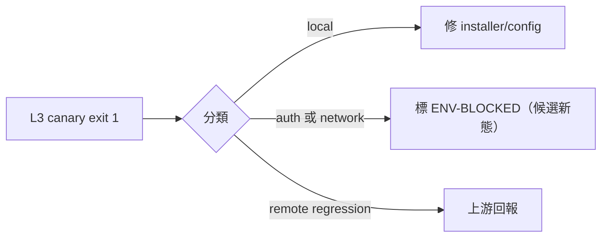
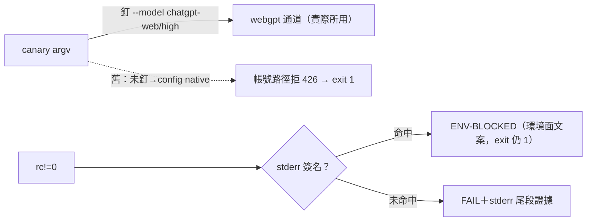

## Description

<!-- SECTION:DESCRIPTION:BEGIN -->
install --verify 的 L3 codex canary FAIL（codex exec exit 1）——目前歸因只是假設（auth/網路），exit 1 本身不提供 attribution。本卡防止 red-gate normalization（verifier 習慣性被忽略＝失去 gate 價值）。

**做什麼**：分類先行——保存 exit 1 的 stderr/phase 原樣輸出，區分 local installation defect／credential-auth unavailable／network-provider unavailable／remote runtime regression；若是環境類，評估 install --verify 的 L3 是否該加 ENV-BLOCKED 第三態（local verify 與 external-readiness 分面）。下次實際 codex 派工失敗即升級。

**不做**：不阻塞任何既有弧；不預先歸因。

<!-- SECTION:DESCRIPTION:END -->

## Acceptance Criteria
<!-- AC:BEGIN -->
- [x] #1 分類完成：local canary 設計缺陷（未釘 model）——非 auth/network/remote；webgpt 健康三證據
- [x] #2 canary 釘 --model chatgpt-web/high；argv 測試釘住
- [x] #3 失敗 detail 帶 stderr 尾段（單行化 300 chars）
- [x] #4 ENV-BLOCKED 三態（8 簽名大小寫不敏感；exit fail-closed 不變）＋6 新測試
- [x] #5 真跑 --verify 全 PASS exit 0（L3 生效）；全套 3357 綠；README 運維單一源同步
<!-- AC:END -->

## Implementation Plan

<!-- SECTION:PLAN:BEGIN -->
〔baseline：ai-guide b8026cc0〕〔Already-decided, do not re-argue: classification-first (local defect / auth / network / remote regression) —— exit 1 itself carries no attribution, existing auth/network suspicions are hypothesis and must not be written as conclusions; evaluate L3 adding ENV-BLOCKED state; escalate to diagnosis on next actual codex dispatch failure〕Scope: diagnosis + install.py --verify L3 tri-state evaluation; do not block existing arcs.
<!-- SECTION:PLAN:END -->

## Final Summary

<!-- SECTION:FINAL_SUMMARY:BEGIN -->
codex canary 修復落地：根因＝argv 未釘 --model→落 config native slug（gpt-6-astra）→ChatGPT 帳號路徑拒（426）→exit 1；webgpt 本身健康（三證據）。修復＝canary 釘 chatgpt-web/high（AIR-221 sanctioned transport）＋失敗 detail 帶 stderr 尾段（歸因證據）＋ENV-BLOCKED 第三態（8 簽名、文案分類非放行、exit 仍 fail-closed）。真跑 L3 PASS exit 0；3357 tests 綠。

<!-- SECTION:FINAL_SUMMARY:END -->
