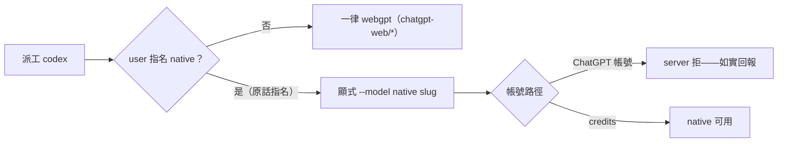
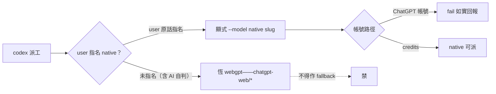

## Description

<!-- SECTION:DESCRIPTION:BEGIN -->
把 user 的 codex 派工裁決（2026-10-06 原話：「基本上都用 webgpt，除非我指名用 codex native」）收編進 model-routing 的 dispatch 預設段。現行 AIR-221 條文已定「bridge 派工一律 webgpt、native 僅 user 手動 app/CLI」——新裁決語義一致且把 native 例外放寬一格：user 在對話中指名即可派 native（顯式指定）。

**做什麼**：skills/model-routing/SKILL.md dispatch 預設段 codex 行——native 例外條款補 user 原話與日期（權威鏈閉環：原話→條文）；「指名」形態對接既有顧問觸發兩層語義（點名即顯式指定）。帳號路徑分界不變（ChatGPT 帳號下 native 全不可派——指名也會 fail，如實回報）。

**不做**：不改 webgpt-only 主政策、不改 family 表、不動 webgpt 專節。

<!-- SECTION:DESCRIPTION:END -->

## Acceptance Criteria
<!-- AC:BEGIN -->
- [x] #1 user 原話逐字入文兩處（dispatch 段＋family 表）——rg 命中 2
- [x] #2 三不變在場——webgpt-only 主政策/native 非 fallback/帳號路徑分界
- [x] #3 :190 診斷 rescue row 同步（未指名僅 webgpt＋例外 pointer）
- [x] #4 恰一檔 3 行；獨立審查 3 findings 全閉
<!-- AC:END -->

## Final Summary

<!-- SECTION:FINAL_SUMMARY:BEGIN -->
codex webgpt 裁決收編落地：user 2026-10-06 原話「基本上都用 webgpt，除非我指名用 codex native」入 model-routing dispatch 預設段＋family 表兩處；native 例外從「僅 user 手動 app/CLI」放寬到「user 對話指名＝顯式指定可派（經 bridge 顯式 --model <native slug>）」；三不變保全（未指名恆 webgpt／native 不作 fallback／帳號路徑分界——指名在 ChatGPT 帳號下仍會 fail 如實回報）。獨立審查 3 findings 退修閉（:190 診斷 rescue row 絕對句加限定＋例外 pointer、:136/:216 限定詞、顧問節指令層錨）。3 行語義編輯；catalog 供給（bridge-codex-sol/astra）端到端可解析。

<!-- SECTION:FINAL_SUMMARY:END -->
