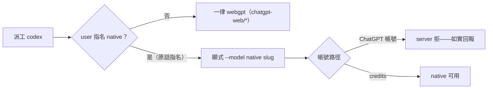

## Description

<!-- SECTION:DESCRIPTION:BEGIN -->
把 user 的 codex 派工裁決（2026-10-06 原話：「基本上都用 webgpt，除非我指名用 codex native」）收編進 model-routing 的 dispatch 預設段。現行 AIR-221 條文已定「bridge 派工一律 webgpt、native 僅 user 手動 app/CLI」——新裁決語義一致且把 native 例外放寬一格：user 在對話中指名即可派 native（顯式指定）。

**做什麼**：skills/model-routing/SKILL.md dispatch 預設段 codex 行——native 例外條款補 user 原話與日期（權威鏈閉環：原話→條文）；「指名」形態對接既有顧問觸發兩層語義（點名即顯式指定）。帳號路徑分界不變（ChatGPT 帳號下 native 全不可派——指名也會 fail，如實回報）。

**不做**：不改 webgpt-only 主政策、不改 family 表、不動 webgpt 專節。

<!-- SECTION:DESCRIPTION:END -->
