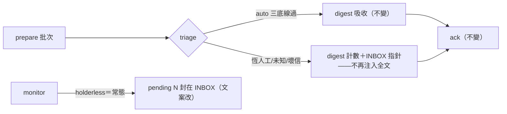
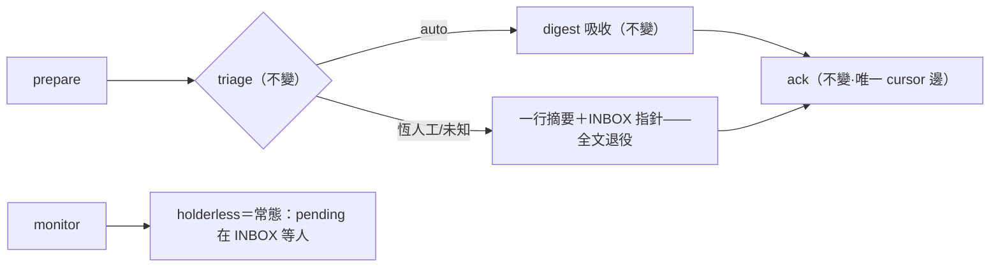

## Description

<!-- SECTION:DESCRIPTION:BEGIN -->
B′ 解凍：SC-305 已上線（SC 能讀 dutymail projection），ai-guide 側兩項跟進落地——G3 收信處理器的 surface 面縮窄＋G4 monitor 的 holderless 語義改常態。

**做什麼**：①G3 surface 縮窄——恆人工項（handoff/patrol/work-order/solicit/未知 class）不再把全文注入 conversation 的 additionalContext，改為 digest 計數行＋「INBOX 查看」指針（人類判讀面＝SC INBOX，B′ 路由分離）；auto 面（inform/receipt 可機械驗證）照舊 digest 吸收。bind/prepare/ack transport 機制完全不動。②G4 monitor——holderless 從「recovery window（異常）」改「常態（pending 在 INBOX 等人）」語義：advisory 文案改、閾值行為保留（session-local 防轟炸）。

**規矩**：default-deny 三層硬底線不動；絕不 flush-ack 不動；v1 零送信不動；roundtrip 文件同步（B′ 語義）。

<!-- SECTION:DESCRIPTION:END -->

## Acceptance Criteria
<!-- AC:BEGIN -->
- [x] #1 全套 3358 tests 綠（基線只增不減；flush-ack/live 閂/default-deny 測試零改動通過）
- [x] #2 recovery window 零命中；INBOX 等人文案在場
- [x] #3 全文見 SC INBOX 在場；SURFACE_FULL_TEXT_LIMIT 退役零命中
- [x] #4 roundtrip B′ 註記兩處
- [x] #5 真跑（shim）：摘要形輸出、envelope 全文不在 additionalContext
<!-- AC:END -->

## Final Summary

<!-- SECTION:FINAL_SUMMARY:BEGIN -->
B′ 解凍落地（SC-305 上線後人類面＝SC INBOX）：G3 surface 縮窄——恆人工項（handoff/patrol/work-order/solicit/未知/壞信）不再注入 conversation 全文，改一行摘要（K 件等你＋class 計數＋envelope_id 前 3＋「全文見 SC INBOX」指針）；digest 主行/auto 面/bind/prepare/ack/default-deny 三層硬底線/flush-ack 防護零改動。G4 monitor——holderless 從 recovery window 改常態（「pending 在 INBOX 等人判讀」）；決策表行為不變。roundtrip 文檔 B′ 註記同步。3358 tests 綠＋shim 真跑摘要形驗證。commit a9813e14。

<!-- SECTION:FINAL_SUMMARY:END -->
