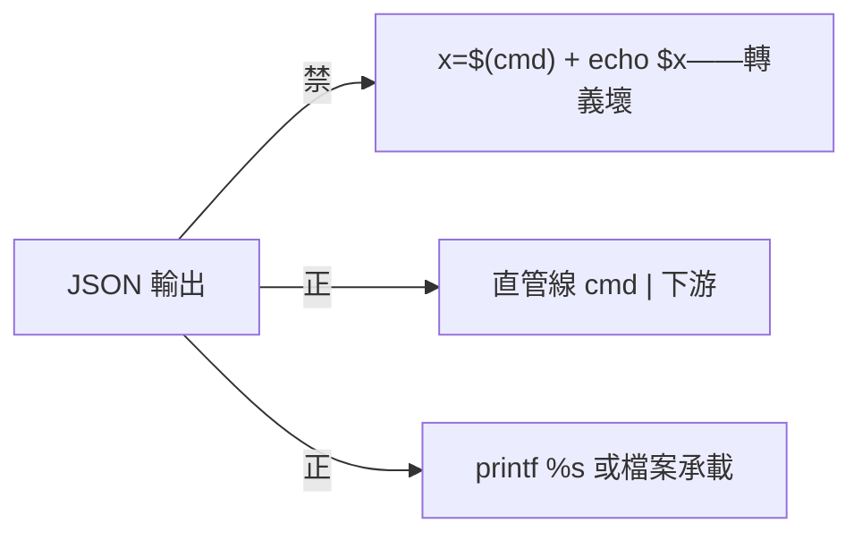
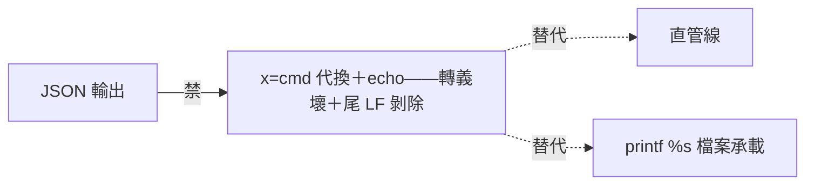

## Description

<!-- SECTION:DESCRIPTION:BEGIN -->
SC 值星提案（附 bridge 歸證 leg 實證）：zsh builtin echo 會解釋反斜線轉義——JSON 經 `$(cmd)`＋echo 往返必壞（\n 變真 LF、\\ 折半）。正確寫法＝直管線（cmd | 下游）、printf %s、或檔案承載。

**做什麼**：tool-discipline skill 的 zsh 細則節補這條陷阱與正確形（3 行內）；含實證來源標註（bridge 歸證 leg，2026-10-06）。

<!-- SECTION:DESCRIPTION:END -->

## Acceptance Criteria
<!-- AC:BEGIN -->
- [x] #1 printf %s 命中；echo 語義＝禁令
- [x] #2 恰一檔；desc/觸發詞同步（scan FAIL=0）
- [x] #3 獨立審查 PASS＋F1 退修閉
<!-- AC:END -->

## Final Summary

<!-- SECTION:FINAL_SUMMARY:BEGIN -->
tool-discipline 補 zsh echo 轉義陷阱（源：SC 值星提案＋bridge 歸證 leg 實證——\n 變真 LF、\\ 折半）：JSON 承載禁 x=$(cmd) 後 echo $x 形，處方＝直管線／printf %s "$x"／檔案承載。獨立審查 PASS（live 對照五組——含 \uXXXX 與 cmdsubst 剝尾 LF 兩個加測機制）＋F1 退修（desc 枚舉＋觸發詞同步——649/1024、FAIL=0）。四欄回執：instruction 語義新增／技術正確性+形態+scope+邊界四軸／PASS with 1 Low（已修）／設計性絕對措辭可接受。

<!-- SECTION:FINAL_SUMMARY:END -->
